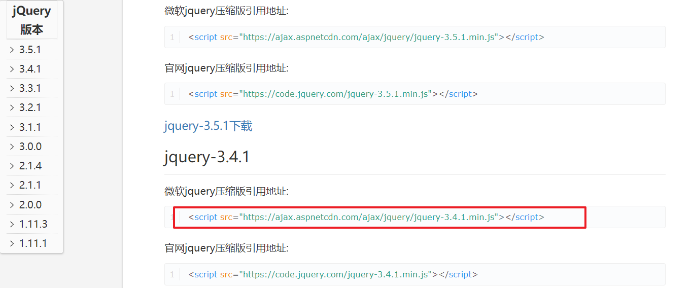
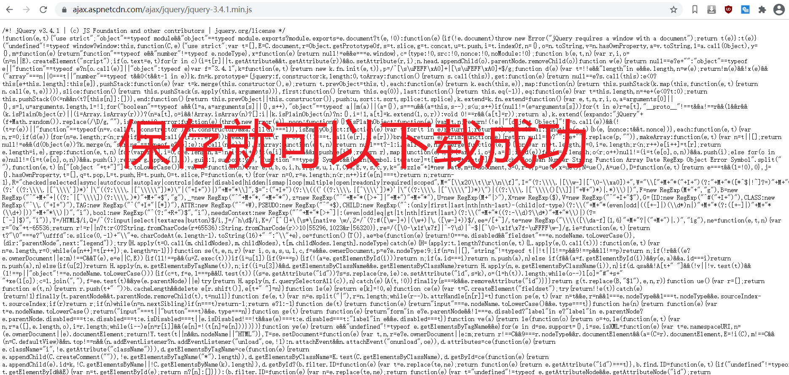

# JQuery

> jQuery is a fast, small, and feature-rich JavaScript library. It makes things like HTML document traversal and manipulation, event handling, animation, and Ajax much simpler with an easy-to-use API that works across a multitude of browsers. With a combination of versatility and extensibility, jQuery has changed the way that millions of people write JavaScript.


## 1. 下载jquery库






## 2. JQuery初体验

### 2.1 Jquery初体验

```html
<!DOCTYPE html>
<html>
	<head>
		<meta charset="utf-8">
		<title>jquery初体验</title>
	</head>
	<body>
		<button>点击一下</button>
		<script src="js/jquery-3.1.1.min.js"></script>
		<script>
			// 通过jquery获取到的是jquery对象  document获取到的是dom对象
			/* let btn = $("button");
			console.log(btn); */
			window.onload = ()=>{
				// js代码
			}
			//页面加载完成以后  回调函数
			/* $(document).ready(function(){
				console.log("----------");
			}) */
			/* 最终也页面加载完成写法简化 */
			$(function(){
				console.log("ready OK!");
			})
			/* es6jquery的写法简单 */
			$(()=>{
				console.log("es6----");
			})
		</script>
	</body>
</html>

```

### 2.2 JQuery核心

#### 2.2.1 Jquey对象和DOM对象互转 和 each

```html
<!DOCTYPE html>
<html>
	<head>
		<meta charset="utf-8">
		<title>核心</title>
		<style>
			div{
				width: 300px;
				height: 300px;
				background: lawngreen;
			}
		</style>
	</head>
	<body>
		<div>
			
		</div>
		
		<ul>
			<li>Hello</li>
			<li>Hello</li>
			<li>Hello</li>
			<li>Hello</li>
			<li>Hello</li>
		</ul>	
		
		<script src="js/jquery-3.1.1.min.js"></script>
		<script>
			$(function(){
				//获取页面的元素 $("css选择器")
				//jquery对象 和 dom 对象转换
				let div = 	$("div");
				/* jquery对象转为dom对象 */
				console.log(div.get(0));
				console.log(div[0]);
				//div.get(0).appendChild();
				/* dom对象转为jquery对象 */
				let main = document.querySelector("div");
				console.log($(main));
				/* 将dom对象转为jquery对象 */
				let p = $("<p></p>");
				console.log(p);
				
				/* each遍历数组 */
				let arr = [1,2,3,4,5,6,7];
				/* arr.forEach((i)=>{
					console.log(i);
				}) */
				/* index是下标 item是下标对应的值 */
				$.each(arr,function(index,item){
					console.log("下标:"+index);
					console.log(item);
				})
				/* arr不是jquery对象 */
				$(arr).each(function(index,item){
					console.log(index);
					console.log("值:"+item);
				})
				/* 获取所有的li标签 */
				let lis = $("li");
				console.log(lis);
				lis.each(function(index,item){
					console.log(index + "="+ item);
				})
			})
		</script>
	</body>
</html>

```

#### 2.2.2 选择器

```html
<!DOCTYPE html>
<html>
	<head>
		<meta charset="utf-8">
		<title>jquery选择器</title>
	</head>
	<body>
		<div></div>
		<div id="main"></div>
		<div class="core"></div>
		<div>
			<p>Hello WOrld</p>
		</div>
		<div class="list">
			<ul>
				<li>Hello 1</li>
				<li>Hello 2</li>
				<li>Hello 3</li>
				<li>Hello 4</li>
				<li>Hello 5</li>
			</ul>
		</div>
		<input type="radio" name="" id="" checked="">
		<script type="text/javascript" src="./js/jquery-3.1.1.min.js">
		</script>
		<script>
			/* jquery选择器 */
			$(()=>{
				/* 获取所有的元素 */
				let div = $("div");
				console.log(div);
				let div1 = $("#main");
				console.log(div1);
				let div2 = $(".core");
				console.log(div2);
				let div3 = $("div>p");
				console.log(div3);
				let div4 = $(".list >ul");
				console.log(div4);
				let div5 = $(".list >ul >li");
				console.log(div5);
				let div6 = $(".list>ul>li:first");
				console.log(div6);
				let div7 = $(".list>ul>li:first-child");
				console.log(div7);
				
				let div8 = $(".list>ul>li:nth-child(3)");
				console.log(div8);
				/* 奇数 */
				let div9 = $(".list>ul>li:even");
				console.log(div9);
				/* 偶数 */
				let div10 = $(".list>ul>li:odd");
				console.log(div10);
				/* 大于3 下标 */
				let div11 = $(".list>ul>li:gt(3)");
				console.log(div11);
				
				let div12 = $(".list>ul>li:lt(3)");
				console.log(div12);
				/* 下标等于的 */
				let div13 = $(".list>ul>li:eq(3)");
				console.log(div13);
				/* 排序元素 */
				let div14 = $(".list>ul>li:not(:first)");
				console.log(div14);
				
				let div15 = $(".list>ul>li:eq(3)").next();
				console.log(div15);
				/* 属性选择器 */
				let div16 = $("div[id='main']");
				console.log(div16);
				
				let inp = $("input:checked");
				console.log(inp);
			})
		</script>
	</body>
</html>

```

### 2.3.css样式

```html
<!DOCTYPE html>
<html>
	<head>
		<meta charset="utf-8">
		<title>css</title>
		<style>
			.active{
				color: #7CFC00;
				font-size: 20px;
				font-family: "microsoft yahei";
				font-weight: 700;
			}
		</style>
	</head>
	<body>
		<button type="button">点击事件</button>
		<div></div>
		<p>当你使用CSS属性在css()或animate()中，我们将根据浏览器自动加上前缀(在适当的时候)</p>
		<input type="text" name="name" id="" value="12345666666" />
		<script type="text/javascript" src="./js/jquery-3.1.1.min.js">
		</script>
		<script>
			let div = $("div");
			/* 定义样式  行内样式*/
			/* 定义一个属性 */
			div.css("width","200px");
			/* 定义多个样式属性 */
			div.css({"height":"200px","background":"red","opacity":"0.5"});
			let p =$("p");
			/* 添加外部的样式 */
				p.addClass('active');
				p.removeClass('active');
				/* jquery和DOM相结合使用 */
			let btn = $("button")[0];
			btn.onclick=()=>{
				/* 有样式就移除  没有就添加 */
				p.toggleClass("active");
			}	
			/* innerHTML */
			/* 填充html */
			p.html("<span>Hello</span>")	
			/* 填充文本 */
			p.text("12345677");	
			/* 获取值   赋值*/
		let inpt = $("[name='name']");
			console.log(inpt.val());
			/* 重新赋值 */
			inpt.val("99999999999999");
			/* 属性操作 */
			inpt.attr("name","username");
			/* 多个属性 */
			inpt.attr({"type":"password","readonly":"true"})
			/* 移除属性 */
			inpt.removeAttr("readonly");
		</script>
	</body>
</html>

```


