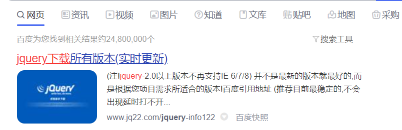

# JQuery

> jQuery is a fast, small, and feature-rich JavaScript library. It makes things like HTML document traversal and manipulation, event handling, animation, and Ajax much simpler with an easy-to-use API that works across a multitude of browsers. With a combination of versatility and extensibility, jQuery has changed the way that millions of people write JavaScript.


[jquery官方学习网站](https://learn.jquery.com/about-jquery/how-jquery-works/)

## 1. 下载jquery库




## 2. JQuery初体验

### 2.1 Jquery初体验

```html
<!DOCTYPE html>
<html>
	<head>
		<meta charset="utf-8">
		<title>jquery初体验</title>
	</head>
	<body>
		<button>点击一下</button>
		<script src="js/jquery-3.1.1.min.js"></script>
		<script>
			// 通过jquery获取到的是jquery对象  document获取到的是dom对象
			/* let btn = $("button");
			console.log(btn); */
			window.onload = ()=>{
				// js代码
			}
			//页面加载完成以后  回调函数
			/* $(document).ready(function(){
				console.log("----------");
			}) */
			/* 最终也页面加载完成写法简化 */
			$(function(){
				console.log("ready OK!");
			})
			/* es6jquery的写法简单 */
			$(()=>{
				console.log("es6----");
			})
		</script>
	</body>
</html>

```

### 2.2 JQuery核心

#### 2.2.1 Jquey对象和DOM对象互转 和 each

```html
<!DOCTYPE html>
<html>
	<head>
		<meta charset="utf-8">
		<title>核心</title>
		<style>
			div{
				width: 300px;
				height: 300px;
				background: lawngreen;
			}
		</style>
	</head>
	<body>
		<div>
			
		</div>
		
		<ul>
			<li>Hello</li>
			<li>Hello</li>
			<li>Hello</li>
			<li>Hello</li>
			<li>Hello</li>
		</ul>	
		
		<script src="js/jquery-3.1.1.min.js"></script>
		<script>
			$(function(){
				//获取页面的元素 $("css选择器")
				//jquery对象 和 dom 对象转换
				let div = 	$("div");
				/* jquery对象转为dom对象 */
				console.log(div.get(0));
				console.log(div[0]);
				//div.get(0).appendChild();
				/* dom对象转为jquery对象 */
				let main = document.querySelector("div");
				console.log($(main));
				/* 将dom对象转为jquery对象 */
				let p = $("<p></p>");
				console.log(p);
				
				/* each遍历数组 */
				let arr = [1,2,3,4,5,6,7];
				/* arr.forEach((i)=>{
					console.log(i);
				}) */
				/* index是下标 item是下标对应的值 */
				$.each(arr,function(index,item){
					console.log("下标:"+index);
					console.log(item);
				})
				/* arr不是jquery对象 */
				$(arr).each(function(index,item){
					console.log(index);
					console.log("值:"+item);
				})
				/* 获取所有的li标签 */
				let lis = $("li");
				console.log(lis);
				lis.each(function(index,item){
					console.log(index + "="+ item);
				})
			})
		</script>
	</body>
</html>

```

#### 2.2.2 选择器

```html
<!DOCTYPE html>
<html>
	<head>
		<meta charset="utf-8">
		<title>jquery选择器</title>
	</head>
	<body>
		<div></div>
		<div id="main"></div>
		<div class="core"></div>
		<div>
			<p>Hello WOrld</p>
		</div>
		<div class="list">
			<ul>
				<li>Hello 1</li>
				<li>Hello 2</li>
				<li>Hello 3</li>
				<li>Hello 4</li>
				<li>Hello 5</li>
			</ul>
		</div>
		<input type="radio" name="" id="" checked="">
		<script type="text/javascript" src="./js/jquery-3.1.1.min.js">
		</script>
		<script>
			/* jquery选择器 */
			$(()=>{
				/* 获取所有的元素 */
				let div = $("div");
				console.log(div);
				let div1 = $("#main");
				console.log(div1);
				let div2 = $(".core");
				console.log(div2);
				let div3 = $("div>p");
				console.log(div3);
				let div4 = $(".list >ul");
				console.log(div4);
				let div5 = $(".list >ul >li");
				console.log(div5);
				let div6 = $(".list>ul>li:first");
				console.log(div6);
				let div7 = $(".list>ul>li:first-child");
				console.log(div7);
				
				let div8 = $(".list>ul>li:nth-child(3)");
				console.log(div8);
				/* 奇数 */
				let div9 = $(".list>ul>li:even");
				console.log(div9);
				/* 偶数 */
				let div10 = $(".list>ul>li:odd");
				console.log(div10);
				/* 大于3 下标 */
				let div11 = $(".list>ul>li:gt(3)");
				console.log(div11);
				
				let div12 = $(".list>ul>li:lt(3)");
				console.log(div12);
				/* 下标等于的 */
				let div13 = $(".list>ul>li:eq(3)");
				console.log(div13);
				/* 排序元素 */
				let div14 = $(".list>ul>li:not(:first)");
				console.log(div14);
				
				let div15 = $(".list>ul>li:eq(3)").next();
				console.log(div15);
				/* 属性选择器 */
				let div16 = $("div[id='main']");
				console.log(div16);
				
				let inp = $("input:checked");
				console.log(inp);
			})
		</script>
	</body>
</html>

```

### 2.3.css样式

```html
<!DOCTYPE html>
<html>
	<head>
		<meta charset="utf-8">
		<title>css</title>
		<style>
			.active{
				color: #7CFC00;
				font-size: 20px;
				font-family: "microsoft yahei";
				font-weight: 700;
			}
		</style>
	</head>
	<body>
		<button type="button">点击事件</button>
		<div></div>
		<p>当你使用CSS属性在css()或animate()中，我们将根据浏览器自动加上前缀(在适当的时候)</p>
		<input type="text" name="name" id="" value="12345666666" />
		<script type="text/javascript" src="./js/jquery-3.1.1.min.js">
		</script>
		<script>
			let div = $("div");
			/* 定义样式  行内样式*/
			/* 定义一个属性 */
			div.css("width","200px");
			/* 定义多个样式属性 */
			div.css({"height":"200px","background":"red","opacity":"0.5"});
			let p =$("p");
			/* 添加外部的样式 */
				p.addClass('active');
				p.removeClass('active');
				/* jquery和DOM相结合使用 */
			let btn = $("button")[0];
			btn.onclick=()=>{
				/* 有样式就移除  没有就添加 */
				p.toggleClass("active");
			}	
			/* innerHTML */
			/* 填充html */
			p.html("<span>Hello</span>")	
			/* 填充文本 */
			p.text("12345677");	
			/* 获取值   赋值*/
		let inpt = $("[name='name']");
			console.log(inpt.val());
			/* 重新赋值 */
			inpt.val("99999999999999");
			/* 属性操作 */
			inpt.attr("name","username");
			/* 多个属性 */
			inpt.attr({"type":"password","readonly":"true"})
			/* 移除属性 */
			inpt.removeAttr("readonly");
		</script>
	</body>
</html>

```

### 2.4 Jquery事件

```html
<!DOCTYPE html>
<html>
	<head>
		<meta charset="utf-8">
		<title>事件</title>
		<style>
			div{
				width: 300px;
				height: 300px;
				display: none;
				background: lawngreen;
			}
		</style>
	</head>
	<body>
		<button>点击看看</button>
		<div></div>
		<script type="text/javascript" src="./js/jquery-3.1.1.min.js">
		</script>
		<script type="text/javascript">
			/* 第一种事件添加的方式 */
			/* $("button").on("click",function(){
				$("body").css("background","#f5f5f5")
			}); */
			/* $("button").click(function(){
				$("body").css("background","red")
				}); */
			/* $("button").hover(function(){
				$("body").css("background","#666")
			})	 */
			$("button").click(function(){
				$("div").toggle("fast")
			})
		</script>
	</body>
</html>

```

### 2.5 效果

+ 显示隐藏

+ 淡入淡出

+ 下拉上啦

```html
  <!DOCTYPE html>
  <html>
  	<head>
  		<meta charset="utf-8">
  		<title>效果</title>
  		<style>
  			div{
  				position: relative;
  				width: 300px;
  				height: 300px;
  				background: lawngreen;
  				display: block;
  			}
  		</style>
  	</head>
  	<body>
  		<button>button</button>
  		<div></div>
  		<script src="./js/jquery-3.1.1.min.js"></script>
  		<script>
  			$("button").click(()=>{
  				//隐藏
  				//$("div").hide();
  				//$("div").show();
  				/* 显示就隐藏 隐藏就显示 */
  				//$("div").toggle()
  				//$("div").slideDown();
  				//$("div").slideUp();
  				/* $("div").slideToggle(3000,function(){
  					$("body").css("background","pink");
  				}) */
  				/* 淡入淡出 */
  				//$("div").fadeIn(3000);
  				//$("div").fadeOut(3000);
  				//$("div").fadeToggle();
  				
  				/* 动画 */
  				$("div").animate({"left":"200px","top":"150px"},3000);
  				$("div").mouseenter(()=>{
  					$("div").stop();
  				})
  				$("div").mouseleave(()=>{
  					console.log("------------");
  					$("div").animate({"left":"200px","top":"150px"},3000);
  				})
  			})
  		</script>
  	</body>
  </html>
  
```

### 2.6 表单验证

```html
<!DOCTYPE html>
<html>
	<head>
		<meta charset="utf-8">
		<title>表单验证</title>
	</head>
	<body>
		<form action="">
			<label for="name">用户名:</label>
			<input type="text" name="name" id="name">
			<span id="namespan"></span>
			<br>
			<label for="password">密&ensp;&ensp;码:</label>
			<input type="text" name="password" id="password">
			<span id="passspan"></span>
			<br>
			<label for="email">用户名:</label>
			<input type="text" name="email" id="email">
			<span id="emailspan"></span>
			<br>
			<input type="button" value="提交"> <input type="reset" value="重置">
		</form>
			<script src="./js/jquery-3.1.1.min.js"></script>
			<script>
				$(function(){
					$("[type='button']").click(()=>{
						//获取输入框的值
						let name = $("#name").val();
						let password = $("#password").val();
						let email = $("#email").val();
						/* 首先判断输入框的值不能为空 */
						if(name===""){
							/* $("#namespan").text("用户名不能为空");
							$("#namespan").css("color","red"); */
							/* 对同一个对象操作就可以使用链式编程 */
							$("#namespan").text("用户名不能为空").css("color","red");
							/* 终止程序 */
							return false;
						}else{
							$("#namespan").text("用户名可用").css("color","green");
						}
						if(password===""){
							$("#passspan").text("密码不能为空").css("color","red");
							return false;
						}else{
							$("#passspan").text("密码可用").css("color","green");
						}
						if(email===""){
							$("#emailspan").text("邮箱不能为空").css("color","red");
							return false;
						}else{
							let regexp = /\w+([-+.]\w+)*@\w+([-.]\w+)*\.\w+([-.]\w+)*/;
							if(regexp.test(email)){
								$("#emailspan").text("邮箱格式正确").css("color","green");
							}else{
								$("#emailspan").text("邮箱格式不正确").css("color","red");
							}
						}
						/* 数据校验通过在进行提交 */
						$("form").attr("action","http://www.baidu.com").submit();
						
					})
				})
			</script>
	</body>
</html>

```

### 2.7 选项卡

```html
<!DOCTYPE html>
<html>
	<head>
		<meta charset="utf-8">
		<title>选项卡</title>
		<style>
			/* 初始化 */
			body,html,ul,li,a,img{
				margin: 0;
				padding: 0;
			}
			ul{
				list-style: none;
			}
			a{
				text-decoration: none;
			}
			div{
				width: 500px;
				height: 150px;
			}
			ul{
				width: 100%;
				height: 100%;
				z-index: 99;
			}
			ul li{
				width: 125px;
				height: 150px;
				box-sizing: border-box;
				float: left;
				padding: 15px 20px;
				border: 1px solid #f5f5f5;
			}
			ul li a{
				display: inline-block;
				width: 100%;
				height: 100%;
			}
			ul li a {
				background: url("https://img.alicdn.com/tfs/TB1eiXTXlTH8KJjy0FiXXcRsXXa-24-595.png") 0 0 no-repeat;
				background-size: 80px ;
			}
			ul li a:first-child{
				background-position:0 20px;
			}
			ul li:nth-child(2) a{
				background-position:0px -130px;
			}
			ul li:nth-child(3) a{
				background-position:0px -270px;
			}
			ul li:nth-child(4) a{
				background-position:0px -420px;
			}
			.infos{
				position: absolute;
				width: 500px;
				height: 300px;
				border: 1px solid red;
				margin-top: -3px;
				display: none;
				z-index: -2;
			}
			.actve{
				display: block;
				border-top: 1px solid red;
				border-right: 1px solid red;
				border-left: 1px solid red;
				border-bottom: 5px solid #fff;
			}
			
		</style>
	</head>
	<body>
		<div class="list">
			<ul>
				<li><a href=""></a></li>
				<li><a href=""></a></li>
				<li><a href=""></a></li>
				<li><a href=""></a></li>
			</ul>
		</div>
		<div class="infos">
			<p>one tag list</p>
		</div>
		<div class="infos">
			<p>two tag list</p>
		</div>
		<div class="infos">
			<p>three tag list</p>
		</div>
		<div class="infos">
			<p>four tag list</p>
		</div>
		<div class="infos">
			<p>five tag list</p>
		</div>
		<script src="./js/jquery-3.1.1.min.js"></script>
		<script>
		let lis = 	$("ul>li");
		let infos = $(".infos");
		lis.each((index,item)=>{
			$(item).mouseenter(()=>{
				$(item).addClass('actve').siblings("li").removeClass("actve");
				/* 等于下标的元素怒 */
				let info = $(".infos:eq("+index+")").css("display","block")
				$(".infos").not($(".infos:eq("+index+")"))
				.css("display","none")
				
			})
			/* $(item).mouseleave(()=>{
						$(item).addClass("actve")
						$(item).siblings("li").removeClass("actve")
				let info = $(".infos:eq("+index+")").css("display","block")
			}) */
		});
		</script>
	</body>
</html>

```


