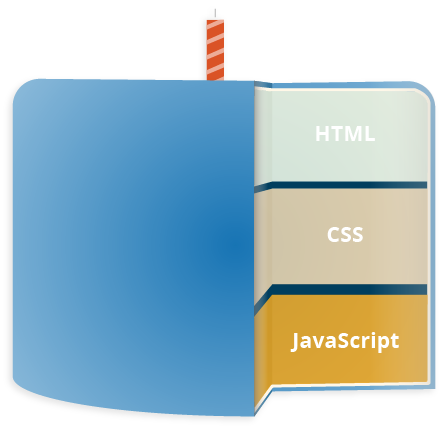
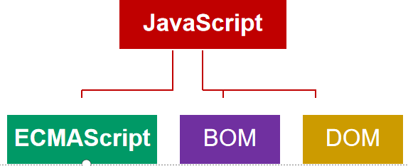

# JavaScript基础知识
[微软官方的JavaScrip教程](https://channel9.msdn.com/Series/Beginners-Series-to-JavaScript/Beginning-the-Beginners-series-1-of-51)

## 1. JavaScript简述

> 世界上第一款浏览器的诞生(Netscape Navigator),早起的浏览器只能浏览静态的网页，简陋的网页也仅仅只能是一些文字的展示相当于报纸一样。
>
> 随着网络技术发展我们需要用户这注册和登录网页，为了实现页面的用户信息验证技术，从而需要一门页面的数据校验的语言去做这件事。网景公司就开发出来了javascript.
>
> **网景公司发布的JavaScript：**
>
> 当 Netscape Navigator 崭露头角时，Nombas 开发了一个可以嵌入网页中的 CEnvi 的版本。这些早期的试验被称为 Espresso Page（浓咖啡般的页面），它们代表了第一个在万维网上使用的客户端语言。而 Nombas 丝毫没有料到它的理念将会成为万维网的一块重要基石。
>
> 当网上冲浪越来越流行时，对于开发客户端脚本的需求也逐渐增大。此时，大部分因特网用户还仅仅通过 28.8 kbit/s 的调制解调器连接到网络，即便这时网页已经不断地变得更大和更复杂。而更加加剧用户痛苦的是，仅仅为了简单的表单有效性验证，就要与服务器进行多次地往返交互。设想一下，用户填完一个表单，点击提交按钮，等待了 30 秒的处理后，看到的却是一条告诉你忘记填写一个必要的字段。
>
> 那时正处于技术革新最前沿的 Netscape，开始认真考虑开发一种客户端脚本语言来解决简单的处理问题。
>
> 当时工作于 Netscape 的 Brendan Eich，开始着手为即将在 1995 年发行的 Netscape Navigator 2.0 开发一个称之为 LiveScript 的脚本语言，当时的目的是在浏览器和服务器（本来要叫它 LiveWire）端使用它。Netscape 与 Sun 及时完成 LiveScript 实现。
>
> 就在 Netscape Navigator 2.0 即将正式发布前，Netscape 将其更名为 JavaScript，目的是为了利用 Java 这个因特网时髦词汇。Netscape 的赌注最终得到回报，JavaScript 从此变成了因特网的必备组件。
>
> **三足鼎立:**
>
> 因为 JavaScript 1.0 如此成功，Netscape 在 Netscape Navigator 3.0 中发布了 1.1 版。恰巧那个时候，微软决定进军浏览器，发布了 IE 3.0 并搭载了一个 JavaScript 的克隆版，叫做 JScript（这样命名是为了避免与 Netscape 潜在的许可纠纷）。微软步入 Web 浏览器领域的这重要一步虽然令其声名狼藉，但也成为 JavaScript 语言发展过程中的重要一步。
>
> 在微软进入后，有 3 种不同的 JavaScript 版本同时存在：Netscape Navigator 3.0 中的 JavaScript、IE 中的 JScript 以及 CEnvi 中的 ScriptEase。与 C 和其他编程语言不同的是，JavaScript 并没有一个标准来统一其语法或特性，而这 3 种不同的版本恰恰突出了这个问题。随着业界担心的增加，这个语言的标准化显然已经势在必行。
>
> **标准的指定:**
>
> 997 年，JavaScript 1.1 作为一个草案提交给欧洲计算机制造商协会（ECMA）。第 39 技术委员会（TC39）被委派来“标准化一个通用、跨平台、中立于厂商的脚本语言的语法和语义”(http://www.ecma-international.org/memento/TC39.htm)。由来自 Netscape、Sun、微软、Borland 和其他一些对脚本编程感兴趣的公司的程序员组成的 TC39 锤炼出了 ECMA-262，该标准定义了名为 ECMAScript 的全新脚本语言。
>
> 在接下来的几年里，国际标准化组织及国际电工委员会（ISO/IEC）也采纳 ECMAScript 作为标准（ISO/IEC-16262）。从此，Web 浏览器就开始努力（虽然有着不同的程度的成功和失败）将 ECMAScript 作为 JavaScript 实现的基础。
>
> 我们可以称之为JavaScript，也可以是ECMScript都是一样的。

## 2.ECMScript标准的制定和版本

> 1998年6月，ECMAScript 2.0版发布。
>
> 1999年12月，ECMAScript 3.0版发布，成为JavaScript的通行标准，得到了广泛支持。
>
> 2007年10月，ECMAScript 4.0版草案发布，对3.0版做了大幅升级，预计次年8月发布正式版本。草案发布后，由于4.0版的目标过于激进，各方对于是否通过这个标准，发生了严重分歧。以Yahoo、Microsoft、Google为首的大公司，反对JavaScript的大幅升级，主张小幅改动；以JavaScript创造者Brendan Eich为首的Mozilla公司，则坚持当前的草案。
>
> 2008年7月，由于对于下一个版本应该包括哪些功能，各方分歧太大，争论过于激进，ECMA开会决定，中止ECMAScript 4.0的开发，将其中涉及现有功能改善的一小部分，发布为ECMAScript 3.1，而将其他激进的设想扩大范围，放入以后的版本，由于会议的气氛，该版本的项目代号起名为Harmony（和谐）。会后不久，ECMAScript 3.1就改名为ECMAScript 5。
>
> 2009年12月，ECMAScript 5.0版正式发布。Harmony项目则一分为二，一些较为可行的设想定名为JavaScript.next继续开发，后来演变成ECMAScript 6；一些不是很成熟的设想，则被视为JavaScript.next.next，在更远的将来再考虑推出。
>
> 2011年6月，ECMAscript 5.1版发布，并且成为ISO国际标准（ISO/IEC 16262:2011）。
>
> 2013年3月，ECMAScript 6草案冻结，不再添加新功能。新的功能设想将被放到ECMAScript 7。
>
> 2013年12月，ECMAScript 6草案发布。然后是12个月的讨论期，听取各方反馈。
>
> 2015年6月17日，ECMAScript 6发布正式版本，即*ECMAScript 2015*。
>
> ECMA的第39号技术专家委员会（Technical Committee 39，简称TC39）负责制订ECMAScript标准，成员包括Microsoft、Mozilla、Google等大公司。TC39的总体考虑是，ES5与ES3基本保持兼容，较大的语法修正和新功能加入，将由JavaScript.next完成。
>
> 截止发布日期，JavaScript的官方名称是ECMAScript 2015，Ecma国际意在更频繁地发布包含小规模增量更新的新版本，下一版本将于2016年发布，命名为ECMAScript 2016。新版本将按照ECMAScript+年份的形式发布。
>
> ES6是继ES5之后的一次主要改进，语言规范由ES5.1时代的245页扩充至600页。ES6增添了许多必要的特性，例如：模块和类，以及一些实用特性，例如Maps、Sets、Promises、生成器（Generators）等。尽管ES6做了大量的更新，但是它依旧完全向后兼容以前的版本，标准化委员会决定避免由不兼容版本语言导致的“web体验破碎”。结果是，所有老代码都可以正常运行，整个过渡也显得更为平滑，但随之而来的问题是，开发者们抱怨了多年的老问题依然存在。

## 3.JavaScript的作用

+ Html  网页的基本的架构
+ Css 网页的样式，美化
+ JavaScript  网页的行为

> 浏览器的核心分为两个部分:
>
> 1. html css 渲染核心  立即解析html 和css 代码在浏览器中展示页面的效果
>
> 2. JavaScript 是等待页面的Html和Css加载完成以后，在通过JavaScript解析器解析页面的动态效果,
>
>    JavaScript是一门解析型的语言，不像其他的语言要先经过编译成对应的文件，在去运行，浏览器直接可以解析和运行JavaScripy的语言功能。

## 4. JavaScript的组成

> 1. ECMAScript是一种语法标准
>    +  语法、变量和数据类型、运算符、逻辑控制语句、关键字、保留字、对象
>      编码遵循ECMAScript标准
> 2. Browser Object Model（浏览器对象模型）
>    + 提供了独立于内容与浏览器窗口进行交互的对象 
> 3. Document Object Model（文档对象模型）
>    + 是HTML文档对象模型（HTML DOM）定义的一套标准方法，用来访问和操纵HTML文档

## 5. JavaScript语言的特点

> JavaScript是一种属于网络的高级脚本语言,已经被广泛用于Web应用开发,常用来为网页添加各式各样的动态功能,为用户提供更流畅美观的浏览效果。通常JavaScript脚本是通过嵌入在HTML中来实现自身的功能的。 [5] 
>
> 1. 是一种解释性脚本语言（代码不进行[预编译](https://baike.baidu.com/item/预编译)）。 [6] 
> 2. 主要用来向[HTML](https://baike.baidu.com/item/HTML)（[标准通用标记语言](https://baike.baidu.com/item/标准通用标记语言)下的一个应用）页面添加交互行为。 [6] 
> 3. 可以直接嵌入HTML页面，但写成单独的[js](https://baike.baidu.com/item/js/10687961)文件有利于结构和行为的[分离](https://baike.baidu.com/item/分离)。 [6] 
> 4. 跨平台特性，在绝大多数浏览器的支持下，可以在多种平台下运行（如[Windows](https://baike.baidu.com/item/Windows)、[Linux](https://baike.baidu.com/item/Linux)、[Mac](https://baike.baidu.com/item/Mac/173)、[Android](https://baike.baidu.com/item/Android/60243)、[iOS](https://baike.baidu.com/item/iOS/45705)等）。
> 5. JavaScript脚本语言同其他语言一样，有它自身的基本数据类型，表达式和[算术运算符](https://baike.baidu.com/item/算术运算符/9324947)及程序的基本程序框架。JavaScript提供了四种基本的数据类型和两种特殊数据类型用来处理数据和文字。而变量提供存放信息的地方，表达式则可以完成较复杂的信息处理。
> 6. 可以实现web页面的人机交互。