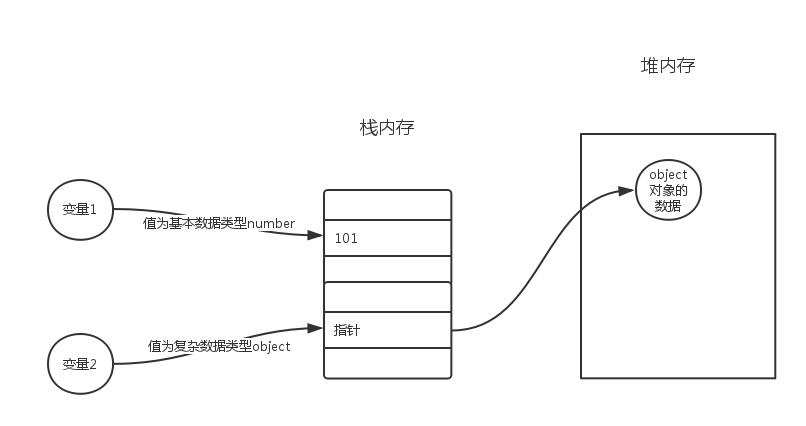

# JavaScript的基本语法

## 1. JavaScript的基本使用方式

### 1.1 **JavaScript的Hello-World**

```html
<!DOCTYPE html>
<html lang="zh-cmn-Hans">
  <head>
    <meta charset="utf-8" />
    <title>javascript</title>
    <script>
      document.write('Hello World')
    </script>
  </head>
  <body></body>
</html>

```


### 1.2 JavaScript的三种使用方式

+ head 标签内部使用JavaScript脚本
+ 在Body底部使用JavaScript甲苯
+ 使用外部的JavaScript脚本

```html
<!DOCTYPE html>
<html lang="zh-cmn-Hans">
  <head>
    <meta charset="utf-8" />
    <title>javascript</title>
    <!-- 在Head标签内部使用script标签 表示js脚本，再在script标签中间书写js代码 -->
    <script>
      document.write('Hello World')
    </script>
    <!-- 当我们将多个页面的js代码可以提取出来，在多个页面中引入使用，提高代码的复用性。页面更加的简洁 -->
    <script src="../js/index.js"></script>
  </head>
  <body>
    <!-- js脚本执行通常需要等待我们页面的Html,Css元素加载完成才可以去执行，所以我们将script脚本放在body底部 -->
    <script>
      document.write('Hello Body Bottom')
    </script>
  </body>
</html>

```

**index.js**

```javascript
document.write("Hello 外部的js文件");
```

## 2. JavaScript的基本语法

> **JavaScript \*语法\*是一套规则，它定义了 JavaScript 的语言结构。**

### 2.1 注释

> 就像 HTML 和 CSS，JavaScript 代码中也可以添加注释，浏览器会忽略它们，注释只是为你的同事（还有你，如果半年后再看自己写的代码你会说，这是什么垃圾玩意。）提供关于代码如何工作的指引。注释非常有用，而且应该经常使用，尤其在大型应用中

+ 单行注释
+ 多行注释

```html'
<script>
     // document.write('Hello Body Bottom');

     /*
      document.write('Hello Body Bottom');
      document.write('Hello Body Bottom');
     */
    </script>
```

### 2.2 关键字

> javaScript中被赋予特殊含义的单词。
>
> 在编辑器中带有颜色提示的单词。

**JavaScript保留关键字**

|          |           |            |           |              |
| -------- | --------- | ---------- | --------- | ------------ |
| abstract | arguments | boolean    | break     | byte         |
| case     | catch     | char       | class*    | const        |
| continue | debugger  | default    | delete    | do           |
| double   | else      | enum*      | eval      | export*      |
| extends* | false     | final      | finally   | float        |
| for      | function  | goto       | if        | implements   |
| import*  | in        | instanceof | int       | interface    |
| let      | long      | native     | new       | null         |
| package  | private   | protected  | public    | return       |
| short    | static    | super*     | switch    | synchronized |
| this     | throw     | throws     | transient | true         |
| try      | typeof    | var        | void      | volatile     |
| while    | with      | yield      |           |              |

### 2.3 标识符

> 代码中我们自己用来命名的名称就是标识符:
>
> + JavaScript语法严格区分大小写。
> + 可以使用:结尾 ，可以不适用分号结尾，建议加上，养成良好的编码习惯和规范。
>
> + 标识符由字母，数字，下划线,$组成
> + 标识符不能以数字开头
> + 建议标识符也不要使用$开头，有些标识符可以使用\_开头。
> + 关键字不能作为标识符使用
>
> + 标识符在命名的时候严格遵守驼峰命名法
>   + 方法名,变量名,参数名 使用小驼峰命名
>   + 构造函数等使用大驼峰命名法

```javascript
 	var num = 100;//声明变量
     function homeAddress(){}//声明函数
     function Student(){}//声明构造函数
```

### 2.4 变量

> - 变量是计算机内存中存储数据的标识符，根据变量名称可以获取到内存中存储的数据
> - 为什么要使用变量
>   - 使用变量可以方便的获取或者修改内存中的数据

#### 2.4.1 变量声明的几种方式

****

> **JavaScript是一门若数据类型的语言，所有变量的声明使用var,let,const,计算机根据值的数据类型去决定变量的数据类型。**
>
> 变量的声明有几种格式:
>
> ​	var 变量名  = 值 ;(ES6之前的声明格式)
>
> ​	let 变量名 = 值;(ES6中变量的声明方式)
>
> ​	const 变量名  = 值;(ES6中常量的声明方式)

**先声明再赋值:**

```javascript
var  num ;
	num = 200;
```

**声明的时候赋值:**

```javascript
var num = 300;
```

**声明多个变量后在赋值:**

```javascript
var num,age,address;
    num = 100;
    age = 99;
    addresss = "西安市";
```

**声明多个变量同时赋值:**

```javascript
var num = 100,age = 88, price = 99.99;
```

**变量必须先初始化再使用不然就是报错: undefined**

```javascript
var num ;
console.log(num);//undefined  未定义   就是变量存在但是没有值
```

#### 2.4.2 JavaScript 变量内存



### 2.5 数据类型

+ 基本数据类型
  + boolean
  + Null
  + undefined
  + Number
  + String
  + Bigint
  + Symbol
+ Object
  + 数组
  + 对象
  + 函数
  + .....

