#   JavaScript的基本语法 :imp:

## 1. JavaScript的基本使用方式

### 1.1 **JavaScript的Hello-World**

```html
<!DOCTYPE html>
<html lang="zh-cmn-Hans">
  <head>
    <meta charset="utf-8" />
    <title>javascript</title>
    <script>
      document.write('Hello World')
    </script>
  </head>
  <body></body>
</html>

```

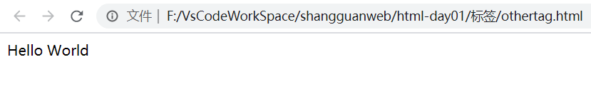

### 1.2 JavaScript的三种使用方式

+ head 标签内部使用JavaScript脚本
+ 在Body底部使用JavaScript甲苯
+ 使用外部的JavaScript脚本

```html
<!DOCTYPE html>
<html lang="zh-cmn-Hans">
  <head>
    <meta charset="utf-8" />
    <title>javascript</title>
    <!-- 在Head标签内部使用script标签 表示js脚本，再在script标签中间书写js代码 -->
    <script>
      document.write('Hello World')
    </script>
    <!-- 当我们将多个页面的js代码可以提取出来，在多个页面中引入使用，提高代码的复用性。页面更加的简洁 -->
    <script src="../js/index.js"></script>
  </head>
  <body>
    <!-- js脚本执行通常需要等待我们页面的Html,Css元素加载完成才可以去执行，所以我们将script脚本放在body底部 -->
    <script>
      document.write('Hello Body Bottom')
    </script>
  </body>
</html>

```

**index.js**

```javascript
document.write("Hello 外部的js文件");
```

## 2. JavaScript的基本语法

> **JavaScript \*语法\*是一套规则，它定义了 JavaScript 的语言结构。**

### 2.1 注释

> 就像 HTML 和 CSS，JavaScript 代码中也可以添加注释，浏览器会忽略它们，注释只是为你的同事（还有你，如果半年后再看自己写的代码你会说，这是什么垃圾玩意。）提供关于代码如何工作的指引。注释非常有用，而且应该经常使用，尤其在大型应用中

+ 单行注释
+ 多行注释

```html'
<script>
     // document.write('Hello Body Bottom');

     /*
      document.write('Hello Body Bottom');
      document.write('Hello Body Bottom');
     */
    </script>
```

### 2.2 关键字

> javaScript中被赋予特殊含义的单词。
>
> 在编辑器中带有颜色提示的单词。

**JavaScript保留关键字**

|          |           |            |           |              |
| -------- | --------- | ---------- | --------- | ------------ |
| abstract | arguments | boolean    | break     | byte         |
| case     | catch     | char       | class*    | const        |
| continue | debugger  | default    | delete    | do           |
| double   | else      | enum*      | eval      | export*      |
| extends* | false     | final      | finally   | float        |
| for      | function  | goto       | if        | implements   |
| import*  | in        | instanceof | int       | interface    |
| let      | long      | native     | new       | null         |
| package  | private   | protected  | public    | return       |
| short    | static    | super*     | switch    | synchronized |
| this     | throw     | throws     | transient | true         |
| try      | typeof    | var        | void      | volatile     |
| while    | with      | yield      |           |              |

### 2.3 标识符

> 代码中我们自己用来命名的名称就是标识符:
>
> + JavaScript语法严格区分大小写。
> + 可以使用:结尾 ，可以不适用分号结尾，建议加上，养成良好的编码习惯和规范。
>
> + 标识符由字母，数字，下划线,$组成
> + 标识符不能以数字开头
> + 建议标识符也不要使用$开头，有些标识符可以使用\_开头。
> + 关键字不能作为标识符使用
>
> + 标识符在命名的时候严格遵守驼峰命名法
>   + 方法名,变量名,参数名 使用小驼峰命名
>   + 构造函数等使用大驼峰命名法

```javascript
 	var num = 100;//声明变量
     function homeAddress(){}//声明函数
     function Student(){}//声明构造函数
```

### 2.4 变量

> - 变量是计算机内存中存储数据的标识符，根据变量名称可以获取到内存中存储的数据
> - 为什么要使用变量
>   - 使用变量可以方便的获取或者修改内存中的数据

#### 2.4.1 变量声明的几种方式

****

> **JavaScript是一门若数据类型的语言，所有变量的声明使用var,let,const,计算机根据值的数据类型去决定变量的数据类型。**
>
> 变量的声明有几种格式:
>
> ​	var 变量名  = 值 ;(ES6之前的声明格式)
>
> ​	let 变量名 = 值;(ES6中变量的声明方式)
>
> ​	const 变量名  = 值;(ES6中常量的声明方式)

**先声明再赋值:**

```javascript
var  num ;
	num = 200;
```

**声明的时候赋值:**

```javascript
var num = 300;
```

**声明多个变量后在赋值:**

```javascript
var num,age,address;
    num = 100;
    age = 99;
    addresss = "西安市";
```

**声明多个变量同时赋值:**

```javascript
var num = 100,age = 88, price = 99.99;
```

**变量必须先初始化再使用不然就是报错: undefined**

```javascript
var num ;
console.log(num);//undefined  未定义   就是变量存在但是没有值
```

#### 2.4.2 JavaScript 变量内存

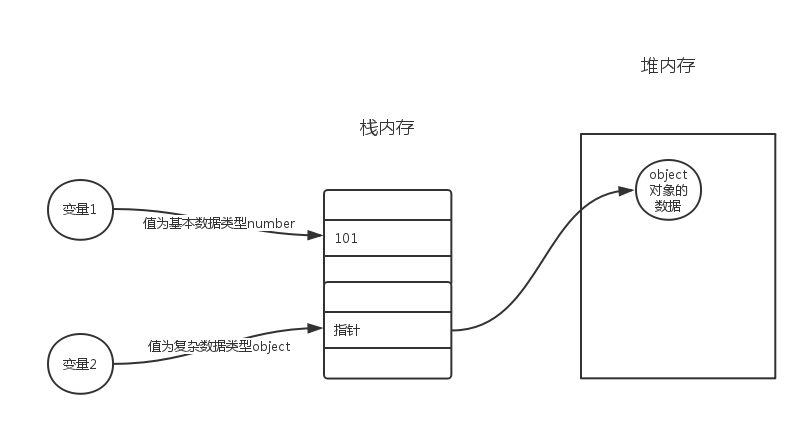

### 2.5 数据类型

#### 2.5.1 数据类型的基础

> typeof  查看数据的数据类型

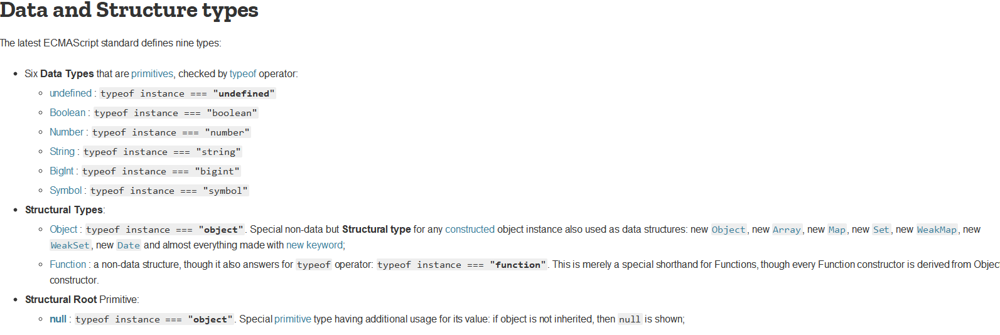
> 数据类型的分类:
>
> **基本数据类型**:
>
> + undefined   未定义   变量声明了但是没有值.
>+ boolean   true/false
> + Number   数字类型
>  + 整数类型
>   + 浮点类型 js在使用浮点类型进行运算的时候精度不能保证，所以要注意。
>   + 正无穷大
>   + 负无穷大
>   + NaN  不是数字类型
> + isNaN  is not a number 
> + String   字符串的值 只要被定义了就是不可变的
>   + 与某些编程语言（例如C）不同，JavaScript字符串是不可变的。这意味着一旦创建了字符串，就无法对其进行修改。(MDN官网)
> + bigint 
>  + 使用`BigInt`s，即使超出`Number`s的安全整数限制，您也可以安全地存储和操作大整数。
> + Symbol(Es6新添加的)
> 
>+ null 表示一个空的对象
> 
>结构类型:Object   function  数组 .....
> 
>使用typeof 可以获取数据的数据类型

```html
<script>
      var num = 100 //数字类型
      var price = 99.99 //数字类型 中的浮点类型
      var result = true //boolea类型
      var name = 'joke' //字符串类型 字符串创建出来以后值就是不可以变化的
      var address = null //表示变量没有指向任何的对象
      var age = undefined //未定义  没有值
      var totalPrice = 2n
      var num1 = 0b101 // 二进制的值  十进制的值是5
      var num2 = 011 //八进制 十进制的值是9
      var num3 = 0x1f //十六进制  十进制的值是 15+16 = 31

      console.log(num)
      console.log(price)
      console.log(result)
      console.log(name)
      console.log(address)
      console.log(age)
      console.log(totalPrice)
      console.log(isNaN('Hello'))
      console.log(num1)
      console.log(num2)
      console.log(num3)
    </script>
```

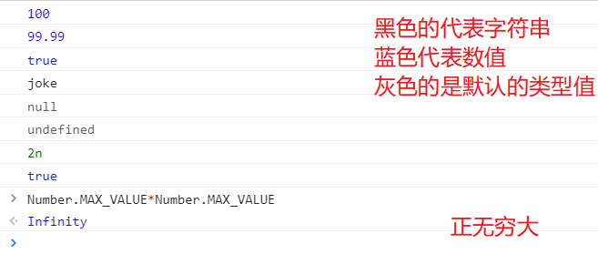

#### 2.5.2 数据类型的转换

> javascript中数据类型转换是将其他的数据类型转换为: String Number Boolean值
>
> 强制数据类型的转化: 将一个数据类型强制转换为其他的数据类型

1. 转化为字符串类型
   + toString()
   + String()
   + 拼接字符串

```html
	<script>
        //null 和 undefined 没有toString方法 如果使用会报错
      var num = 123
      console.log(num)
      console.log(num.toString()) //使用方法转为字符串
      console.log(num + '') //拼接空的字符串转为字符串
      console.log(String(null)) //对于不能使用toString()的数值
    </script>
```

2. 转换为数值类型
   + Number()  数字的字符串类型  包含不是数字的值就是NaN
   + Number.parseInt()  转换为整数类型
     + 有的浏览器对进制的数字转换会有问题 
       + `var num = 080; 有的会按照10进制转换 有的会按照二进制转换`
     + `parseInt(数值,进制);`   Number.parseInt(080,10); 10进制转换数值
   + Number.parseFloat() 转换为浮点类型
   + \+ \-   进行拼接和运算后的结果是数字值

```html
 <script>
      var str = '123'
      var price = '99.99'
      console.log(Number('123')) //数值类型的字符串转为数值类型
      console.log(Number('123abc')) //NaN 字符串中又是数字值的时候就是NaN
      console.log(Number.parseInt(str)) //转为整数类型
      console.log(Number.parseFloat(price)) //转为浮点类型
      console.log('123' + 0) //数值的运算可以自动转换 拼接后的是数字类型的值
      console.log('123' - 0) //进行运算后的值是原本的数字值
    </script>
```

3. 转换为boolean类型

> 0  " "(空字符串) null undefined NaN 会转换成false  其它都会转换成 true

```html
if (0) {
        console.log('1')
      } else {
        console.log('0')
      }
```

### 2.6 运算符

> 通过运算符可以对一个或者多个值运行运算，并获取运算的结果

#### 2.6.1 算数运算符

| 运算符 | 描述                                                         |
| :----- | :----------------------------------------------------------- |
| +      | 加法 字符串的拼接  <br />任何数据类型的值和字符串运算结果都是字符串 |
| -      | 减法                                                         |
| *      | 乘法                                                         |
| /      | 除法                                                         |
| %      | 系数                                                         |
| ++     | 递加                                                         |
| --     | 递减                                                         |

+ 任何值和字符串相加结果都是字符串  字符串拼接操作
+ 给任意数据类型的值 + "" 加空的字符串就是拼接为 字符串 
+ 任何值做  - * / 运算都会换转换才能Number类型  
  + `var num = '123'\*1; 转换为Number类型`
+ 可以对其他的值使用 + 转换为Number类型 (一元运算符)
  + `var  result = 123 + + "123"+90;  `  这都是隐式的转换

#### 2.6.2 赋值运算符

| 运算符 | 例子   | 等同于    |
| :----- | :----- | :-------- |
| =      | x = y  | x = y     |
| +=     | x += y | x = x + y |
| -=     | x -= y | x = x - y |
| *=     | x *= y | x = x * y |
| /=     | x /= y | x = x / y |
| %=     | x %= y | x = x % y |

#### 2.6.3 关系运算符

| 运算符 | 描述           |
| :----- | :------------- |
| ==     | 等于           |
| ===    | 等值等型       |
| !=     | 不相等         |
| !==    | 不等值或不等型 |
| >      | 大于           |
| <      | 小于           |
| >=     | 大于或等于     |
| <=     | 小于或等于     |
| ?      | 三元运算符     |

+ NaN 和任何值比较都是 false
+ 字符串比较是比较字符串的Unicode编码 但是会有问题
  + 字符串字母比较 位数相同 unicode编码比较 位数相同时进位比较 
  + （中文编码比较会有问题）汉字的编码顺序
  +  数字的字符串在比较的时候一定要进行转型
    + ``"11111111" < "5" 按照位比价 所以会有问题  进行转型  "111111" < +"5"``
+ NaN 不和任何值相等 包括自身
+ isNaN 检测是是否是NaN

```javascript

```


#### 2.6.4 逻辑运算符

| 运算符 | 描述   |
| :----- | :----- |
| &&     | 逻辑与 |
| \|\|   | 逻辑或 |
| !      | 逻辑非 |

+ 可以通过将其他数据类型进行两次取反转换为布尔类型 (隐式转换)

  + `console.log(!! "Hello");  结果为true`

+ && 短路与 前边不成立就会忽略后边的不去判断

  + `非布尔值的运算 先将其转换为布尔值运算  在运算后返回结果的原值 `

  + `第一个值是true返回第二个值`

  + `第一个值是false 返回第一个值`

  + `1&&2 返回 2  都是true 返回后边的值`

  + `两个值中有false 返回fasle   都是false 返回前面的false`

#### 2.6.5 类型运算符

| 运算符     | 描述                                  |
| :--------- | :------------------------------------ |
| typeof     | 返回变量的类型。                      |
| instanceof | 返回 true，如果对象是对象类型的实例。 |

#### 2.6.6 位运算符

| 运算符 | 描述         | 例子    | 等同于       | 结果 | 十进制 |
| :----- | :----------- | :------ | :----------- | :--- | :----- |
| &      | 与           | 5 & 1   | 0101 & 0001  | 0001 | 1      |
| \|     | 或           | 5 \| 1  | 0101 \| 0001 | 0101 | 5      |
| ~      | 非           | ~ 5     | ~0101        | 1010 | 10     |
| ^      | 异或         | 5 ^ 1   | 0101 ^ 0001  | 0100 | 4      |
| <<     | 零填充左位移 | 5 << 1  | 0101 << 1    | 1010 | 10     |
| >>     | 有符号右位移 | 5 >> 1  | 0101 >> 1    | 0010 | 2      |
| >>>    | 零填充右位移 | 5 >>> 1 | 0101 >>> 1   | 0010 | 2      |

#### 2.6.7 JavaScript运算符的优先级

[MDNJavaScript运算符的优先级](https://developer.mozilla.org/zh-CN/docs/Web/JavaScript/Reference/Operators/Operator_Precedence)

### 2.7 流程控制语句

> 表达式: 一个表达式可以产生一个值，有可能是运算、函数调用、有可能是字面量。表达式可以放在任何需要值的地方。

#### 2.7.1 顺序语句

> 程序的默认执行流程就是从上到下。从左到右的执行。

**代码块**

```javascript
{
    /*在JavaScript当中代码块只有对代码分组的作用  并不能对代码进行隔离 和其他的编程语言不一样
    	代码块中的代码对外部的代码是可见的、
    */
    var num = 100;
}
```

#### 2.7.2 分支语句

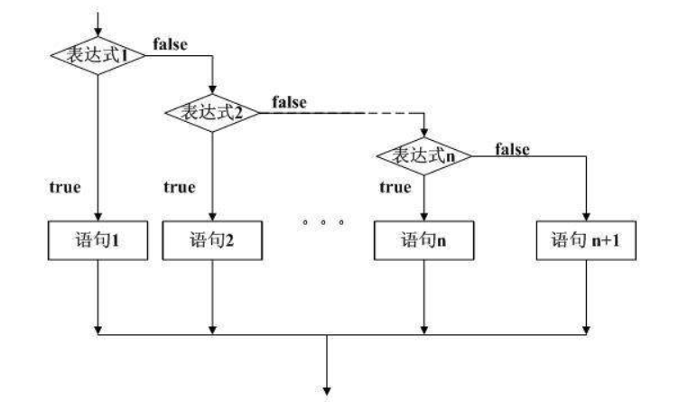

> 分支语句分为以下几种:
>
> + if(布尔表达式/布尔值){ 执行的代码}
> + if() else{}
> + if () else if(){}
> + switch 语句
>
> **注意:**
>
> + undefined,null,0,-0,NaN,"" //空字符串  转为 flase 其他的值是true

```javascript
if (/* 条件表达式 */) {
  // 执行语句
}

if (/* 条件表达式 */){
  // 成立执行语句
} else {
  // 否则执行语句
}

if (/* 条件1 */){
  // 成立执行语句
} else if (/* 条件2 */){
  // 成立执行语句
} else if (/* 条件3 */){
  // 成立执行语句
} else {
  // 最后默认执行语句
}
```

```javascript
switch (expression) {
  case 常量1:
    语句;
    break;
  case 常量2:
    语句;
    break;
  case 常量3:
    语句;
    break;
  …
  case 常量n:
    语句;
    break;
  default:
    语句;
    break;
}
```

> 思考题: 
>
> var num = !!"123"; //结果是？
>
> var num = !!123; //结果是？

#### 2.7.3 循环语句


> 循环语句分为以下:
>
> + while()
> + do{} while{}
> + for (){} 
> + for 循环嵌套

**while循环:**

> while 循环为true 时出现死循环，避免出现死循环

```javascript
// 当循环条件为true时，执行循环体，
// 当循环条件为false时，结束循环。
while (循环条件) {
  //循环体
}
```

**do while 循环:**

> do..while循环和while循环非常像，二者经常可以相互替代，但是do..while的特点是不管条件成不成立，都会执行一次。

```javascript
do {
  // 循环体;
} while (循环条件);
```

**For循环:**

> while和do...while一般用来解决无法确认次数的循环。for循环一般在循环次数确定的时候比较方便

```javascript
// for循环的表达式之间用的是;号分隔的，千万不要写成,
for (初始化表达式1; 判断表达式2; 自增表达式3) {
  // 循环体4
}
```

**Break:**

> break 语句跳出循环后，会继续执行该循环之后的代码

**Continue:**

> **continue 语句**中断循环中的迭代，如果出现了指定的条件，然后继续循环中的下一个迭代。

**循环的嵌套**

```javascript
 /* 外层循环控制行  内层循环控制列
        每行结束进行换行
       */
      for (var i = 0; i < 10; i++) {
        for (var k = 0; k < 10; k++) {
          document.write('Hello \t');
        }
        document.write('<br>');
      }
```

**九九乘法表**

```javascript
/* for (var i = 1; i <= 9; i++) {
        for (var k = 1; k <= 9; k++) {
          document.write(k + '*' + i + '=' + i * k + '\t');
        }
        document.write('<br>');
      } */

      for (var i = 1; i <= 9; i++) {
        for (var k = 1; k <= i; k++) {
          document.write(k + '*' + i + '=' + i * k + '&nbsp;');
        }
        document.write('<br>');
      }
```

**水仙花数**

```javascript
 for (var i = 100; i < 1000; i++) {
        //获取个位数
        var a = i % 10;
        //获取十位
        var b = Number.parseInt((i / 10) % 10);
        //获取百位数
        var c = Number.parseInt(i / 100);

        /* if (a * a * a + b * b * b + c * c * c == i) {
          console.log(i + '  是水仙花数');
        } */
        /* 幂次方 */
        if (Math.pow(a,3) + b * b * b + c * c * c == i) {
          console.log(i + '  是水仙花数');
        }
      }
```

**等腰三角形**

```javascript
for (var i = 1; i <= 4; i++) {
        //前半部分
        for (var k = 4 - i; k > 0; k--) {
          document.write('&ensp;');
        }
        //后半部分
        for (var j = 1; j <= 2 * i - 1; j++) {
          document.write('*');
        }
        document.write('<br>');
      }
```

**鸡兔同笼**

> 鸡兔同笼 共有头 35 脚94 鸡多少 兔多少

```javascript
//i为鸡的数量
      for (var i = 0; i <= 35; i++) {
        if (i * 2 + (35 - i) * 4 == 94) {
          console.log('鸡的数量是:' + i);
          console.log('兔的数量是:' + (35 - i));
        }
      }
```

**Chrome断点调试工具:**

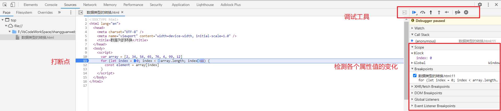

### 2.8 数组(Array)

> 所谓数组，就是将多个元素（通常是同一类型）按一定顺序排列放到一个集合中，那么这个集合我们就称之为数组.
>
> **注意:****
>
> 1. <font style='color:red;'>**在其他的严格型的语言中数组只能保存同一种数据类型的语言，在javascript中可以保存多种数据类型的值.**</font>
> 2. <font style="color:red;">**在其他严格型的语言中数组的只要被声明了，数组的长度就是不可以变化的，但是在JavaScript中数组的长度是可以变化的，获取数组的元素是通过数组的下标来获取，获取不到就是undefined** </font>

#### 2.8.1 数组的声明

> 数组的声明方式:
>
> 1. 学习归变量 变量 只能保存一个值 
>
>       数组: 就是使用同一个变量保存多个值
>
>       js是一个弱数据类型的语言 所以在js的数组中 既可以保存多个值 并且值的数据类型可以不一样
>
> 2. 数组的声明 : 
>
>       var 变量名称 = new Array()[];
>
> 3. 数组是保存多个值 在获取数组中元素值的时候 或者 给数组中元素赋值的使用使用数组下标 (index)
>
>    ​    数组的下标是从0开始
>
>       数组下标位获取不到值就是undefined 未定义
>
>       //静态声明数组 定义数组的时候给定 值 由系统计算数组的程度
>
>       var arr = new Array(2, 3, 54, 56);
>
> 4. JAVASCRIPT中数组的长度是可扩增的。
>
>       我们可以通过length属性获取数组的长度
>
> 5. 数组的简化的声明方式: 
>
>       var arr = [2,3,4,5,6,7,8];
>
> 6. 但是在使用时候尽量保持一个数组中的数据类型一致

```javascript
<script>
      //var array = new Array(2, 34, 54, 65, 76, 4, 99, 12)
      var array = [2, 34, 54, 65, 76, 4, 99, 12]
	//数组的遍历
      for (let index = 0; index < array.length; index++) {
        console.log(array[index])
      }
 	for (var i in arr) {
        console.log(i);
        console.log(arr[i]);
      }
</script>
```

#### 2.8.2 **数组的最值:**

```javascript
 var arr = [2, 24, 13, 45, 8, 99, 66, 41];
      /* 求数组中元素的最值  最大值 最小值 */
      var num = arr[1];
      for (var i in arr) {
        if (num < arr[i]) {
          num = arr[i];
        }
      }
      console.log('最大值就是:' + num);
```

#### 2.8.3 **数组的排序:**

> 数组常见的排序方式:
>
> + 冒泡排序
> + 选择排序
> + 插入排序
> + 快速排序
> + 归并排序
> + 希尔排序

**冒泡排序:**

```javascript
*/
      /* 不论任何的排序方式我们首先要确定 排序的规则: 升序 降序
      1、 冒泡排序 
          数组中 元素之间两两进行比较 ， 按照排序的规则进行换位
          
    */
      var arr = [21, 2, 34, 56, 4, 53, 67, 88, 8, 70];
      //外层循环控制比较的次数
      /* for (var i = 0; i < arr.length-1; i++) {
        //内层循环之间两两比较
        for (var k = 0; k < arr.length-1; k++) {
          if(arr[k] > arr[k+1]){
            var  temp = arr[k];
            arr[k] = arr[k+1];
            arr[k+1] = temp;
          }
        }
      } */
      //代码的比较次数减少  效率提交
      for (var i = 0; i < arr.length - 1; i++) {
        //内层循环之间两两比较
        for (var k = 0; k < arr.length - 1 - i; k++) {
          if (arr[k] > arr[k + 1]) {
            var temp = arr[k];
            arr[k] = arr[k + 1];
            arr[k + 1] = temp;
          }
        }
      }
      //效果 一样  考虑代码的优化 性能和时间
      //在看排序后的结果值
      console.log(arr);
```

**选择排序:**

```javascript
var arr = [21, 2, 34, 56, 4, 53, 67, 88, 8, 70];
      /* for (var i = 0; i < arr.length; i++) {
        for (var k = 0; k < arr.length; k++) {
          if (arr[k] > arr[i]) {
            var temp = arr[k];
            arr[k] = arr[i];
            arr[i] = temp;
          }
        }
      } */
      //代码有没有问题
      //从外层下标位的下一个元素参与比较
      for (var i = 0; i < arr.length - 1; i++) {
        for (var k = i + 1; k < arr.length; k++) {
          if (arr[k] > arr[i]) {
            var temp = arr[k];
            arr[k] = arr[i];
            arr[i] = temp;
          }
        }
      }
      console.log(arr);
```

**插入排序:**

```javascript
/* 插入排序: 
        生活中玩扑克牌。 给你一副牌怎么整理的。
        在数组的排序中呢?
    */
      var arr = [21, 2, 34, 56, 4, 53, 67, 88, 8, 70];

      for (var i = 0; i < arr.length - 1; i++) {
        //获取下一个元素
        var temp = arr[i + 1];
        //获取当前的下标位
        var index = i;

        while (index >= 0 && temp < arr[index]) {
          arr[index + 1] = arr[index];
          index--;
        }
        //console.log(index);
        // while循环中index多运算一次  -1
        arr[index + 1] = temp;
      }
      console.log(arr);
```

## 3. 函数(Function)

> 函数是 JavaScript 中的基本组件之一。 一个函数是 JavaScript 过程 — 一组执行任务或计算值的语句。要使用一个函数，你必须将其定义在你希望调用它的作用域内。
>
> 函数也是程序的基本单元，是完成特定代码的语句块。
>
> 在javaScript中我们可以将重复使用的代码封装起来，具有部分功能代码封装，起个名字在其他的地方进行调用，就是函数
>
> <font style="color:red">JavaScript中函数的定义:</font>
>
> function 函数的名称(参数列表){
>
> ​	方法语句;
>
> }
>
> **函数只有被调用才能使用，可以重复调用和使用:**

### 3.1 函数的声明和使用

> 函数的声明以后并不能直接执行，函数只有被调用才能执行。
>
> 一个函数它通常只能干一件事情，但是也会有一些复杂的函数，函数的名称我们通常使用动词。

#### 3.1.0 使用构造函数创建函数

```javascript
var fun = new Function(console.log("Hello World"));
fun();
var funn = new Function("args","console.log(`${args}`)");
funn("Hahahaha");
```

> 使用起来比较的麻烦，很少用。

#### 3.1.1 直接声明

```javascript
/*函数的声明*/
function show(){
    console.log("Hello JavaScript");
}
/*函数的调用*/
show();
show();
```

#### 3.1.2 函数表达式声明函数

```javascript
/*函数式声明函数*/
var show = function(){//后边其实是一个匿名的函数
     console.log("Hello JavaScript");
}
console.log(show);
/*函数式声明的函数的调用*/
show();
show();
```

#### 3.1.3 全局变量和局部变量

> 全局变量:  在函数外声明的变量，网页上的所有脚本和函数都能访问它
>
> 局部变量：在函数内部声明的变量（必须使用var），只能在函数内部访问它
>
> + 可以在不同的函数中使用名称相同的局部变量
>
> 变量的生命周期:
>
> + 全局变量在网页关闭以后被从内存中清除
> + 局部变量在方法执行完成以后从内存中被清除

### 3.2 函数的返回值

> 比如我们需要一个计算数字和的函数，执行完成以后我们要拿到数字的和的值。
>
> **返回值函数的声明:**
>
> function show(){
>
> ​		return  返回值;
>
> }
>
> 如果函数使用 return语句，但是return后面没有任何值，那么函数的返回值也是：undefined

```javascript
function sum(){
    return 10 + 20;
}
sum();//有返回值的函数调用不会出现结果
var result = sum();//必须先接收返回值
console.log(result);
```

> 在函数执行的时候,如果程序不行再继续向后边执行我们可以使用return false 终止程序运行。

```javascript
 <script>
      function show() {
        if (10 > 9) {
          return false
        }
        //下面的语句并不会执行
        console.log('JavaScript')
      }
      show()
</script>
```

### 3.3 函数的传参

> ```javascript
> //param 是形式参数 仅仅是在函数中进行占位
> function [name]([param[, param[, ... param]]]) {
>    statements
> }
> ```

#### 3.3.1 普通参数

```javascript
//javaScript是弱数据类型的语言 所以在声明参数的时候不需要数据类型，系统会根据函数调用时传入的参数的数据类型判断形式参数的数据类型
function sum(a,b){
    console.log(a+b);
}
sum(10,20);
sum(99.99,90);
```

#### 3.3.2 可变参数

> 有的时候在程序的执行中我们并不确定，参数的个数，就可以使用可变参数。可变参数的本质就是数组.
>
> function show (...param){}
>
> <font style="color:red;">function show(name,age,.....param){} 多个参数和可变参数使用的时候可变参数必须在最后边，前边的参数取完值剩下的交给可变参数。可变参数在前边会报错</font>

```javascript
 <script>
      function show(...param) {
        console.log(param)
      }
      show(1, 2, 3, 4, 5, 5)
      function sum(name, age, ...param) {
        console.log(name + ':' + age + ':' + param)
      }
      sum('joke', 23, 45, 67, 89)
    </script>
```

#### 3.3.3 arguments的使用

> JavaScript中，arguments对象是比较特别的一个对象，实际上是当前函数的一个内置属性。也就是说所有函数都内置了一个arguments对象，arguments对象中存储了传递的所有的实参。arguments是一个伪数组，因此及可以进行遍历

```javascript
 function sum(name, age, ...param) {
        console.log(arguments);
      }
      sum('joke', 23, 45, 67, 89)
```

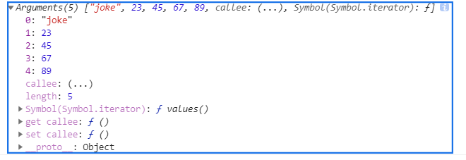

#### 3.3.4 匿名函数

> 没有名字的函数,通常是将一个匿名函数交给一个变量去引用。也就是函数的函数表达式声明形式。

```javascript
var show = function(){}
```

#### 3.3.5 函数的自调用  :small_airplane:

> 匿名函数不能通过直接调用来执行，因此可以通过匿名函数的自调用的方式来执行
>
> 自我调用的函数只能使用一次。

```javascript
(function(){
    console.log("Helllo 自我调用的函数");
})()
//为了区别明显在前面加分号
 ;(function (a, b) {
        console.log('自我的调用函数的第一种使用方式:' + (a + b))
      })(100, 200)

 ;(function (a, b) {
        console.log('自我的调用函数的第二种使用方式:' + (a + b))
      }(100, 200))
//还有一种书写方式
  +function (a, b) {
        console.log('自我的调用函数的第一种使用方式:' + (a + b))
      }(100, 200)
```

> `+`号使得js解释器认为它现在在处理的是一个表达式, 而非函数定义. 如果不写这个`+`号, 解释器会按照函数定义去处理, 并认为后面的`()`是语法错误.
>
> 其实除了`+`号, `-`, `!`, `~`以及其他一元操作符都可以产生相同的效果.
>
> 与要在用`()`把函数包起来的常用写法相比, 这种写法的好处(也许)就是只要在前面加个`+`就行了, 更省事儿. 当然, 最后的`();`是一定不能少的.

#### 3.5.6 函数作为参数和返回值

> 函数也是一种数据类型。所以函数也可以作为参数来使用后面回见到很多的(回调函数)
>
> 函数也可以作为返回值来使用

```javascript
<script>
    //函数作为参数使用
      function num(a, b) {
        return a + b
      }
      function show(a) {
        console.log(a)
      }
      show(num(100, 200))
  </script>

//函数作为返回值使用
function show(a){
    var num = 100;
    return function(){
        return a+num;
    }
}
show(200)()//返回值的函数执行;
```

### 3.4 箭头函数(重点) :kissing_smiling_eyes:

> 在ES6的语法中，新规定了一种函数叫做箭头函数 ，现在使用的普遍较多,是对函数式编程的引进。
>
> 语法格式:  var show = (参数列表)=>{
>
> ​	执行语句;
>
> }

```javascript
 <script>
      var show = () => {
        console.log('Hello World')
      }
      var sum = () => console.log('没有返回值可以省略 大括号')
      // 没有返回值的带参数的箭头函数
      var num = (a, b) => console.log(a + b)
      // 有返回值  有参数的 箭头函数
      var caculate = (a, b) => {
        return a + b
      }
</script>
```

**注册的练习: return 用法**

```html
<!DOCTYPE html>
<html lang="en">
  <head>
    <meta charset="UTF-8" />
    <meta name="viewport" content="width=device-width, initial-scale=1.0" />
    <title>Document</title>
  </head>
  <body>
    <form method="POST">
      <input type="text" name="username" id="username" /><br />

      <input type="password" name="password" id="password" /><br />
      <input type="text" name="email" id="email" /><br />
      <input type="button" value="注册" onclick="sub()" />
    </form>
    <script>
      //表单验证
      function sub() {
        var username = document.querySelector('#username').value;
        var pass = document.querySelector('#password').value;
        var email = document.querySelector('#email').value;
        if (username.length < 6 || username.length > 12) {
          console.log('用户名长度必须在6-12位');
          return false;
        }
        if (pass.length < 6 || pass.length > 12) {
          console.log('密码长度必须在6-12位');
          return false;
        }
        var regexp = /\w+([-+.]\w+)*@\w+([-.]\w+)*\.\w+([-.]\w+)*/;
        if (!regexp.test(email)) {
          console.log('邮箱格式不正确');
          return false;
        }
        console.log('------------表单的提交操作-------------');
      }
    </script>
  </body>
</html>

```

### 3.5 块级作用域 :exclamation:

> 任何一对花括号（｛和｝）中的语句集都属于一个块，在这之中定义的所有变量在代码块外都是不可见的，我们称之为块级作用域。
> **在es5之前没有块级作用域的的概念,只有函数作用域**，现阶段可以认为JavaScript没有块级作用域

#### 3.5.1 基本的块级作用域

```javascript
<script>
      //全局变量
      var num = 100
      function show() {
        console.log(num)
        //局部变量
        var age = 99
        console.log(age)
      }
      console.log(num) //q00
      console.log(age) //报错没有被定义
    </script>
```

**在代码块中使用var 没有作用域:**

```javascript
//全局变量
      var num = 100
      {
        console.log(num)
        var sum = 100
      }
      console.log(sum) //100 输出成功了  那就是有问题
```

#### 3.5.2 作用域链

> 只有函数可以制造作用域结构， 那么只要是代码，就至少有一个作用域, 即全局作用域。凡是代码中有函数，那么这个函数就构成另一个作用域。如果函数中还有函数，那么在这个作用域中就又可以诞生一个作用域。
>
> 将这样的所有的作用域列出来，可以有一个结构: 函数内指向函数外的链式结构。就称作作用域链。

```javascript
var num = 123;
function show(){
    var name = "joke";
    console.log(name);
}

function sum(){
    var age = 23;
    function say(){
        console.log(age)
    }
}
show();
sum();
```

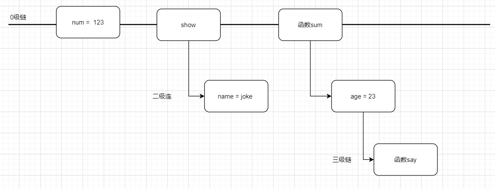

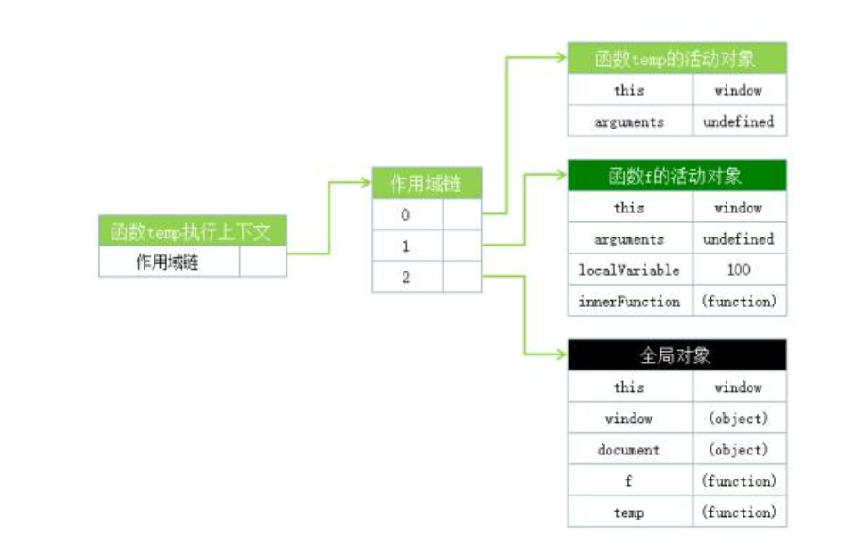

### 3.6 嵌套函数和 闭包(closure) :exclamation:

阮一峰 闭包[http://www.ruanyifeng.com/blog/2009/08/learning_javascript_closures.html](http://www.ruanyifeng.com/blog/2009/08/learning_javascript_closures.html)

> 闭包就是能够读取其他函数内部变量的函数。
>
> 由于在Javascript语言中，只有函数内部的子函数才能读取局部变量，因此可以把闭包简单理解成"定义在一个函数内部的函数"。
>
> 所以，在本质上，闭包就是将函数内部和函数外部连接起来的一座桥梁。

#### 3.6.1 变量的作用域

```javascript
//javascript的变量作用域可以分为两种：全局变量和局部变量。
//在函数内声明的变量就是局部变量，这个变量在函数体内可访问，在函数外部无法直接读取局部变量。
//例如：
var globalVariable = 1; //全局变量
function f() {
    var localVariable = 100; //局部变量 注意函数内的变量一定要加上关键字var才能成为局部变量，不然就会成为全局变量
}
alert(globalVariable); //显示1
alert(localVariable);  //抛出错误 提示localVariable未声明

function f1(){
    //没有使用 var n 就是一个全局的变量
　　　　n=999;
　　}
　　f1();
　　alert(n); // 999
```

#### 3.6.2 如何在外部读取函数内部的局部变量

```javascript
 <script>
      /*show 作用域中的变量是对fn函数可见的 但是反过来就不可以 */
      function show() {
        function fn() {
          var num = 200
          /* 将fn中的局部变量作为返回值 在 show就可以看见了 */
          return num
        }
        //在函数内部执行 fn就可以使用fn内部的局部变量的值了
        var result = fn()
        console.log(result)

        return fn()
      }
      show()
      console.log(show())
</script>

<script>
      /*show 作用域中的变量是对fn函数可见的 但是反过来就不可以 */
      function show() {
        function fn() {
          var num = 200
          /* 将fn中的局部变量作为返回值 在 show就可以看见了 */
          return num
        }
        //在函数内部执行 fn就可以使用fn内部的局部变量的值了
        //var result = fn()
        //console.log(result)

        return fn
      }
      var ff = show()
      var f2 = ff()
      console.log(f2)
</script>
```

> 上述代码的实现就是闭包:

#### 3.6.3 闭包可以使函数内部的变量一致保存在内存中

> 闭包可以用在许多地方。它的最大用处有两个，一个是前面提到的可以读取函数内部的变量，另一个就是让这些变量的值始终保持在内存中。

```javascript
      /*show 作用域中的变量是对fn函数可见的 但是反过来就不可以 */
      function show() {
        var count = 0
        function fn() {
          count++
          console.log(count)
        }
        return fn
      }
      var ff = show()
      ff() //函数执行完成 局部变量并没有从内存中释放掉
      ff()
      ff()
```

> **使用闭包的注意点**
>
> 1）由于闭包会使得函数中的变量都被保存在内存中，内存消耗很大，所以不能滥用闭包，否则会造成网页的性能问题，在IE中可能导致内存泄露。解决方法是，在退出函数之前，将不使用的局部变量全部删除。
>
> 2）闭包会在父函数外部，改变父函数内部变量的值。所以，如果你把父函数当作对象（object）使用，把闭包当作它的公用方法（Public Method），把内部变量当作它的私有属性（private value），这时一定要小心，不要随便改变父函数内部变量的值。

#### 3.6.4 闭包的高级写法

> 前面的写法是最原始的写法在实际应用中，会将闭包和匿名函数联系在一起使用。

```javascript
      ;(function () {
        function doSomething() {
          console.log('doSomething')
        }
        function doOtherthing() {
          console.log('doOtherthing')
        }
        //将局部的方法暴露给全局对象window 就可以放心的去调用了
        window.doThings = {
          doOtherthing: doOtherthing,
          doSomething: doSomething,
        }
      })()

      doThings.doOtherthing()
      doThings.doSomething()
```

#### 3.6.5 闭包和变量

```javascript
unction show() {
        var result = new Array();
        //i就是show的局部变量
        for (var i = 0; i <= 9; i++) {
          result[i] = function (num) {
            return (function () {
              return num;
            })(i);
          };
        }
        return result;
      }
      var fun = show();
      console.log(fun);
      setInterval(() => {}, 1000);

      /* 只会显示最终的值 */
```

### 3.7 预解析

> JavaScript代码的执行是由浏览器中的JavaScript解析器来执行的。JavaScript解析器执行JavaScript代码的时候，分为两个过程：预解析过程和代码执行过程。在当前的作用域之下
> ，js运行之前，会把带有var和function关键字声明的变量先声明，并在内存中安排好。然后从上至下解析js语句。而且function的声明优先于var声明
>
> 预解析过程：
>
> 1. 把变量的声明提升到当前作用域的最前面，只会提升声明，不会提升赋值。
> 2. 把函数的声明提升到当前作用域的最前面，只会提升声明，不会提升调用。
> 3. 先提升fucntion，在提升var。

#### 3.7.1 变量的提示

> - 变量提升
>
>   定义变量的时候，变量的声明会被提升到作用域的最上面，变量的赋值不会提升。

```javascript
      console.log(num) //undefined
      var num = 10
      console.log(num) //10
//可以分解为
	var num ;
	console.log(num);
	num = 10;
	console.log(num)
```

```javascript
 		var num = 10
      fun()
      function fun() {
        //局部变量 不是全局变量 变量的提升
        console.log(num)
        var num = 20
      }
//结果是undefined
```

```javascript
	 var a = 18
      f1()
      function f1() {
        var b = 9
        console.log(a) //undefined
        console.log(b) //9
        var a = '123'
      }
```

```javascript
		f1()
      console.log(c) //9
      console.log(b) //9
      console.log(a) //a is not defined
      function f1() {
        var a = (b = c = 9)
        console.log(a) //9
        console.log(b) //9
        console.log(c) //9
      }
      /* 
      var a = (b = c = 9) 
      解析为: 
      var a = 9;
      b = 9;
      c= 9;
      b 和c 就是全局变量
      a 是局部变量 在全局中是访问不到的 
      */
```

### 3.8 this 关键字 :exclamation:

> 面向对象语言中 this 表示当前对象的一个引用。
>
> 但在 JavaScript 中 this 不是固定不变的，它会随着执行环境的改变而改变。
>
> - 在方法中，this 表示该方法所属的对象。
> - 如果单独使用，this 表示全局对象。
> - 在函数中，this 表示全局对象。
> - 在函数中，在严格模式下，this 是未定义的(undefined)。
> - 在事件中，this 表示接收事件的元素。
> - 类似 call() 和 apply() 方法可以将 this 引用到任何对象。

## 4. JavaScript常用的对象和方法

> `在开发中对象就是对属性和方法的封装，在使用和调用的时候很方便，直观理解`
>
> `在JavaScript中万事万物皆是对象，页面中的按钮，图片，表单，表格，超链接等等...`
>
> JavaScript 对象是拥有属性和方法的特殊数据类型:
>
> + 内置对象  Strring Object Number Math Date Array  Regexp Function .....
> + 宿主对象  浏览器提供的对象(Bom  Dom)
> + 自定义对象
>
> 在 JavaScript中，几乎所有的事物都是对象。

真实生活中，一辆汽车是一个对象。

对象有它的属性，如重量和颜色等，方法有启动停止等:

| 对象                               | 属性                                                         | 方法                                              |
| :--------------------------------- | :----------------------------------------------------------- | :------------------------------------------------ |
|  | car.name = Fiat  car.model = 500  car.weight = 850kg  car.color = white | car.start()  car.drive()  car.brake()  car.stop() |

所有汽车都有这些属性，但是每款车的属性都不尽相同。

所有汽车都拥有这些方法，但是它们被执行的时间都不尽相同。

### 4.1 内置对象

> js中已经定义好的对象。
>
> 内置对象有的属性和方法学习

#### 4.2.1 Object

> 在JavaScript中，几乎所有的对象都是`Object`类型的实例，它们都会从`Object.prototype`继承属性和方法

**构造函数常见对象:**

```javascript
<script>
      /* 创建爱Object的对象 */
      var obj = new Object();
      console.log(obj);
      /* 为obj对象添加属性  通过使用.来添加属性 */
      obj.name = 'admin';
      obj.age = 88;
      /* 通过对象.属性 来调用对象的属性 并使用 */
      console.log(obj.name);
      console.log(obj.age);

      /* 如果使用不规则的属性名使用[]
        不规则的属性还是尽量的少用， 不容易记住
        不符合一般的使用习惯
      */
      obj['123'] = 'Hello World';
      obj['@#$%'] = '你规则的属性名称使用';
      console.log(obj['123']);
      console.log(obj['@#$%']);

      /*
         使用变量名获取到对象的属性名 在获取到属性对应的值
          这种方式在有些前端的框架中使用的比较的多
      */
      obj['address'] = '陕西省西安市';
      var n = 'address';
      console.log(obj[n]);
      /* 在创建对象的时候  可以传入什么值那么创建出的就是声明数据类型的对象
       对象的值就是传入的值 传入值的包装 */
      var object = new Object('Hello World');
      /* 等价于 var object = new String("Hello World") */

      console.log(object);
      object.num = '666';

      console.log(object.toString());
      console.log(object.valueOf());
      console.log(object.num);

      var obj2 = new Object(123);
      console.log(obj2);
      console.log(obj2.toString());
      console.log(obj2.valueOf());

      var obj3 = new Object(null);
      console.log(obj3);
      var obj4 = new Object(undefined);
      console.log(obj4);

      var obj5 = new Object(['a', 'b', 'c']);
      console.log(obj5);
      /* in 运算符 验证某一个对象是否有某一个属性
       */
      console.log('num' in object); //true
      /* instanceof 检测某一个对象是否是属于哪一个构造函数的 */
      console.log(object instanceof Object); //true
 </script>
```

`在JavaScript的运算符优先级中() . [] new 排在最前面。`

<font style="color:red;">**字面量创建对象:**</font>

> ES6 新的创建对象的方式，更简便，使用也方便。

```javascript
<script>
      /* 
      字面量创建对象  ES6规定新的对象创建方式更简单
      */
      var obj = {};
      obj.name = 'admin';
      obj.age = 99;
      console.log(obj);
      console.log(obj.name);
      console.log(obj.age);
      /* 
        传统的创建对象的方式只能先创建对在添加 属性和方法 有一些多余的步骤
        字面量创建对象并添加属性和方法: 
        a. 属性名可以加引号 可以不加引号 习惯的写法是不加引号
        b. 属性名和属性值之间使用冒号隔开，属性和属性之间使用分号隔开
        c. 最后一个属性结尾的位置不需要添加分号

       */
      var obj2 = {
        name: 'joke',
        age: 99,
        teacher: {
          teaName: '张三',
          teaAge: 99,
        },
        say: function () {
          console.log('say i love you');
        },
      };
      console.log(obj2);
    </script>
```

#### 4.2.2 Math

MDN 官方详细看考资料[https://developer.mozilla.org/zh-CN/docs/Web/JavaScript/Reference/Global_Objects/Math](https://developer.mozilla.org/zh-CN/docs/Web/JavaScript/Reference/Global_Objects/Math)

> Math  是一个内置对象，它拥有一些数学常数属性和数学函数方法。`Math` 不是一个函数对象。
>
> 与其他全局对象不同的是，`Math` 不是一个构造器。`Math` 的所有属性与方法都是静态的。引用圆周率的写法是 `Math.PI`，调用正余弦函数的写法是 `Math.sin(x)`，`x` 是要传入的参数。`Math` 的常量是使用 JavaScript 中的全精度浮点数来定义的。

```javascript
Math.PI						// 圆周率
Math.random()				// 生成随机数
Math.floor()/Math.ceil()	 // 向下取整/向上取整
Math.round()				// 取整，四舍五入
Math.abs()					// 绝对值
Math.max()/Math.min()		 // 求最大和最小值

Math.sin()/Math.cos()		 // 正弦/余弦
Math.power()/Math.sqrt()	 // 求指数次幂/求平方根
```

#### 4.2.3 Date

MDN官方参考资料[https://developer.mozilla.org/zh-CN/docs/Web/JavaScript/Reference/Global_Objects/Date](https://developer.mozilla.org/zh-CN/docs/Web/JavaScript/Reference/Global_Objects/Date)

> 创建一个 JavaScript `Date` 实例，该实例呈现时间中的某个时刻。`Date` 对象则基于 [Unix Time Stamp](http://pubs.opengroup.org/onlinepubs/9699919799/basedefs/V1_chap04.html#tag_04_16)，即自1970年1月1日（UTC）起经过的毫秒数。

```javascript
// 获取当前时间，UTC世界时间，距1970年1月1日（世界标准时间）起的毫秒数
var now = new Date();
console.log(now.valueOf());	// 获取距1970年1月1日（世界标准时间）起的毫秒数

Date构造函数的参数
1. 毫秒数 1498099000356		new Date(1498099000356)
2. 日期格式字符串  '2015-5-1'	 new Date('2015-5-1')
3. 年、月、日……				  new Date(2015, 4, 1)   // 月份从0开始
```

- 获取日期的毫秒形式

```javascript
var now = new Date();
// valueOf用于获取对象的原始值
console.log(date.valueOf())	

// HTML5中提供的方法，有兼容性问题
var now = Date.now();	

// 不支持HTML5的浏览器，可以用下面这种方式
var now = + new Date();			// 调用 Date对象的valueOf() 
```

- 日期格式化方法

```javascript
toString()		// 转换成字符串
valueOf()		// 获取毫秒值
// 下面格式化日期的方法，在不同浏览器可能表现不一致，一般不用
toDateString()
toTimeString()
toLocaleDateString()
toLocaleTimeString()
```

- 获取日期指定部分

```javascript
getTime()  	  // 返回毫秒数和valueOf()结果一样
getMilliseconds() 
getSeconds()  // 返回0-59
getMinutes()  // 返回0-59
getHours()    // 返回0-23
getDay()      // 返回星期几 0周日   6周6
getDate()     // 返回当前月的第几天
getMonth()    // 返回月份，***从0开始***
getFullYear() //返回4位的年份  如 2016
```

**日期格式化:**

```javascript
function formatDate(d) {
  //如果date不是日期对象，返回
  if (!date instanceof Date) {
    return;
  }
  var year = d.getFullYear(),
      month = d.getMonth() + 1, 
      date = d.getDate(), 
      hour = d.getHours(), 
      minute = d.getMinutes(), 
      second = d.getSeconds();
  month = month < 10 ? '0' + month : month;
  date = date < 10 ? '0' + date : date;
  hour = hour < 10 ? '0' + hour : hour;
  minute = minute < 10 ? '0' + minute:minute;
  second = second < 10 ? '0' + second:second;
  return year + '-' + month + '-' + date + ' ' + hour + ':' + minute + ':' + second;
}
```

#### 4.2.4 Array(数组)

> 数组对象的作用是：使用单独的变量名来存储一系列的值。
>
> 数组是一种类列表对象，它的原型中提供了遍历和修改元素的相关操作。JavaScript 数组的长度和元素类型都是非固定的。因为数组的长度可随时改变，并且其数据在内存中也可以不连续，所以 JavaScript 数组不一定是密集型的，这取决于它的使用方式

**数组的创建方式:**

*常规方式*

```html
var myCars=new Array();
myCars[0]="Saab";      
myCars[1]="Volvo";
myCars[2]="BMW";
```

*简洁方式*

```html
var myCars=new Array("Saab","Volvo","BMW");
```

*字面量方式*

```html
var myCars=["Saab","Volvo","BMW"];
```

> 通过指定数组名以及索引号码，你可以访问某个特定的元素。
>
> var name=myCars[0];  获取数组下标是0的对象值
>
> myCars[0]="Opel"; 给数组下标位0的位置赋值

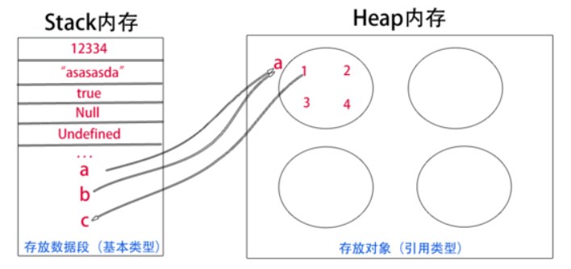

>  数组的属性: 
>
>  + length 数组的长度，数组中元素的个数
>
>  + constuctor 返回数组的原型构造函数
>  + prototype 数组的原型

**数组对象常用的方法:**

+ `concat`连接两个或者更多的数组并返回结果

+ `indexof` 返回数组元素所在的下标值
+ `lastindexOf ` 搜索数组中的元素并返回最后一次出现的下标值
+ `isArray` 判断对新是否是数组
+ `includes` 判断一个数组对象是否包含一个指定值
+ `join`  将数组的所有元素放入一个字符串
+ `pop` 删除数组的最后一个元素，并将最后一个元素返回
+ `push`  向数组的末尾添加一个或更多元素，并返回新的长度。
+ `reverse` 反转数组的元素顺序
+ `shift` 删除并返回数组的第一个元素
+ `sort` 对数组的元素进行排序
+ `unshift` 向数组的头部添加一个或者多个元素，并返回新的长度
+ `slice` 返回数组的一部分新的数组
+ `splice` 丛数组中添加或者删除元素
+ `filter` 检测数值元素，并返回符合条件所有元素的数组。

 ```html
<!DOCTYPE html>
<html lang="en">
  <head>
    <meta charset="UTF-8" />
    <meta name="viewport" content="width=device-width, initial-scale=1.0" />
    <title>数组</title>
  </head>
  <body>
    <script>
      /* 数组的定义 字面量方式 */
      var arr = [21, 23, 4, 5, 67, 89, 2, 56, 99, 13, 40, 66]
      /* 数组元素的拼接 */
      console.log(arr.concat(100, 200, 300))
      /* 检索数组中元素所在的下标 */
      console.log(arr.indexOf(100))
      /* 返回数组中元素最后一次所在位置的下标 */
      console.log(arr.lastIndexOf(66))
      /* 过滤数组中符合条件的元素 */
      console.log(
        arr.filter((a) => {
          return a > 50
        })
      )
      /* sort排序  必须需定义排序规则  由大到小还是由小到大 */
      console.log(
        arr.sort((a, b) => {
          return a - b
        })
      )
      /* 删除数组的最后一个元素并返回 */
      console.log(arr.pop())
      /* 数组的最后一位添加元素并返回数组的长度 */
      console.log(arr.push(11111))
      /* 数组元素的顺序反转 */
      console.log(arr.reverse())
      /* 移除数组的第一个元素并返回值 */
      console.log(arr.shift())
      /* 截取数组的一部分并返回新的数组 */
      console.log(arr.slice(0, 4))
      console.log(arr)
      /* splice  有添加  删除 和替换三个功能 */
      /* 从哪开始截取 截取几个元素  相当删除元素 */
      console.log(arr.splice(2, 3))
      console.log(arr)
      /* 删除一个元素 在使用新的元素替换 */
      console.log(arr.splice(2, 1, 99999))
      console.log(arr)
      /* 添加多个元素 */
      console.log(arr.splice(4, 2, 99999, 8888, 6666))
      console.log(arr)
      /* 向数组的末尾追加元素 */
      console.log(arr.splice(arr.length, 0, 1111, 222, 333))
      console.log(arr)
    </script>
  </body>
</html>

 ```

#### 4.2.5 String字符串

> 在javascript 中字符串就是使用双引号或单引号包含任意长度的文本。

**字符串的创建方式:**

```html
var str = new String("Hello Wolrd");
简单方式创建字符串
var str = "Hello World";
```

> 字符串对象的属性:
>
> + length 字符串的长度
> + constructor 对该对象的函数引用
> + prototype  原型属性 可以给对象添加属性和方法

**字符串常用的方法:**

+ `charAt` 返回指定位置的字符
+ `charCodeAt` 返回指定位置的字符的Uinicode编码
+ `concat` 连接两个或者更多的字符串 返回新的字符串
+ `fromCharCode` 将Unicode编码转换为字符
+ `indexof` 指定字符首次出现的下标值
+ `lastIndexOf` 指定字符最后一次出现的下标值
+ `match` 查找找到一个或多个正则表达式的匹配。
+ `replace` 在字符串中查找匹配的子串， 并替换与正则表达式匹配的子串。
+ `search` 查找与正则表达式匹配的值
+ `splice` 截取字符串
+ `split` 按正则表达式将字符串风格为字符串数组
+ `startWith` 查看字符串是否以指定的子字符串开头。
+ `substr` 从起始索引号提取字符串中指定数目的字符。
+ `substring` 提取字符串中两个指定的索引号之间的字符。
+ `toLowerString` 转为小写
+ `toUpperCase` 转为大写
+ `trim` 去除字符串前后的空格

```html
<!DOCTYPE html>
<html lang="en">
  <head>
    <meta charset="UTF-8" />
    <meta name="viewport" content="width=device-width, initial-scale=1.0" />
    <title>字符串</title>
  </head>
  <body>
    <script>
      /* 在JavaScript 中 单引号和双引号的都是字符串 */
      var str = 'This is a very long string which needs IS'
      /* 字符串拼接 */
      console.log(str.concat(' Hello World'))
      /* 返回指定下标位的字符值 */
      console.log(str.charAt(10))
      /* 返回指定字符的Unicode编码 */
      console.log(str.charCodeAt('H'))
      /* 返回指定字符第一次在字符串中出现的下标值 */
      console.log(str.indexOf('l'))
      /* 返回指定字符在字符串最后一次出现的下标值 */
      console.log(str.lastIndexOf('o'))
      /* 字符串下标位元素的unicode编码 */
      console.log(str.codePointAt(4))
      /* 字符串以什么结尾的  返回布尔值 */
      console.log(str.endsWith('world'))
      /* 字符串以什么开始的 */
      console.log(str.startsWith('this'))
      /* 全局检索 忽略大小写 */
      console.log(str.match(/is/gi))
      /* 匹配字符串的开始下标位置  没找到返回-1 */
      console.log(str.search(/is/gi))
      /* 替换字符串为新的字符串 */
      console.log(str.replace('This', 'That'))
      /* 截取字符串 */
      console.log(str.slice(2, 10))
      /* 匹配的正则表达式将字符串分割为字符串数组 */
      console.log(str.split(' '))
      /* 大写字母转换为小写的字母 */
      console.log(str.toLocaleLowerCase())
      /* 小的字母全转换为大写字母 */
      console.log(str.toLocaleUpperCase())
      /* 取消前后 的控股个 */
      console.log('   Hello world  '.trim())
    </script>
  </body>
</html>

```

#### 4.2.6 正则表达式

> 正则表达式是描述字符模式的对象。
>
> 正则表达式用于对字符串模式匹配及检索替换，是对字符串执行模式匹配的强大工具。
>
> var patt=new RegExp(pattern,modifiers);
>
> 简单的方式
>
> var patt =  /pattern/modifiers;

修饰符用于执行区分大小写和全局匹配:

| 修饰符                                             | 描述                                                     |
| :------------------------------------------------- | :------------------------------------------------------- |
| [i](https://www.runoob.com/js/jsref-regexp-i.html) | 执行对大小写不敏感的匹配。                               |
| [g](https://www.runoob.com/js/jsref-regexp-g.html) | 执行全局匹配（查找所有匹配而非在找到第一个匹配后停止）。 |
| m                                                  | 执行多行匹配。                                           |

RegExp 对象方法

| 方法                                                         | 描述                                               |
| :----------------------------------------------------------- | :------------------------------------------------- |
| [compile](https://www.runoob.com/jsref/jsref-regexp-compile.html) | 在 1.5 版本中已废弃。 编译正则表达式。             |
| [exec](https://www.runoob.com/jsref/jsref-exec-regexp.html)  | 检索字符串中指定的值。返回找到的值，并确定其位置。 |
| [test](https://www.runoob.com/jsref/jsref-test-regexp.html)  | 检索字符串中指定的值。返回 true 或 false。         |
| [toString](https://www.runoob.com/jsref/jsref-regexp-tostring.html) | 返回正则表达式的字符串。                           |

```html
<!DOCTYPE html>
<html lang="en">
  <head>
    <meta charset="UTF-8" />
    <meta name="viewport" content="width=device-width, initial-scale=1.0" />
    <title>正则表达式</title>
  </head>
  <body>
    <script>
      /* regexp 正则表达式对象
        对象用于将文本与一个模式匹配。  
        邮箱  身份证  手机号  字符串长度匹配

       */
      var regexp = new RegExp('[a-z]');
      if (regexp.test('123')) {
        console.log('数据匹配');
      } else {
        console.log('数据不匹配');
      }

      /* var regexp1 = /[a-z]/;
      if (regexp1.test('123')) {
        console.log('数据匹配');
      } else {
        console.log('数据不匹配');
      } */
      //转义字符
      var regexp1 = /\'/;
      if (regexp1.test("1'3")) {
        console.log('数据匹配');
      } else {
        console.log('数据不匹配');
      }
      //^ 开始的位置  $结束的位置
      //var regexp2 = /^a$/;
      //* abc零次或者多次
      //+ 一次或者多次
      // g 全文搜索
      //i 忽略大小写
      //m 多行搜索
      //var regexp2 = /abc+/i;
      //{n,m} 字符或者字母的个数 最少n 最多m个
      //var regexp2 = /[a-zA-Z0-9]{2,4}/;
      //非空白的字符
      //var regexp2 = /\S{6,12}/;
      //要求用户名不能包含中文 长度是6-12 a-z之间
      //var regexp2 = /[a-zA-Z0-9]{6,12}\S/g;
      //邮箱验证的
      var regexp2 = /^[a-z0-9]+@[a-z0-9]+.[a-z]+/;
      if (regexp2.test('523458@qq.com')) {
        console.log('是以a开始的');
      }
    </script>
  </body>
</html>

```


#### 4.2.7 Number

> 在 JavaScript 里面，数字均为双精度浮点类型（[double-precision 64-bit binary format IEEE 754](https://en.wikipedia.org/wiki/Double-precision_floating-point_format)），即一个介于±2−1023和±2+1024之间的数字，或约为±10−308到±10+308，数字精度为53位。整数数值仅在±(253 - 1)的范围内可以表示准确。

| 属性              | 描述                                   |
| :---------------- | :------------------------------------- |
| constructor       | 返回对创建此对象的 Number 函数的引用。 |
| MAX_VALUE         | 可表示的最大的数。                     |
| MIN_VALUE         | 可表示的最小的数。                     |
| NEGATIVE_INFINITY | 负无穷大，溢出时返回该值。             |
| NaN               | 非数字值。                             |
| POSITIVE_INFINITY | 正无穷大，溢出时返回该值。             |
| prototype         | 允许您可以向对象添加属性和方法。       |

| 方法                     | 描述                                                         |
| :----------------------- | :----------------------------------------------------------- |
| `Number.parseFloat()`    | 把字符串参数解析成浮点数， 和全局方法 [`parseFloat()`](https://developer.mozilla.org/zh-CN/docs/Web/JavaScript/Reference/Global_Objects/parseFloat) 作用一致. |
| `Number.parseInt()`      | 把字符串解析成特定基数对应的整型数字，和全局方法 [`parseInt()`](https://developer.mozilla.org/zh-CN/docs/Web/JavaScript/Reference/Global_Objects/parseInt) 作用一致. |
| `Number.isFinite()`      | 判断传递的值是否为有限数字。                                 |
| `Number.isInteger()`     | 判断传递的值是否为整数。                                     |
| `Number.isNaN()`         | 判断传递的值是否为 [`NaN`](https://developer.mozilla.org/zh-CN/docs/Web/JavaScript/Reference/Global_Objects/NaN). More robust version of the original global [`isNaN()`](https://developer.mozilla.org/zh-CN/docs/Web/JavaScript/Reference/Global_Objects/isNaN). |
| `Number.isSafeInteger()` | 判断传递的值是否为安全整数。                                 |

```javascript
 <script>
      var num = 1000
      console.log(num)
      console.log(typeof num)
      /* 最大值 */
      console.log(Number.MAX_VALUE)
      /* 字符串数字转换为Number类型 */
      console.log(Number.parseInt('1234'))
      /* 字符串浮点值转换为Number类型 */
      console.log(Number.parseFloat('12.22'))
   </script>
```

### 4.2 自定义对象

> 在javaScript中自定义对象有两种方式:
>
> 1. 使用构造函数创建对象
> 2. 使用字面量创建对象(ES6以后主要推荐使用)

<font style="color:red;">**构造函数创建对象**</font>

```javascript
//构造函数名称首字母必须大写
function Person(){
    this.name = "joke";
    this.age = 25;
   	this.say = function(){
        console.log("say hello world");
    } 
}
//使用new关键字实例化对象
var p1 = new Person();
console.log(p1);
console.log(p1.name);
console.log(p1.age);
p1.say();
 var p2 = new Person();
console.log(p2);
console.log(p2.name);
console.log(p2.age);
p2.say();
```

> 存在的问题对象的属性值都是相同 的。

```javascript
//构造函数名称首字母必须大写
function Person(name,age){
    this.name = name;
    this.age = age;
   	this.say = function(){
        console.log("say hello world");
    } 
}
//使用new关键字实例化对象
var p1 = new Person("admin",88);
console.log(p1);
console.log(p1.name);
console.log(p1.age);
p1.say();
 var p2 = new Person("jjoke",99);
console.log(p2);
console.log(p2.name);
console.log(p2.age);
p2.say();
```

> 属性值可以通过实例对象时候的参数去指定

```javascript
//构造函数名称首字母必须大写
function Person(){
    this.name = "joke";
    this.age = 25;
   	this.say = function(){
        console.log("say hello world");
    } 
}
//使用new关键字实例化对象
var p1 = new Person();
console.log(p1);
console.log(p1.name);
console.log(p1.age);
p1.say();
 var p2 = new Person();
console.log(p2);
console.log(p2.name);
console.log(p2.age);
p2.say();
//比较两个对象之间的属性和方法
console.log(p1 == p2);//false
console.log(p1 === p2);//fasle
console.log(p1.name === p2.name)//true
console.log(p1.age === p2.age)//true
console.log(p1.say == p2.say )//false
console.log(p1.say === p2.say )//false

```

> 我们发现对象之间是不相同的，属性值是相同, 调用同一个方法 发现值是false。方法对于对象来说在构造函数中的方法，应该是各个对象来共享的。那么为什么不一样呢？

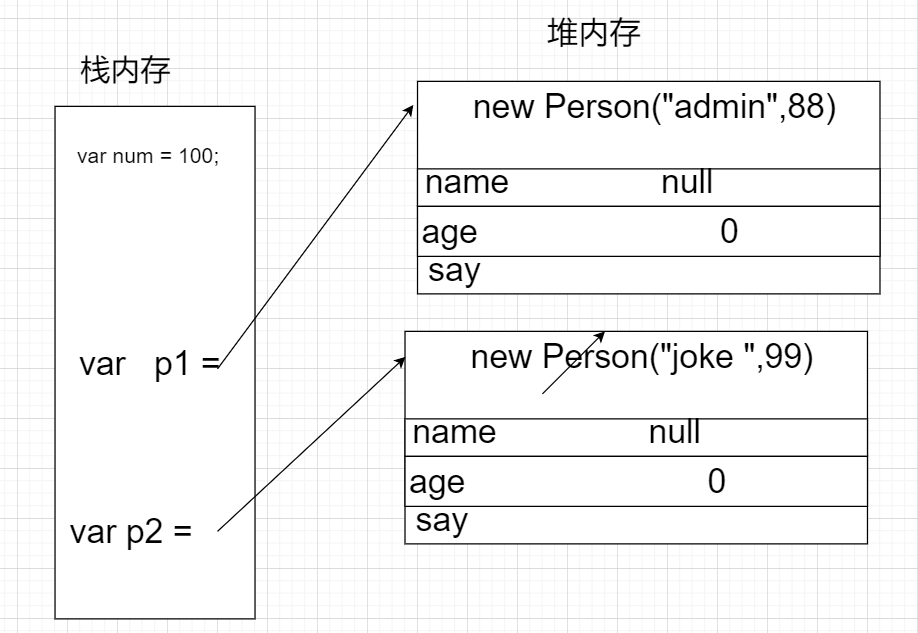

> new 开辟 堆内存空间，内存地址不一样，所以方法在各自的内存中，不能共享
>
> 怎么解决呢?
>
> JavaScript提供了原型 就是来解决这一问题的

<font style="color:red">**原型**</font>

```javascript
<script>
      //构造函数名称首字母必须大写
      function Person(name, age) {
        this.name = name
        this.age = age
      }
      //共享的方法
      Person.prototype.say = function () {
        console.log('Hello World')
      }
      //共享的属性
      Person.prototype.address = '陕西省西安市'
      //使用new关键字实例化对象
      var p1 = new Person('admin', 88)
      console.log(p1)
      console.log(p1.name)
      console.log(p1.age)
      p1.say()
      var p2 = new Person('joke', 99)

      console.log(p2)
      console.log(p2.name)
      console.log(p2.age)
      p2.say()
      //比较两个对象之间的属性和方法
      console.log(p1 == p2) //fasle
      console.log(p1 === p2) //false
      console.log(p1.name === p2.name) //fasle
      console.log(p1.age === p2.age) //fasle
      console.log(p1.say == p2.say) //true
      console.log(p1.say === p2.say) //true
      console.log(p1.address === p2.address) //true
    </script>
```

> 原型链js高级部分讲解:

## 5. BOM

### 5.1 Window 对象

> 所有浏览器都支持 *window* 对象。它代表浏览器的窗口。
>
> 所有全局 JavaScript 对象，函数和变量自动成为 window 对象的成员。
>
> 全局变量是 window 对象的属性。
>
> 全局函数是 window 对象的方法。
>
> 甚至（HTML DOM 的）document 对象也是 window 对象属性：

**全局的作用域**

```javascript
  /* 声明全局的属性和方法 */
      var age = 20
      function show() {
        console.log('hello world')
      }
      /* window是全局的对象 */
      console.log(window.age)
      console.log(this.age)
      show()
      window.show()
      this.show()
      /* this代表全局的对象window */
      console.log(this)
```

**JavaScript弹窗:**

> 弹窗在实际的项目开发中很少的使用，必须点中才能取消掉。弹窗在书写Js的代码中可以帮助我们检测项目中的错误。

```javascript
alert("Hello Wolrd")  //普通弹窗
confirm() //带取消按钮的弹窗
prompt() //带有输入框的弹窗
```

**window的常用属性:**

+ `screenLeft `窗口距离屏幕左边的大小  Opera 不支持
+ `screenTop` 窗口距离屏幕上边的大小
+ `screenX `窗口距离屏幕左边的大小
+ `screenY` 窗口距离屏幕上边的大小

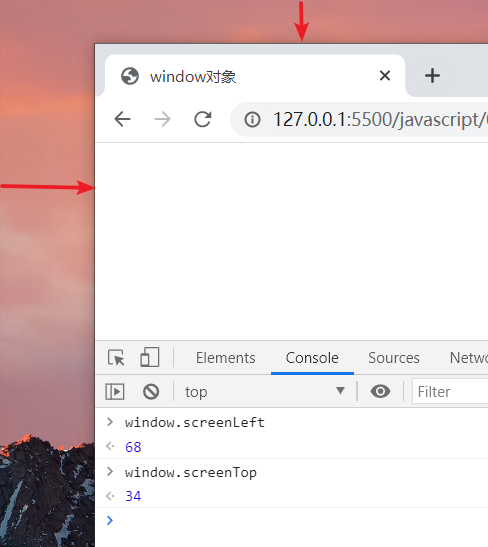

+ `innerHeight` 返回窗口的文档显示区的高度。
+ `innerWidth` 返回窗口的文档显示区的宽度。
+ `outerHeight` 返回窗口的外部高度，包含工具条与滚动条。
+ `outerWidth` 返回窗口的外部宽度，包含工具条与滚动条。
+ `document.documentElement.clientHeight`  在页面上返回内容的可视高度（不包括边框，边距或滚动条）
+ `document.documentElement.clientWidth`  在页面上返回内容的可视宽度（不包括边框，边距或滚动条）

>  Chrome 中，outerWidth、outerHeight 与innerWidth、innerHeight 返回相同的值，即视口（viewport）大小而非浏览器窗口大小。

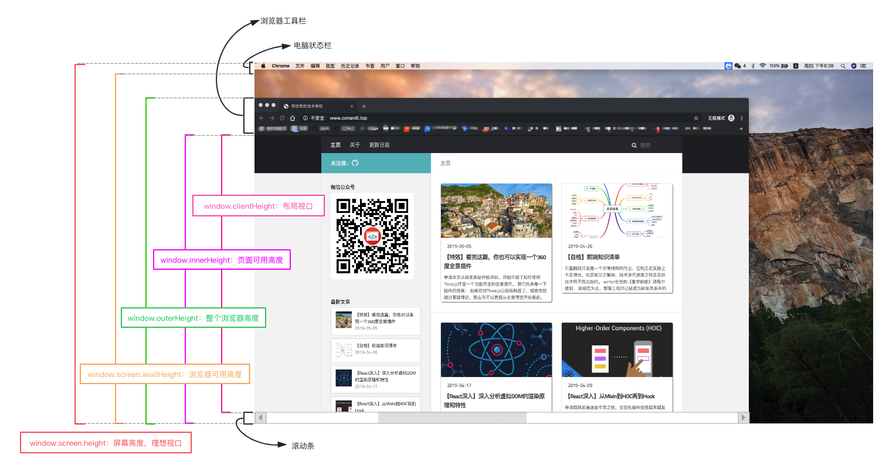

**window常用方法:**

+ `alert`
+ `clearInterval`  取消由 setInterval() 设置的 timeout。
+ `clearTimeOut`  取消由 setTimeout() 方法设置的 timeout。
+ `close` 关闭浏览器窗口
+ `moveBy()` 移动指定像素
+ `moveTo()` 窗口左上角移动到指定的点
+ `resizeBy` 指定像素改变窗口大小
+ `resiseTo` 窗口调整到指定的宽和高
+ `setInterval`  按照指定的周期（以毫秒计）来调用函数或计算表达式。
+ `setTimeout` 在指定的毫秒数后调用函数或计算表达式。
+ `stop` 停止页面载入

## 6. DOM


