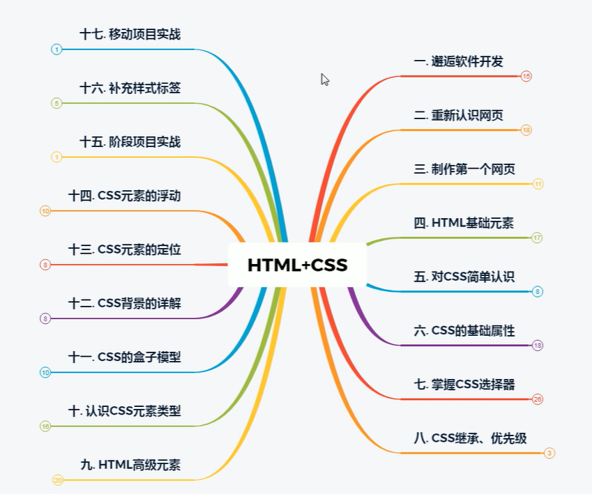

# web 前端开发

## 1. 为什么学习前端开发

> 前端开发是创建 Web 页面或 app 等前端界面呈现给用户的过程，通过 HTML，CSS 及 JavaScript 以及衍生出来的各种技术、框架、解决方案，来实现互联网产品的用户界面交互 [1] 。它从网页制作演变而来，名称上有很明显的时代特征。在互联网的演化进程中，网页制作是 Web1.0 时代的产物，早期网站主要内容都是静态，以图片和文字为主，用户使用网站的行为也以浏览为主。随着互联网技术的发展和 HTML5、CSS3 的应用，现代网页更加美观，交互效果显著，功能更加强大。 [2]
> 移动互联网带来了大量高性能的移动终端设备以及快速的无线网络，HTML5，node.jS 的广泛应用，各类框架类库层出不穷。
> 前端技术的发展是互联网自身发展变化的一个缩影。
> 前端技术指通过浏览器到用户端计算机的统称，存贮于服务器端的统称为后端技术。
> 前端开发主要职能就是把网站的界面更好地呈现给用户。
> 以前会 Photoshop 和 Dreamweaver 就可以制作网页，随着网站开发难度加大、开发方式多样，网页制作更接近传统的网站后台开发，网页制作更多被称为 Web 前端开发。前端技术包括 4 个部分：前端美工、浏览器兼容、CSS、HTML“传统”技术与 Adobe AIR、Google Gears,以及概念性较强的交互式设计，艺术性较强的视觉设计等。
> 在 Web1.0 时代，由于网速和终端能力的限制，大部分网站只能呈现简单的图文信息，并不能满足用户在界面上的需求，对界面技术的要求也不高。随着硬件的完善、高性能浏览器的出现和宽带的普及，技术可以在用户体验方面实现更多种可能，前端技术领域迸发出旺盛的生命力。
> 2005 年以后，互联网进入 Web2.0 时代，各种类似桌面软件的 Web 应用大量涌现，前端由此发生了翻天覆地的变化。网页不再只是承载单一的文字和图片，各种富媒体让网页的内容更加生动，网页上软件化的交互形式为用户提供了更好的使用体验，这些都是基于前端技术实现的。
> 随着手机成为人们生活中不可或缺的一部分，成为人们身体的延伸，人们迎来了体验为王的时代。移动端的前端技术开发前景宽阔。此外，前端技术还能应用于智能电视、智能手表甚至人工智能领域

- [淘宝](https://www.taobao.com)

- [京东](https://www.jd.com)
- [京东移动端](https://m.jd.com/)

## 2. 课程体系

