# Css样式属性表详解

## 1.  布局(layout)


> 学习完html标签和css基础的知识，接下来就是我们如何去实现一个优美，漂亮的网页的制作，在制作之前我们首先要了解网页如何进行布局.
>
> 网页布局有很多种方式，一般分为以下几个部分：**头部区域、菜单导航区域、内容区域、底部区域**。


> 在w3c 官方的规范中规定了7中布局方式:
>
> + 常规流布局
> + 表格布局  (已经淘汰)
> + 浮动布局  (最常见的布局)
> + 定位布局  
> + 多列布局  (框架中做自适应布局)
> + 弹性盒布局 (应用正在普及)[阮一峰Flex布局](http://www.ruanyifeng.com/blog/2015/07/flex-grammar.html)
> + 网格布局   (未大面积推广流行)[阮一峰Grid布局](http://www.ruanyifeng.com/blog/2019/03/grid-layout-tutorial.html)

### 1.1.1 常规文档流布局( :car: )

> 正常的布局流是将元素放置在浏览器视口内的系统：
>
> + 块级元素（display:block）在视口中垂直布局——每个都将显示在上一个元素下面的新行上，并且它们的外边距将分隔开它们。
> + 内联元素（也叫行内元素display:inline）表现不一样——它们不会出现在新行上；相反，它们互相之间以及任何相邻（或被包裹）的文本内容位于同一行上，只要在父块级元素的宽度内有空间可以这样做。如果没有空间，那么溢流的文本或元素将向下移动到新行。
> + 通俗一点来说就是像在地铁站排队一样，正常情况，排成一队，一个一个来的就是内联元素，来一群人他们可能直接再排一队（不文明哈），那他们就是块级元素。

##  2. Float布局(:airplane:  )

### 2.1 Float的设计初衷

> 浮动的设计目的是为了让文字环绕图片，说到文字，那就不得不说文本流了。
> 设置float是会脱离了文档流，他后面的元素块会占用他的位置，但是元素块中的文字却还是定位在float元素旁边，所以他没有脱离文本流。
> 如果一个float元素的上一个元素也是float的，那么它会紧紧的跟在后面，不留一点空隙。
> 文本流就像是守规矩的好孩子，虽然他的兄弟float了，但它们还是会为他留出空间。就算是他的爸爸的兄弟，他爸占位了，他也不会占位。


> 代码实现:

```html
<!DOCTYPE html>
<html lang="en">
  <head>
    <meta charset="UTF-8" />
    <meta name="viewport" content="width=device-width, initial-scale=1.0" />
    <title>盒子模型</title>
    <style>
      p {
        width: 400px;
        height: 300px;
        float: left;
      }
      img {
        float: left;
      }
    </style>
  </head>
  <body>
    <div>
      <p>
        955年6月8日，伯纳斯·李（Tim
        Berners-Lee）出生于英格兰伦敦西南部。父亲是康威·伯纳斯·李，母亲是玛丽·李·伍兹。
        他的父母都参与了世界上第一台商业电脑，曼切斯特1型（Manchester Mark
        I）的建造。伯纳斯-李在辛山小学（Sheen Mount Primary
        School）念小学，在伦敦伊曼纽尔公学（Emanuel School）念中学。
        1973年，他中学毕业，进入牛津大学王后学院深造，最后以一级荣誉获得物理学士学位。
        2017年，他因“发明万维网、第一个浏览器和使万维网得以扩展的基本协议和算法”而获得2016年度的图灵奖。
      </p>
      
    </div>
  </body>
</html>

```


> **什么是浮动?**
>
> 元素的浮动是指设置了浮动属性的元素会脱离标准普通流的控制，移动到其父元素中指定位置的过程。
>
> CSS 的 Float（浮动），会使元素向左或向右移动，其周围的元素也会重新排列。
>
> Float（浮动），往往是用于图像，但它在布局时一样非常有用。
>
> 选择器 {float: 属性值;}
>
> 注意: float在绝对定位和设置了 dispaly:none时不生效

"CSS" 列中的数字表示不同的 CSS 版本（CSS1 或 CSS2）定义了该属性。

| 属性                                                       | 描述                               | 值                                      | CSS  |
| :--------------------------------------------------------- | :--------------------------------- | :-------------------------------------- | :--- |
| [clear](https://www.runoob.com/cssref/pr-class-clear.html) | 指定不允许元素周围有浮动元素。     | left    right   both    none    inherit | 1    |
| [float](https://www.runoob.com/cssref/pr-class-float.html) | 指定一个盒子（元素）是否可以浮动。 | left    right     none     inherit      | 1    |

> **浮动详细内幕特性:**
>
> 浮动脱离标准流，不占位置，会影响标准流。浮动只有左右浮动
>
> 浮动首先创建包含块的概念（包裹）。就是说， 浮动的元素总是找理它最近的父级元素对齐。但是不会超出内边距的范围。 

```html
<!DOCTYPE html>
<html lang="en">
  <head>
    <meta charset="UTF-8" />
    <meta name="viewport" content="width=device-width, initial-scale=1.0" />
    <title>盒子模型</title>
    <style>
      div {
        padding: 15px;
        width: 900px;
        height: 350px;
        border: 5px solid green;
      }
      p {
        width: 400px;
        height: 300px;
        float: left;
      }
      img {
        float: left;
      }
    </style>
  </head>
  <body>
    <div>
      <p>
        955年6月8日，伯纳斯·李（Tim
        Berners-Lee）出生于英格兰伦敦西南部。父亲是康威·伯纳斯·李，母亲是玛丽·李·伍兹。
        他的父母都参与了世界上第一台商业电脑，曼切斯特1型（Manchester Mark
        I）的建造。伯纳斯-李在辛山小学（Sheen Mount Primary
        School）念小学，在伦敦伊曼纽尔公学（Emanuel School）念中学。
        1973年，他中学毕业，进入牛津大学王后学院深造，最后以一级荣誉获得物理学士学位。
        2017年，他因“发明万维网、第一个浏览器和使万维网得以扩展的基本协议和算法”而获得2016年度的图灵奖。
      </p>
      
    </div>
  </body>
</html>

```


### 2.2 Float的特性

> 一个元素设置了float属性以后，会具有以下的特性:
>
> + 包裹性
> + 块状格式化上下文
> + 破坏文档流
> + 没有margin合并

#### 2.2.1 包裹性

```html
<!DOCTYPE html>
<html lang="en">
  <head>
    <meta charset="UTF-8" />
    <meta name="viewport" content="width=device-width, initial-scale=1.0" />
    <title>盒子模型</title>
    <style>
      div {
        padding: 15px;
        border: 5px solid green;
      }
    </style>
  </head>
  <body>
    <div>
      
    </div>
  </body>
</html>

```


```html
<!DOCTYPE html>
<html lang="en">
  <head>
    <meta charset="UTF-8" />
    <meta name="viewport" content="width=device-width, initial-scale=1.0" />
    <title>盒子模型</title>
    <style>
      div {
        padding: 15px;
        border: 5px solid green;
        float: left;
      }
      div img {
        float: left;
      }
    </style>
  </head>
  <body>
    <div>
      
    </div>
  </body>
</html>

```


> 我们看到上面的效果:
>
> 普通的div如果没有设置宽度，它会撑满整个屏幕，在之前的盒子模式那一节也讲到过。而如果给div增加float:left之后，它突然变得紧凑了，宽度发生了变化，把内容“王福朋”三个字包裹了——这就是包裹性。div设置了float之后，其宽度会自动调整为包裹住内容宽度，而不是撑满整个父容器。
>
> 　　注意，此时div虽然体现了包裹性，但是它的display样式是没有变化的，还是block。

#### 2.2.2 破坏性

```html
<!DOCTYPE html>
<html lang="en">
  <head>
    <meta charset="UTF-8" />
    <meta name="viewport" content="width=device-width, initial-scale=1.0" />
    <title>盒子模型</title>
    <style>
      div {
        padding: 15px;
        border: 5px solid green;
      }
      div img {
        float: left;
      }
    </style>
  </head>
  <body>
    <div>
      
    </div>
  </body>
</html>

```

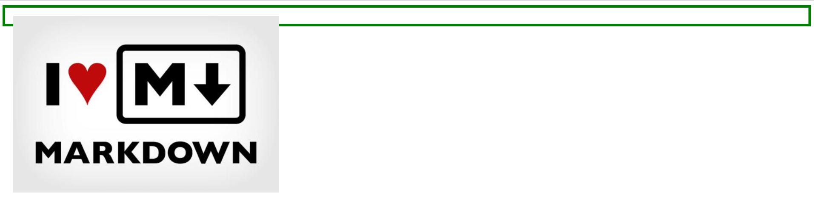

> 相比较包裹性的特性，我们给图片加了float:left;我没看到div的高度没有了。外层的<div>却出现了“坍塌”现象。这就是我们说的破坏性
>
> 初次接触“脱离文档流”的朋友可以这样理解：div是父亲，img是它的儿子，原本好好的父子关系，原本爷俩可以体面的展示一个包含关系的效果。直到有一天，img被设置了float。老天爷（浏览器）规定，任何float元素都不允许再呆在自己的家族中，于是img被逐出家门，断绝和div父子关系。于是乎，div没有了img儿子，也就不能再展示这种父子的包含关系，于是两者就各过各的，互不相干。——这样一说，容易理解了吧？
>
> 但是，永远都不要忘记float被设计的初衷——实现文字环绕效果。当div中有文字时，文字还是会环绕在img周围的。如下图：文字环绕后又把父元素撑起来了

```html
<!DOCTYPE html>
<html lang="en">
  <head>
    <meta charset="UTF-8" />
    <meta name="viewport" content="width=device-width, initial-scale=1.0" />
    <title>盒子模型</title>
    <style>
      div {
        padding: 15px;
        border: 5px solid green;
      }
      div img {
        float: left;
      }
    </style>
  </head>
  <body>
    <div>
      
      <p>
        元素的水平方向浮动，意味着元素只能左右移动而不能上下移动。
        一个浮动元素会尽量向左或向右移动，直到它的外边缘碰到包含框或另一个浮动框的边框为止。
        浮动元素之后的元素将围绕它。 浮动元素之前的元素将不会受到影响。
      </p>
    </div>
  </body>
</html>

```


> 好了，大家现在已经知道了float具有破坏性，可能也有很多朋友之前就知道这一特性，但是你有没有思考一下：**float**为什么会被设计成具有破坏性，为什么会脱离文档流？这一点非常重要！**其实原因非常简单——为了要实现文字的环绕效果？
>
> 　　有人可能会问：啊？你刚才不是说了float的初衷就是实现文字环绕效果吗？和破坏性有啥关系？
>
> 　　这时我会反问你：如果float不让父元素坍塌，能实现文字环绕效果吗？给你两个图看看你就知道了。

```html
<!DOCTYPE html>
<html lang="en">
  <head>
    <meta charset="UTF-8" />
    <meta name="viewport" content="width=device-width, initial-scale=1.0" />
    <title>盒子模型</title>
    <style>
      div {
        padding: 15px;
        width: 600px;
        border: 5px solid green;
      }
      div img {
          /*取消img的浮动*/
          /*float:left;*/
      }
    </style>
  </head>
  <body>
    <div>
      
      <p>
        元素的水平方向浮动，意味着元素只能左右移动而不能上下移动。
        一个浮动元素会尽量向左或向右移动，直到它的外边缘碰到包含框或另一个浮动框的边框为止。
        浮动元素之后的元素将围绕它。 浮动元素之前的元素将不会受到影响。
      </p>
    </div>
  </body>
</html>

```


```html
<!DOCTYPE html>
<html lang="en">
  <head>
    <meta charset="UTF-8" />
    <meta name="viewport" content="width=device-width, initial-scale=1.0" />
    <title>盒子模型</title>
    <style>
      div {
        padding: 15px;
        width: 600px;
        border: 5px solid green;
      }
      div img {
        float: left;
      }
    </style>
  </head>
  <body>
    <div>
      
      <p>
        元素的水平方向浮动，意味着元素只能左右移动而不能上下移动。
        一个浮动元素会尽量向左或向右移动，直到它的外边缘碰到包含框或另一个浮动框的边框为止。
        浮动元素之后的元素将围绕它。 浮动元素之前的元素将不会受到影响。
      </p>
    </div>
  </body>
</html>

```


#### 2.2.3 没有margin合并

> 设置了float的元素，由于形成了BFC ,因此就没有了margin合并

#### 2.2.4 清除空格

```html
<!DOCTYPE html>
<html lang="en">
  <head>
    <meta charset="UTF-8" />
    <meta name="viewport" content="width=device-width, initial-scale=1.0" />
    <title>盒子模型</title>
    <style>
      div {
        padding: 15px;
        width: 850px;
        border: 5px solid green;
      }
      div img {
      }
    </style>
  </head>
  <body>
    <div>
      
      
      
      
    </div>
  </body>
</html>

```


```html
<!DOCTYPE html>
<html lang="en">
  <head>
    <meta charset="UTF-8" />
    <meta name="viewport" content="width=device-width, initial-scale=1.0" />
    <title>盒子模型</title>
    <style>
      div {
        padding: 15px;
        width: 850px;
        height: 200px;
        border: 5px solid green;
      }
      div img {
        float: left;
      }
    </style>
  </head>
  <body>
    <div>
      
      
      
      
    </div>
  </body>
</html>

```


> 第一段例子中我们看到，正常的img中间是会有空格的，因为多个标签会有换行，而浏览器识别换行为空格，这也是很正常的。第二个例子中，img增加了float:left的样式，这就使得img之间没有了空格，四个img紧紧挨着。
>
> 　　如果大家之前没注意，现在想想之前写过的程序，是不是有这个特性。为什么float适合用于网页排版（俗称“砌砖头”）？就是因为float排版出来的网页严丝合缝，中间连个苍蝇都飞不进去。
>
> 　　“清空格”这一特性的根本原因是由于float会导致节点脱离文档流结构。它都不属于文档流结构了，那么它身边的什么换行、空格就都和它没关系的，它就尽量的往一边去靠拢，能靠多近就靠多近，这就是清空格的本质。

### 2.3 清除盒子浮动

> float具有“破坏性”，它会导致父元素“坍塌”，这将不是所要看到的。如何去避免float带来的这种影响呢（也就是我们常说的“清除浮动”） ？
>
> + 为父元素设置 overflow:hidden 
> + 浮动元素
> + 第三种方法也不是很常用，但是大家要知道clear:both这个东西。通过在所有浮动元素下方添加一个clear:both的元素，可以消除float的破坏性。
> + clearfix (掌握)


1. 为父元素设置overflow:hidden;

```html
<!DOCTYPE html>
<html lang="en">
  <head>
    <meta charset="UTF-8" />
    <meta name="viewport" content="width=device-width, initial-scale=1.0" />
    <title>盒子模型</title>
    <style>
      div {
        padding: 15px;
        width: 850px;
        border: 5px solid green;
        /*清除浮动 第一种方式*/
        overflow: hidden;
      }
    </style>
  </head>
  <body>
    <div>
      
      
      
      
    </div>
  </body>
</html>

```

2. 设置元素浮动

```html
<!DOCTYPE html>
<html lang="en">
  <head>
    <meta charset="UTF-8" />
    <meta name="viewport" content="width=device-width, initial-scale=1.0" />
    <title>盒子模型</title>
    <style>
      div {
        padding: 15px;
        width: 850px;
        border: 5px solid green;
        float: left;
        /*清除浮动 第一种方式*/
      }
      div img {
        float: left;
      }
    </style>
  </head>
  <body>
    <div>
      
      
      
      
    </div>
  </body>
</html>

```

3. 在父元素的末尾添加clear:both;

```html
<!DOCTYPE html>
<html lang="en">
  <head>
    <meta charset="UTF-8" />
    <meta name="viewport" content="width=device-width, initial-scale=1.0" />
    <title>盒子模型</title>
    <style>
      .container {
        padding: 15px;
        width: 850px;
        border: 5px solid green;
      }
    </style>
  </head>
  <body>
    <div class="container">
      
      
      
      
      <div style="clear: both"></div>
    </div>
  </body>
</html>

```

4. **clearfix**(掌握)

```html
<!DOCTYPE html>
<html lang="en">
  <head>
    <meta charset="UTF-8" />
    <meta name="viewport" content="width=device-width, initial-scale=1.0" />
    <title>盒子模型</title>
    <style>
      .container {
        padding: 15px;
        width: 850px;
        border: 5px solid green;
      }
      .container::after {
        content: '';
          display:block;
        clear: both;
        overflow: hidden;
          visibility: hidden; 
      }
      .clearfix {
        /*兼容IE低版本  IE6,7*/
        *zoom: 1;
      }
    </style>
  </head>
  <body>
    <div class="container clearfix">
      
      
      
      
    </div>
  </body>
</html>

```


5. 使用before 和 after双伪元素

```html
<!DOCTYPE html>
<html lang="en">
  <head>
    <meta charset="UTF-8" />
    <meta name="viewport" content="width=device-width, initial-scale=1.0" />
    <title>盒子模型</title>
    <style>
      .container {
        padding: 15px;
        width: 850px;
        border: 5px solid green;
      }
      .clearfix:before,
      .clearfix:after {
        content: '';
        display: table; /* 这句话可以出发BFC BFC可以清除浮动,BFC我们后面讲 */
      }
      .clearfix:after {
        clear: both;
      }
      .clearfix {
        *zoom: 1;
      }
    </style>
  </head>
  <body>
    <div class="container clearfix">
      
      
      
      
    </div>
  </body>
</html>

```

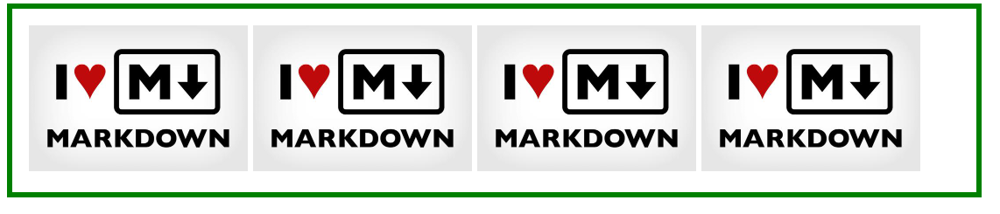

## 3. 定位(position)

> 如果，说浮动， 关键在一个 “浮” 字上面， 那么 我们的定位，关键在于一个 “位” 上。
>
> PS: 定位是我们CSS算是数一数二难点的了，但是，你务必要学好它，我们CSS离不开定位，特别是后面的js特效，天天和定位打交道。不要抵触它，反而要爱上它，它可以让我们工作更加轻松哦！


> 前面学习了float我们知道，float可以决定元素在一行排列的顺序和位置，那么遇到在比如在小米官网中的，左右箭头的banner导航，小的序列圆标，鼠标滑动到导航是出现的div在最上边，这些怎么去解决？那就要使用到我们接下来学习的定位:position
>
> 在W3C规范中，position属性分为两类:
>
> + 定位模式
>   + static  HTML 元素的默认值，即没有定位，遵循正常的文档流对象。静态定位的元素不会受到 top, bottom, left, right影响
>   + fixed  元素的位置相对于浏览器窗口是固定位置。即使窗口是滚动的它也不会移动：
>   + relative  相对定位
>   + absolute   绝对定位
> + 边偏移
>   + left  左侧偏移量
>   + top  顶部偏移量
>   + bottom  底部偏移量
>   + right  右侧偏移量

| absolute | 生成绝对定位的元素，相对于 static 定位以外的第一个父元素进行定位。元素的位置通过 "left", "top", "right" 以及 "bottom" 属性进行规定。 |
| -------- | ------------------------------------------------------------ |
| fixed    | 生成绝对定位的元素，相对于浏览器窗口进行定位。元素的位置通过 "left", "top", "right" 以及 "bottom" 属性进行规定。 |
| relative | 生成相对定位的元素，相对于其正常位置进行定位。因此，"left:20" 会向元素的 LEFT 位置添加 20 像素。 |
| static   | 默认值。没有定位，元素出现在正常的流中（忽略 top, bottom, left, right 或者 z-index 声明）。 |
| inherit  | 规定应该从父元素继承 position 属性的值。                     |

### 3.1 静态定位(static)

> 静态定位是所有元素的默认定位方式，当position属性的取值为static时，可以将元素定位于静态位置。 所谓静态位置就是各个元素在HTML文档流中默认的位置。
>
> 上面的话翻译成白话：  就是网页中所有元素都默认的是静态定位哦！ 其实就是标准流的特性。
>
> 在静态定位状态下，无法通过边偏移属性（top、bottom、left或right）来改变元素的位置。

### 3.2 relative(相对定位)

> 相对定位是将元素相对于它在标准流中的位置进行定位，当position属性的取值为relative时，可以将元素定位于相对位置。
>
> 对元素设置相对定位后，可以通过边偏移属性改变元素的位置，但是它在文档流中的位置仍然保留。如下图所示，即是一个相对定位的效果展示：


> 注意：   
>
> 1. 相对定位最重要的一点是，它可以通过边偏移移动位置，但是原来的所占的位置，继续占有。
> 2. 其次，每次移动的位置，是以自己的左上角为基点移动（相对于自己来移动位置）
>
> 就是说，相对定位的盒子仍在标准流中，它后面的盒子仍以标准流方式对待它。（相对定位不脱标）
>
> 如果说浮动的主要目的是 让多个块级元素一行显示，那么定位的主要价值就是 移动位置， 让盒子到我们想要的位置上去。

### 3.3 绝对定位

> 绝对定位:
>
> ​	绝对定位是将元素依据最近的已经定位（绝对、固定或相对定位）的父元素（祖先）进行定位

```html
<!DOCTYPE html>
<html lang="en">
  <head>
    <meta charset="UTF-8" />
    <meta name="viewport" content="width=device-width, initial-scale=1.0" />
    <title>盒子模型</title>
    <style>
      div {
        padding: 10px;
        background: lightcoral;
        border: 5px solid green;
        position: absolute;
      }
    </style>
  </head>
  <body>
    <div>
      
    </div>
  </body>
</html>

```

**div元素自身未加absolute属性**


**div元素自身加了absolute属性**


```html
<!DOCTYPE html>
<html lang="en">
  <head>
    <meta charset="UTF-8" />
    <meta name="viewport" content="width=device-width, initial-scale=1.0" />
    <title>盒子模型</title>
    <style>
      div {
        padding: 10px;
        background: lightcoral;
        border: 5px solid green;
        position: absolute;
        left: 50px;
      }
    </style>
  </head>
  <body>
    <div>
      
    </div>
  </body>
</html>

```


### 3.4 父相子绝


```html
<!DOCTYPE html>
<html lang="en">
  <head>
    <meta charset="UTF-8" />
    <meta name="viewport" content="width=device-width, initial-scale=1.0" />
    <title>盒子模型</title>
    <style>
      div {
        padding: 10px;
        width: 100px;
        height: 50px;
        background: lightcoral;
        border: 5px solid green;
        position: absolute;
        top: 50px;
      }
      span {
        position: relative;
        left: 130px;
        top: -30px;
      }
    </style>
  </head>
  <body>
    <div>
      <span>Hot</span>
    </div>
  </body>
</html>

```


> 因为子级是绝对定位，不会占有位置， 可以放到父盒子里面的任何一个地方。
>
> 父盒子布局时，需要占有位置，因此父亲只能是 相对定位. 
>
> 这就是子绝父相的由来。

### 3.5 绝对定位的盒子水平垂直居中

```html
<!DOCTYPE html>
<html lang="en">
  <head>
    <meta charset="UTF-8" />
    <meta name="viewport" content="width=device-width, initial-scale=1.0" />
    <title>盒子模型</title>
    <style>
      nav {
        margin: 0 auto;
        width: 1200px;
        height: 100px;
        border: 2px solid red;
        position: absolute;
      }
      header {
        width: 1000px;
        padding: 10px;
        height: 35px;
        border: 1px solid green;
        position: relative;
        left: 50%;
        line-height: 35px;
        top: 50%;
        margin-top: -30.5px;
        margin-left: -500px;
      }
    </style>
  </head>
  <body>
    <nav>
      <header>
        Vue (读音 /vjuː/，类似于 view)
        是一套用于构建用户界面的渐进式框架。与其它大型框架不同的是，Vue
        被设计为可以自底向上逐层应用
      </header>
    </nav>
  </body>
</html>

```

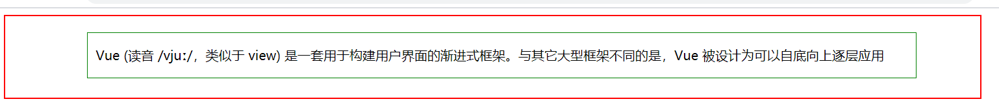

> 普通的盒子是左右margin 改为 auto就可， 但是对于绝对定位就无效了
>
> 定位的盒子也可以水平或者垂直居中，有一个算法。
>
> 1. 首先left 50%   父盒子的一半大小
>
> 2. 然后走自己外边距负的一半值就可以了 margin-left。

### 3.6 Fixed定位

> 固定定位是绝对定位的一种特殊形式，类似于 正方形是一个特殊的 矩形。它以浏览器窗口作为参照物来定义网页元素。当position属性的取值为fixed时，即可将元素的定位模式设置为固定定位。
>
> 当对元素设置固定定位后，它将脱离标准文档流的控制，始终依据浏览器窗口来定义自己的显示位置。不管浏览器滚动条如何滚动也不管浏览器窗口的大小如何变化，该元素都会始终显示在浏览器窗口的固定位置。
>
> 固定定位有两点：
>
> 1. 固定定位的元素跟父亲没有任何关系，只认浏览器。
> 2. 固定定位完全脱标，不占有位置，不随着滚动条滚动


### 3.7 层叠顺序(z-index)

> 在CSS中，要想调整重叠定位元素的堆叠顺序，可以对定位元素应用z-index层叠等级属性，其取值可为正整数、负整数和0。
>
> ​		比如：  z-index: 2;
>
> 注意：
>
> 1. z-index的默认属性值是0，取值越大，定位元素在层叠元素中越居上。
>
> 2. 如果取值相同，则根据书写顺序，后来居上。
>
> 3. 后面数字一定不能加单位。
>
> 4. 只有相对定位，绝对定位，固定定位有此属性，其余标准流，浮动，静态定位都无此属性，亦不可指定此属性。

```html
<!DOCTYPE html>
<html lang="en">
  <head>
    <meta charset="UTF-8" />
    <meta name="viewport" content="width=device-width, initial-scale=1.0" />
    <title>盒子模型</title>
    <style>
      div {
        position: absolute;
      }
      div:first-child {
        width: 100px;
        height: 100px;
        background: lawngreen;
      }
      div:nth-child(2) {
        width: 200px;
        height: 200px;
        background: lightblue;
      }
      div:nth-child(3) {
        width: 300px;
        height: 300px;
        background: lightcoral;
      }
    </style>
  </head>
  <body>
    <div></div>
    <div></div>
    <div></div>
  </body>
</html>

```


> 后边大的div会覆盖前面的。

```html
<!DOCTYPE html>
<html lang="en">
  <head>
    <meta charset="UTF-8" />
    <meta name="viewport" content="width=device-width, initial-scale=1.0" />
    <title>盒子模型</title>
    <style>
      div {
        position: absolute;
      }
      div:first-child {
        width: 100px;
        height: 100px;
        background: lawngreen;
        z-index: 3;
      }
      div:nth-child(2) {
        width: 200px;
        height: 200px;
        background: lightblue;
        z-index: 2;
      }
      div:nth-child(3) {
        width: 300px;
        height: 300px;
        background: lightcoral;
        z-index: 1;
      }
    </style>
  </head>
  <body>
    <div></div>
    <div></div>
    <div></div>
  </body>
</html>

```


### 3.8 四种定位的总结

| 定位模式         | 是否脱标占有位置     | 是否可以使用边偏移 | 移动位置基准                     |
| ---------------- | -------------------- | ------------------ | -------------------------------- |
| 静态static       | 不脱标，正常模式     | 不可以             | 正常模式                         |
| 相对定位relative | 不脱标，占有位置     | 可以               | 相对自身位置移动（自恋型）       |
| 绝对定位absolute | 完全脱标，不占有位置 | 可以               | 相对于定位父级移动位置（拼爹型） |
| 固定定位fixed    | 完全脱标，不占有位置 | 可以               | 相对于浏览器移动位置（认死理型） |

### 3.9 元素的显示与隐藏

#### 3.9.1 Display

+ none
+ block  将行内元素转换为块级元素   也有元素显示的意思

#### 3.9.2 Visibility

+ hidden 
+ visible 

> display和visible区别:
>
> + dispaly:none; 元素隐藏以后也会丢失自己的物理空间 ，不在占有原来的物理空间大小
> + visibility:hidden; 元素虽然隐藏了，但是原来还在原来的位置占有物理空间大小。

#### 3.9.3 OverFlow (溢出)

> 检索或设置当对象的内容超过其指定高度及宽度时如何管理内容。
>
> visible : 　不剪切内容也不添加滚动条。
>
> auto : 　 超出自动显示滚动条，不超出不显示滚动条
>
> hidden : 　不显示超过对象尺寸的内容，超出的部分隐藏掉
>
> scroll : 　不管超出内容否，总是显示滚动条

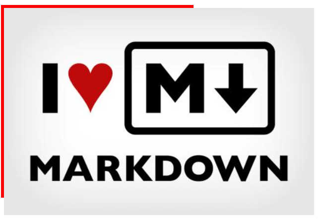

```html
<!DOCTYPE html>
<html lang="en">
  <head>
    <meta charset="UTF-8" />
    <meta name="viewport" content="width=device-width, initial-scale=1.0" />
    <title>盒子模型</title>
    <style>
      div {
        width: 300px;
        height: 300px;
        border: 5px solid red;
        overflow: hidden;
      }
    </style>
  </head>
  <body>
    <div>
      
    </div>
  </body>
</html>

```


## 4. 背景(Background)

### 4.1 背景颜色

#### 4.1.1 颜色

[在线色值表查询](http://www.mamicode.com/info-detail-1163830.html)

+ 颜色的英文名称
  + red
  + green
+ 十六进制的颜色
  + \#000
  + \#fff
+ rgb三原色
  + rgb(0,0,0,)  最小值
  + rgb(255,255,255,255)  最大值
+ rgba 透明度的颜色
  + rgba(255,255,255,0.6)
  + 透明度阿尔法取值是0-1之间


```html
<!DOCTYPE html>
<html lang="en">
  <head>
    <meta charset="UTF-8" />
    <meta name="viewport" content="width=device-width, initial-scale=1.0" />
    <title>document</title>
    <style>
      div {
        width: 300px;
        height: 300px;
        border: 1px solid red;
        /*
        颜色的名称
        */
        /*
        background-color: lightcoral;
        */
        /*
        background-color: rgb(200, 180, 45);
        */
        background-color: #00ff7f;
      }
    </style>
  </head>
  <body>
    <div></div>
  </body>
</html>

```

### 4.2 背景图片

1. **background-img**

```html
 <style>
      body {
        /*图片的路径一般使用相对路径*/
        background-image: url('../images/1.jpg');
      }
    </style>
<!--背景是多张图片组成-->
<style>
      body {
        /*图片的路径一般使用相对路径*/
        background-image: url('../images/2.jpg'), url('../images/1.jpg');
        background-repeat: no-repeat;
      }
    </style>
```


2. **background-repeat**

+ repeat-x x轴方向平铺
+ repeat-y  y轴方向平铺
+ repeat  背景图像平铺
+ no-repeat  背景图像不平铺
+ round 背景图像自动缩放直到适应且填充满整个容器。（CSS3） 
+ space 背景图像以相同的间距平铺且填充满整个容器或某个方向。（CSS3）

```html
<!DOCTYPE html>
<html lang="en">
  <head>
    <meta charset="UTF-8" />
    <meta name="viewport" content="width=device-width, initial-scale=1.0" />
    <title>document</title>
    <style>
      body {
        /*图片的路径一般使用相对路径*/
        background-image: url('../images/2.jpg'), url('../images/1.jpg');
        background-repeat: no-repeat;
      }
    </style>
  </head>
  <body></body>
</html>

```


3. **background-attachment**

+ fixed  背景图像相对于敞口固定
+ scroll  背景图像相对于元素固定，也就是说当元素内容滚动时背景图像不会跟着滚动，因为背景图像总是要跟着元素本身。但会随元素的祖先元素或窗体一起滚动。
+ local： 背景图像相对于元素内容固定，也就是说当元素随元素滚动时背景图像也会跟着滚动，因为背景图像总是要跟着内容。（CSS3）

```html
<!DOCTYPE html>
<html lang="en">
  <head>
    <meta charset="UTF-8" />
    <meta name="viewport" content="width=device-width, initial-scale=1.0" />
    <title>document</title>
    <style>
      body {
        /*图片的路径一般使用相对路径*/
        background-image: url('../images/2.jpg'), url('../images/1.jpg');
        background-repeat: space;
        background-attachment: fixed;
      }
    </style>
  </head>
  <body></body>
</html>

```

4. **background-size**

+ 长度值 不允许负值
+ 百分比  不允许负值
+ auto  图像的真实大小
+ cover  背景完全覆盖容器
+ contain  将背景图像等比缩放到宽度或高度与容器的宽度或高度相等，背景图像始终被包含在容器内。 

```html
<!DOCTYPE html>
<html lang="en">
  <head>
    <meta charset="UTF-8" />
    <meta name="viewport" content="width=device-width, initial-scale=1.0" />
    <title>document</title>
    <style>
      body {
        /*图片的路径一般使用相对路径*/
        background-image: url('../images/2.jpg');
        background-repeat: space;
        background-attachment: fixed;
        background-size: 400px;
      }
    </style>
  </head>
  <body></body>
</html>

```

5. **background-position**

+ 百分比指定填充位置
+ 长度指定可以为负值
+ center  图片水平垂直方向居中
+ left  横向填充从左边开始
+ right 横向填充从右边开始
+ top 顶部开始
+ bottom 底部开始

```html
<!DOCTYPE html>
<html lang="en">
  <head>
    <meta charset="UTF-8" />
    <meta name="viewport" content="width=device-width, initial-scale=1.0" />
    <title>document</title>
    <style>
      body {
        /*图片的路径一般使用相对路径*/
        background-image: url('../images/2.jpg');
        background-attachment: fixed;
        background-repeat: no-repeat;
        background-size: 400px;
        background-position: 80% 50%;
      }
    </style>
  </head>
  <body></body>
</html>

```


### 4.3 精灵图

> CSS雪碧 即[CSS Sprite](https://baike.baidu.com/item/CSS Sprite)，也有人叫它CSS精灵，是一种CSS图像合并技术，该方法是将小图标和背景图像合并到一张图片上，然后利用css的背景定位来显示需要显示的图片部分。
>
> 一个网页中往往会应用很多小的背景图像作为修饰，当网页中的图像过多时，服务器就会频繁地接受和发送请求，这将大大降低页面的加载速度。为了有效地减少服务器接受和发送请求的次数，提高页面的加载速度，出现了CSS精灵技术（也称CSS Sprites、CSS雪碧）。


```html
<!DOCTYPE html>
<html lang="en">
  <head>
    <meta charset="UTF-8" />
    <meta name="viewport" content="width=device-width, initial-scale=1.0" />
    <title>document</title>
    <style>
      div {
        width: 100px;
        height: 100px;
        border: 1px solid red;
        /*图片的路径一般使用相对路径*/
        background-image: url('../images/index_icon.png');
        background-position: -15px -128px;
      }
    </style>
  </head>
  <body>
    <div></div>
  </body>
</html>

```


## 5. 文字和文本

### 5.1 font字体

+ font -style 字体样式
+ font-weight  字重
+ font-size  字体大小
+ font-family  字体名称

```html
<!DOCTYPE html>
<html lang="zh-cmn-Hans">
  <head>
    <meta charset="utf-8" />
    <title>字体</title>
    <meta
      name="author"
      content="Joy Du(飘零雾雨), dooyoe@gmail.com, www.doyoe.com"
    />
    <style>
      p {
        /*字体颜色*/
        color: lawngreen;
        font-weight: 500;
        font-size: 20px;
        /*字体名称可以使用中文，但是建议使用英文名称*/
        font-family: Arial, Helvetica, sans-serif;
      }
    </style>
  </head>
  <body>
    <p>
      “彝人制造”组建于1995年，三位小伙子都是土生土长的彝族人。
      曲比哈布是乐队主创及灵魂人物，曲比哈日是哈布的弟弟，
      倮伍阿木曾在济南当过兵，在西昌和曲比兄弟相识后便有了现在的乐队。
    </p>
  </body>
</html>

```

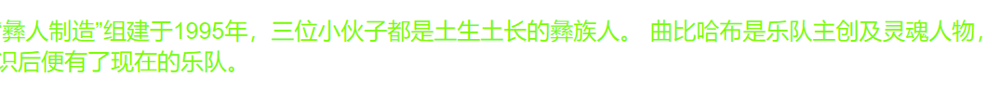

### 5.2 文本

+ white-space  设置或检索对象内空格的处理方式。
+ word-break 设置或检索对象内文本的字内换行行为。
+ text-algin  文字水平居中
  + left  左对齐
  + right 右对齐
  + center 居中
+ text-indent 文字缩进
  + 段落文字首字母或者文字缩进两个字符或者文字大小
+ line-height 行高
  + 一般情况下为了解决文字在行内的垂直居中
  + 一般情况下，行距比字号大7.8像素左右就可以了。
+ letter-spacing 行间距
+ word-spacing 单词间距
  + 该属性将指定的间隔添加到每个单词(词内不发生)之后，但最后一个字将被排除在外。 
  + 判断是否为单词的依据是单词间是否有空格。 

> word-spacing和letter-spacing均可对英文进行设置。不同的是letter-spacing定义的为字母之间的间距，而word-spacing定义的为英文单词之间的间距

```HTML
<!DOCTYPE html>
<html lang="zh-cmn-Hans">
  <head>
    <meta charset="utf-8" />
    <title>字体文本</title>
    <meta
      name="author"
      content="Joy Du(飘零雾雨), dooyoe@gmail.com, www.doyoe.com"
    />
    <style>
      p {
        width: 400px;
        height: 200px;
        border: 1px solid red;
        padding: 10px;
        /*字体颜色*/
        color: lawngreen;
        font-weight: 500;
        font-size: 20px;
        /*字体名称可以使用中文，但是建议使用英文名称*/
        font-family: Arial, Helvetica, sans-serif;
        text-align: center;
        line-height: 30px;
        letter-spacing: 10px;
        word-spacing: 5px;
      }
    </style>
  </head>
  <body>
    <p>
      “彝人制造”组建于1995年，三位小伙子都是土生土长的彝族人。
      曲比哈布是乐队主创及灵魂人物，曲比哈日是哈布的弟弟，
      倮伍阿木曾在济南当过兵，在西昌和曲比兄弟相识后便有了现在的乐队。
    </p>
  </body>
</html>

```

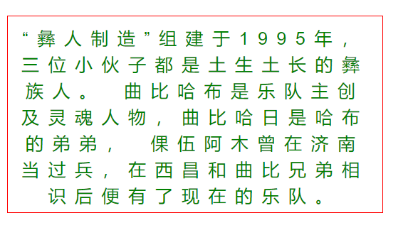

### 5.3 text-shandow (文字阴影)

> text-shandow: 阴影水平偏移 阴影垂直偏移  阴影模糊程度  阴影的颜色;
>
> - 可以设定多组效果，每组参数值以逗号分隔。多组阴影特殊效果

```html
<!DOCTYPE html>
<html lang="zh-cmn-Hans">
  <head>
    <meta charset="utf-8" />
    <title>文字阴影</title>
    <meta
      name="author"
      content="Joy Du(飘零雾雨), dooyoe@gmail.com, www.doyoe.com"
    />
    <style>
      p {
        /*字体颜色*/
        color: lawngreen;
        font-size: 30px;
        text-shadow: 0px 0px 10px green;
      }
    </style>
  </head>
  <body>
    <p>“彝人制造”组建于1995年，三位小伙子都是土生土长的彝族人。</p>
  </body>
</html>

```

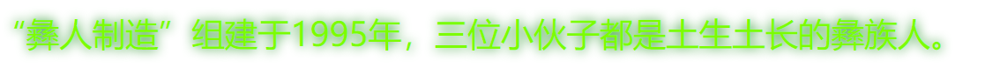

### 5.4 凹凸文字

```html
<!DOCTYPE html>
<html lang="zh-cmn-Hans">
  <head>
    <meta charset="utf-8" />
    <title>凹凸文字</title>
    <meta
      name="author"
      content="Joy Du(飘零雾雨), dooyoe@gmail.com, www.doyoe.com"
    />
    <style>
      body {
        background-color: #ccc;
      }
      p {
        color: #ccc;
        font: 700 80px '微软雅黑';
      }
      p:first-child {
        text-shadow: 1px 1px 1px #000, -1px -1px 1px #fff;
      }
      p:last-child {
        text-shadow: -1px -1px 1px #000, 1px 1px 1px #fff;
      }
    </style>
  </head>
  <body>
    <p>“彝人制造”组建于1995年，三位小伙子都是土生土长的彝族人。</p>
    <p>“彝人制造”组建于1995年，三位小伙子都是土生土长的彝族人。</p>
  </body>
</html>

```

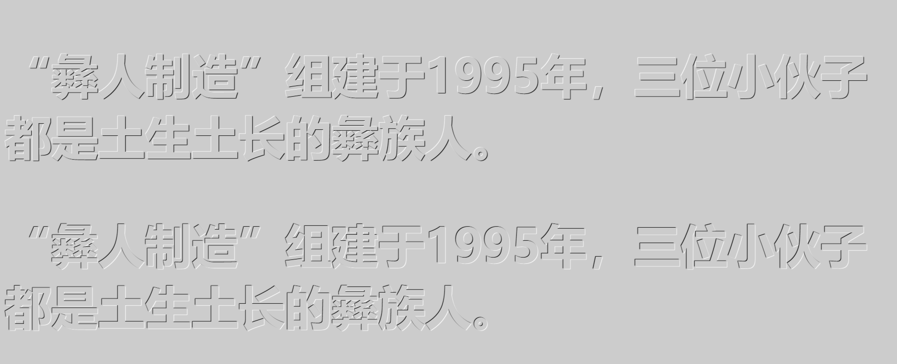

### 5.5 火焰文字

```html
<!DOCTYPE html>
<html lang="zh-cmn-Hans">
  <head>
    <meta charset="utf-8" />
    <title>火焰文字</title>
    <meta
      name="author"
      content="Joy Du(飘零雾雨), dooyoe@gmail.com, www.doyoe.com"
    />
    <style>
      #fire {
        text-align: center;
        margin: 100px auto;
        font-family: 'Comic Sans MS';
        font-size: 80px;
        color: white;
        text-shadow: 0 0 20px #fefcc9, 10px -10px 30px #feec85,
          -20px -20px 40px #ffae34, 20px -40px 50px #ec760c,
          -20px -60px 60px #cd4606, 0 -80px 70px #973716,
          10px -90px 80px #451b0e;
      }

      body {
        background: black;
      }
    </style>
  </head>
  <body>
    <h1 id="fire">Html5 Css3</h1>
  </body>
</html>

```

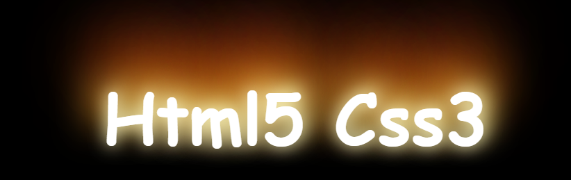

## 6. 过渡

> 我们为了添加某种效果可以从一种样式转变到另一个的时候，无需使用Flash动画或JavaScript。

| 属性                                                         | 描述                                         | CSS  |
| :----------------------------------------------------------- | :------------------------------------------- | :--- |
| [transition](https://www.runoob.com/cssref/css3-pr-transition.html) | 简写属性，用于在一个属性中设置四个过渡属性。 | 3    |
| [transition-property](https://www.runoob.com/cssref/css3-pr-transition-property.html) | 规定应用过渡的 CSS 属性的名称。              | 3    |
| [transition-duration](https://www.runoob.com/cssref/css3-pr-transition-duration.html) | 定义过渡效果花费的时间。默认是 0。           | 3    |
| [transition-timing-function](https://www.runoob.com/cssref/css3-pr-transition-timing-function.html) | 规定过渡效果的时间曲线。默认是 "ease"。      | 3    |
| [transition-delay](https://www.runoob.com/cssref/css3-pr-transition-delay.html) | 规定过渡效果何时开始。默认是 0。             | 3    |

```html
<!DOCTYPE html>
<html lang="zh-cmn-Hans">
  <head>
    <meta charset="utf-8" />
    <title></title>
    <meta
      name="author"
      content="Joy Du(飘零雾雨), dooyoe@gmail.com, www.doyoe.com"
    />
    <style>
      #fire {
        text-align: center;
        margin: 100px auto;
        font-family: 'Comic Sans MS';
        font-size: 80px;
        color: white;
        text-shadow: 0 0 20px #fefcc9, 10px -10px 30px #feec85,
          -20px -20px 40px #ffae34, 20px -40px 50px #ec760c,
          -20px -60px 60px #cd4606, 0 -80px 70px #973716,
          10px -90px 80px #451b0e;
        transition: all  5s;
      }

      body {
        background: black;
      }
      #fire:hover {
        text-shadow: 0 0 20px #451b0e, 10px -10px 30px #973716,
          -20px -20px 40px #cd4606, 20px -40px 50px #ec760c,
          -20px -60px 60px #ec760c, 0 -80px 70px #feec85,
          10px -90px 80px #fefcc9;
      }
    </style>
  </head>
  <body>
    <h1 id="fire">Html5 Css3</h1>
  </body>
</html>

```

```html
<!DOCTYPE html>
<html lang="zh-cmn-Hans">
  <head>
    <meta charset="utf-8" />
    <title></title>
    <meta
      name="author"
      content="Joy Du(飘零雾雨), dooyoe@gmail.com, www.doyoe.com"
    />
    <style>
      #fire {
        text-align: center;
        margin: 100px auto;
        font-family: 'Comic Sans MS';
        font-size: 80px;
        color: white;
        text-shadow: 0 0 20px #fefcc9, 10px -10px 30px #feec85,
          -20px -20px 40px #ffae34, 20px -40px 50px #ec760c,
          -20px -60px 60px #cd4606, 0 -80px 70px #973716,
          10px -90px 80px #451b0e;
          /*过渡的属性值  过度持续时间 过渡的动画方式  延迟时间*/
          transition: all 5s ease-in  2s;
      }

      body {
        background: black;
      }
      #fire:hover {
        transform: rotateY(360deg);
      }
    </style>
  </head>
  <body>
    <h1 id="fire">Html5 Css3</h1>
  </body>
</html>

```


## 7. 转换

> 向元素应用2D或3D转换。该属性允许我们对元素进行**旋转、缩放、移动、或者倾斜**

| Property                                                     | 描述                   | CSS  |
| :----------------------------------------------------------- | :--------------------- | :--- |
| [transform](https://www.runoob.com/cssref/css3-pr-transform.html) | 适用于2D或3D转换的元素 | 3    |
| [transform-origin](https://www.runoob.com/cssref/css3-pr-transform-origin.html) | 允许您更改转化元素位置 | 3    |

###  7.1 2D 转换方法

| 函数                            | 描述                                     |
| :------------------------------ | :--------------------------------------- |
| matrix(*n*,*n*,*n*,*n*,*n*,*n*) | 定义 2D 转换，使用六个值的矩阵。         |
| translate(*x*,*y*)              | 定义 2D 转换，沿着 X 和 Y 轴移动元素。   |
| translateX(*n*)                 | 定义 2D 转换，沿着 X 轴移动元素。        |
| translateY(*n*)                 | 定义 2D 转换，沿着 Y 轴移动元素。        |
| scale(*x*,*y*)                  | 定义 2D 缩放转换，改变元素的宽度和高度。 |
| scaleX(*n*)                     | 定义 2D 缩放转换，改变元素的宽度。       |
| scaleY(*n*)                     | 定义 2D 缩放转换，改变元素的高度。       |
| rotate(*angle*)                 | 定义 2D 旋转，在参数中规定角度。         |
| skew(*x-angle*,*y-angle*)       | 定义 2D 倾斜转换，沿着 X 和 Y 轴。       |
| skewX(*angle*)                  | 定义 2D 倾斜转换，沿着 X 轴。            |
| skewY(*angle*)                  | 定义 2D 倾斜转换，沿着 Y 轴。            |

```html
<!DOCTYPE html>
<html lang="zh-cmn-Hans">
  <head>
    <meta charset="utf-8" />
    <title></title>
    <meta
      name="author"
      content="Joy Du(飘零雾雨), dooyoe@gmail.com, www.doyoe.com"
    />
    <style>
      .fire {
        text-align: center;
        margin: 100px auto;
        font-family: 'Comic Sans MS';
        font-size: 80px;
        color: white;
        text-shadow: 0 0 20px #fefcc9, 10px -10px 30px #feec85,
          -20px -20px 40px #ffae34, 20px -40px 50px #ec760c,
          -20px -60px 60px #cd4606, 0 -80px 70px #973716,
          10px -90px 80px #451b0e;
        transition: all 5s ease-in;
      }

      body {
        background: black;
      }
      /* 旋转  deg是角度单位 */
      .fire:first-child:hover {
        transform: rotateY(360deg);
      }
      /* 水平x轴移动 */
      .fire:nth-child(2):hover {
        transform: translateX(200px);
      }
      /* 放大或者缩小 */
      .fire:nth-child(3):hover {
        transform: scale(1.2);
      }
      /* 扭曲  x轴和y轴一定的方向*/
      .fire:nth-child(4):hover {
        transform: skew(30deg, 30deg);
      }
    </style>
  </head>
  <body>
    <h1 class="fire">Html5 Css3</h1>
    <h1 class="fire">Html5 Css3</h1>
    <h1 class="fire">Html5 Css3</h1>
    <h1 class="fire">Html5 Css3</h1>
  </body>
</html>

```


### 7.2 3D转换

> 要利用 CSS3 实现 3D 的效果，最主要的就是借助 transform-style 属性。transform-style 只有两个值可以选择：
>
> + transform-style: flat; ``// 默认，子元素将不保留其 3D 位置
> + transform-style: preserve-3d; ``// 子元素将保留其 3D 位置。

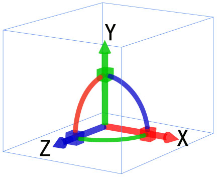

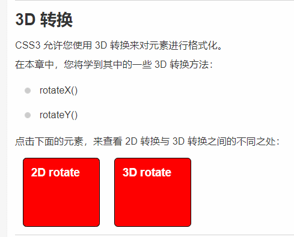


```html
<!DOCTYPE html>
<html lang="zh-cmn-Hans">
  <head>
    <meta charset="utf-8" />
    <title></title>
    <meta
      name="author"
      content="Joy Du(飘零雾雨), dooyoe@gmail.com, www.doyoe.com"
    />
    <style>
      * {
        margin: 0;
        padding: 0;
        list-style: none;
        box-sizing: border-box;
      }
      .container {
        width: 300px;
        height: 300px;
        margin: 200px auto;
      }
      .box {
        /* 指定观察者与「z=0」平面的距离，使具有三维位置变换的元素产生透视效果。
          「z>0」的三维元素比正常大，而「z<0」时则比正常小，大小程度由该属性的值决定。
         */
        perspective: 600px;
        position: relative;
      }
      .content {
        width: 300px;
        height: 300px;
        transform-style: preserve-3d;
        animation: run 10s infinite;
      }
      .content div {
        width: 300px;
        height: 300px;
        position: absolute;
        text-align: center;
        line-height: 300px;
        font-size: 32px;
      }
      .front {
        transform: translateZ(100px);
        background-color: rgba(36, 85, 75, 0.5);
      }
      .back {
        transform: translateZ(-100px) rotateY(180deg);
        background-color: rgba(36, 255, 1, 0.5);
      }
      .left {
        left: -100px;
        transform: rotateY(-90deg);
        background-color: rgba(25, 62, 75, 0.5);
      }
      .right {
        left: 100px;
        transform: rotateY(90deg);
        background-color: rgba(25, 62, 75, 0.5);
      }
      .top {
        top: -100px;
        transform: rotateX(90deg);
        background-color: rgba(255, 62, 26, 0.5);
      }
      .bottom {
        top: 100px;
        transform: rotateX(-90deg);
        background-color: rgba(255, 62, 26, 0.5);
      }
      @keyframes run {
        0% {
          transform: rotateY(0);
        }
        10% {
          transform: rotateY(180deg);
        }
        20% {
          transform: rotateX(180deg);
          transform: rotateY(180deg);
        }
      }
    </style>
  </head>
  <body>
    <div class="container">
      <div class="box">
        <div class="content">
          <div class="front">front</div>
          <div class="back">back</div>
          <div class="left">left</div>
          <div class="right">right</div>
          <div class="top">top</div>
          <div class="bottom">bottom</div>
        </div>
      </div>
    </div>
  </body>
</html>

```

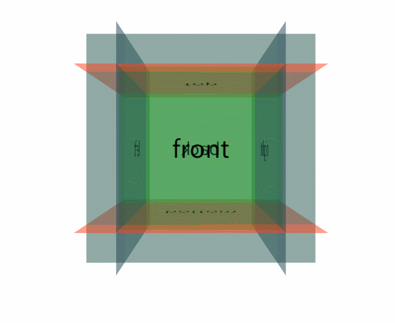

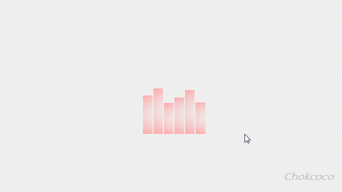

## 8. 动画

> CSS3 可以创建动画，它可以取代许多网页动画图像、Flash 动画和 JavaScript 实现的效果。

下面的表格列出了 @keyframes 规则和所有动画属性：

| 属性                                                         | 描述                                                         | CSS  |
| :----------------------------------------------------------- | :----------------------------------------------------------- | :--- |
| [@keyframes](https://www.runoob.com/cssref/css3-pr-animation-keyframes.html) | 规定动画。                                                   | 3    |
| [animation](https://www.runoob.com/cssref/css3-pr-animation.html) | 所有动画属性的简写属性。                                     | 3    |
| [animation-name](https://www.runoob.com/cssref/css3-pr-animation-name.html) | 规定 @keyframes 动画的名称。                                 | 3    |
| [animation-duration](https://www.runoob.com/cssref/css3-pr-animation-duration.html) | 规定动画完成一个周期所花费的秒或毫秒。默认是 0。             | 3    |
| [animation-timing-function](https://www.runoob.com/cssref/css3-pr-animation-timing-function.html) | 规定动画的速度曲线。默认是 "ease"。                          | 3    |
| [animation-fill-mode](https://www.runoob.com/cssref/css3-pr-animation-fill-mode.html) | 规定当动画不播放时（当动画完成时，或当动画有一个延迟未开始播放时），要应用到元素的样式。 | 3    |
| [animation-delay](https://www.runoob.com/cssref/css3-pr-animation-delay.html) | 规定动画何时开始。默认是 0。                                 | 3    |
| [animation-iteration-count](https://www.runoob.com/cssref/css3-pr-animation-iteration-count.html) | 规定动画被播放的次数。默认是 1。                             | 3    |
| [animation-direction](https://www.runoob.com/cssref/css3-pr-animation-direction.html) | 规定动画是否在下一周期逆向地播放。默认是 "normal"。          | 3    |
| [animation-play-state](https://www.runoob.com/cssref/css3-pr-animation-play-state.html) | 规定动画是否正在运行或暂停。默认是 "running"。               | 3    |

```html
<!DOCTYPE html>
<html lang="zh-cmn-Hans">
  <head>
    <meta charset="utf-8" />
    <title></title>
    <meta
      name="author"
      content="Joy Du(飘零雾雨), dooyoe@gmail.com, www.doyoe.com"
    />
    <style>
      * {
        margin: 0;
        padding: 0;
        list-style: none;
        box-sizing: border-box;
      }
      .container {
        width: 300px;
        height: 300px;
        margin: 200px auto;
        background-color: lightcoral;
        /* 动画名称 动画持续时间 动画播放方式 循环方式(无限循环) */
        animation: run 5s ease infinite;
      }

      @keyframes run {
        0% {
          transform: rotateY(0);
        }
        10% {
          transform: rotateY(180deg);
        }
        20% {
          transform: rotateX(180deg);
          transform: rotateY(180deg);
        }
      }
    </style>
  </head>
  <body>
    <div class="container"></div>
  </body>
</html>

```

> 常用的css3动画库:
>
> [animates.css](https://daneden.github.io/animate.css/)
>
> [magic.css](https://github.com/miniMAC/magic)
>
> [Effect.css ](https://1stwebdesigner.com/css-effects/)
>
> [hover.css ](http://ianlunn.github.io/Hover/)

## 9 .Css补充知识

### 9.1 鼠标样式

```html
<ul>
  <li style="cursor:default">我是小白</li>
  <li style="cursor:pointer">我是小手</li>
  <li style="cursor:move">我是移动</li>
  <li style="cursor:text">我是文本</li>
</ul>
```

### 9.2outline(轮廓线)

> 在input元素中浏览器默认会添加外部的轮廓线 我们是不需要的，一般情况下去掉就可以了

```html
<input  type="text"  style="outline: 0;"/>
<input  type="text"  style="outline: none;"/>
```

### 9.3 文本拖拽

> 文本域我们一般设定好大小以后就不允许拖拽改变大小

```html
<textarea  style="resize: none;"></textarea>
```

### 9.4 vertical-align 垂直对齐

> 以前我们讲过让带有宽度的块级元素居中对齐，是margin: 0 auto;
>
> 以前我们还讲过让文字居中对齐，是 text-align: center;
>
> 但是我们从来没有讲过有垂直居中的属性， 我们的妈妈一直很担心我们的垂直居中怎么做。
>
> vertical-align 垂直对齐， 这个看上去很美好的一个属性， 实际有着不可捉摸的脾气，否则我们也不会这么晚来讲解。
>
> vertical-align 不影响块级元素中的内容对齐，它只针对于 行内元素或者行内块元素，特别是行内块元素， **通常用来控制图片/表单与文字的对齐**。
>
> 所以我们知道，我们可以通过vertical-align 控制图片和文字的垂直关系了。 默认的图片会和文字基线对齐

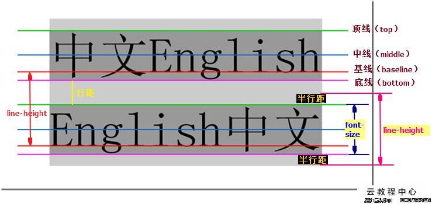


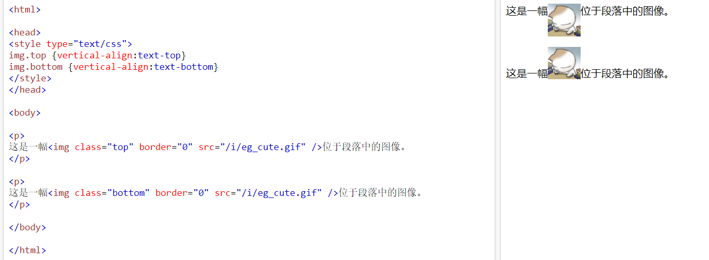

### 9.5 去除图片底部空白

> 有个很重要特性你要记住： 图片或者表单等行内块元素，他的底线会和父级盒子的基线对齐。这样会造成一个问题，就是图片底侧会有一个空白缝隙。

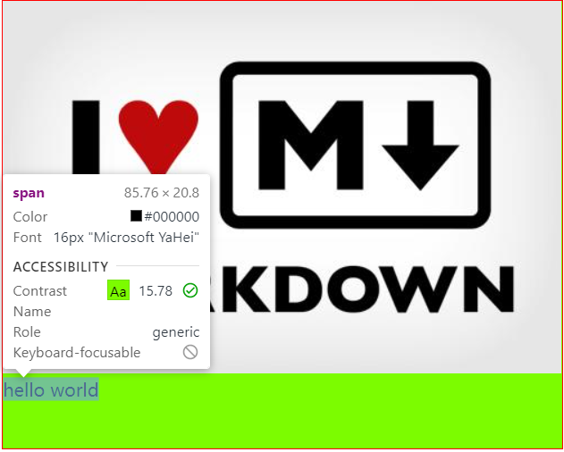

```html
<!DOCTYPE html>
<html lang="zh-cmn-Hans">
  <head>
    <meta charset="utf-8" />
    <title></title>
    <meta
      name="author"
      content="Joy Du(飘零雾雨), dooyoe@gmail.com, www.doyoe.com"
    />
    <style>
        /* 去除间隙有三种方式:
        1. 图片变为block块级元素
        2. vertical-align: top | middle | bottom;
        3. 把父级的字体大小设置为0px
        
        */
     .container {
        width: 500px;
        height: 400px;
        margin: 0 auto;
        display: inline-block;
        border: 1px solid red;
        background: lawngreen;
        font-size: 0;
      }
      img {
        /* display: block; */
        /* vertical-align: middle; */
      }
      span {
        font-size: 16px;
      }
    </style>
  </head>
  <body>
    <div class="container">
      
      <span>hello world</span>
    </div>
  </body>
</html>

```

**去除间隙后的效果**

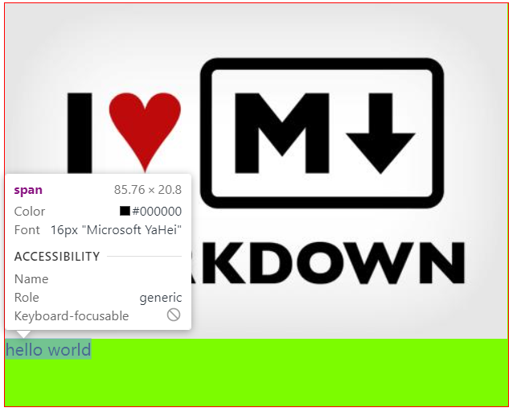

### 9.6 字体库

> 引入第三方的字体库 :
>
> [站长字体](http://font.chinaz.com/)
>
> [第一字体库](http://www.diyiziti.com/List)

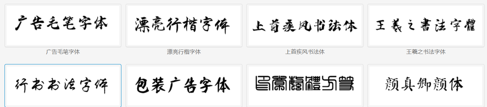

```html
<!DOCTYPE html>
<html lang="zh-cmn-Hans">
  <head>
    <meta charset="utf-8" />
    <title></title>
    <meta
      name="author"
      content="Joy Du(飘零雾雨), dooyoe@gmail.com, www.doyoe.com"
    />
    <style>
      @font-face {
          /*第三方字体库起别名*/
        font-family: 'di';
          /*下载的第三方的字体库*/
        src: url('../毛笔行书繁7.ttf');
      }
      p {
        font-family: 'di';
      }
    </style>
  </head>
  <body>
    <p>
      层叠样式表(英文全称：Cascading Style
      Sheets)是一种用来表现HTML（标准通用标记语言的一个应用）或XML（标准通用标记语言的一个子集）等文件样式的计算机语言
    </p>
  </body>
</html>

```

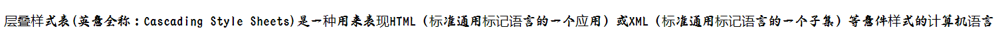

### 9.7 字体图标(icon)

> 图片是有诸多优点的，但是缺点很明显，比如图片不但增加了总文件的大小，还增加了很多额外的"http请求"，这都会大大降低网页的性能的。更重要的是图片不能很好的进行“缩放”，因为图片放大和缩小会失真。 我们后面会学习移动端响应式，很多情况下希望我们的图标是可以缩放的。此时，一个非常重要的技术出现了，额不是出现了，是以前就有，是被从新"宠幸"啦。。 这就是字体图标（iconfont).
>
> 正如你所看到的，现在市面上大多数网页使用的图标都是类似这样的形式，也有不少icon图标库可供我们使用
>  它的实现方式有：
>
> - image
> - CSS Sprites
> - Icon Font
> - SVG（目前来看，是最完美的）
> - CSS手写icon（太麻烦，而且自己做往往不好看（这时候你需要一个UI小姐姐的帮助））
>
> **字体图标的优点**
>
> 1. 可以做出跟图片一样可以做的事情,改变透明度、旋转度，等..
> 2. 但是本质其实是文字，可以很随意的改变颜色、产生阴影、透明效果等等...
> 3. 本身体积更小，但携带的信息并没有削减。
> 4. 几乎支持所有的浏览器5移动端设备必备良药...


假如图标是我们公司单独设计，那就需要第一步了，这个属于UI设计人员的工作， 他们在 illustrator 或 Sketch 这类矢量图形软件里创建 icon图标，在保存为svg格式我们就可以去使用了， 比如下图：

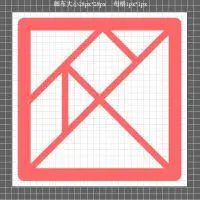

#### 常用的第三方的字体图标库

easyicon[https://www.easyicon.net/](https://www.easyicon.net/)最好用的图标搜索网站。真的是你能想到的都能搜索到，最重要的一点就是，你如果在输入框输入中文，他会立马帮你翻译成英文搜索。牛惹

**icomoon字库** [http://icomoon.io](http://icomoon.io)

**阿里icon font字库** [ http://www.iconfont.cn/](http://www.iconfont.cn/)

**fontello** [https://fontello.com/](https://fontello.com/)

Font-Awesome [http://www.fontawesome.com.cn/faicons/](http://www.fontawesome.com.cn/faicons/)

icons8  [[https://icons8.com/](https://icons8.com/)]([https://icons8.com/](https://icons8.com/))

bootstrap字库

layui图标库

天气图标字库 [http://erikflowers.github.io/weather-icons/](http://erikflowers.github.io/weather-icons/)

[http://ecomfe.github.io/fontmin/](http://ecomfe.github.io/fontmin/) 【百度开发】第一个纯 JavaScript 字体子集化方案。百度最近在开发领域还是非常突出的，连续推出了很多js应用都获得了好评。这个应该算是一个新的概念，百度刚刚捣鼓出来。

**Font-Awesome使用方式**

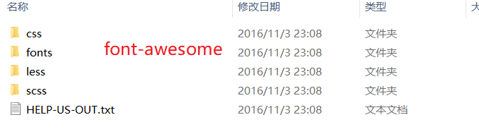

```html
<!DOCTYPE html>
<html lang="zh-cmn-Hans">
  <head>
    <meta charset="utf-8" />
    <title>字体图标库</title>

    <link
      rel="stylesheet"
      href="../font-awesome-4.7.0/font-awesome-4.7.0/css/font-awesome.min.css"
    />
    <style>
      i {
        color: lightcoral;
      }
    </style>
  </head>
  <body>
    <i class="fa fa-address-book-o fa-2x"></i>
    <i class="fa fa-backward fa-2x"></i>
    <i class="fa fa-percent fa-2x"></i>
    <i class="fa fa-phone fa-2x"></i>
  </body>
</html>

```

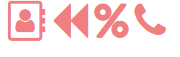

**IconMoon使用:**

## 10 . Flex伸缩盒

阮一峰的网络日志  flex布局[http://www.ruanyifeng.com/blog/2015/07/flex-grammar.html](http://www.ruanyifeng.com/blog/2015/07/flex-grammar.html)


> 布局的传统解决方案，基于[盒状模型](https://developer.mozilla.org/en-US/docs/Web/CSS/box_model)，依赖 [`display`](https://developer.mozilla.org/en-US/docs/Web/CSS/display) 属性 + [`position`](https://developer.mozilla.org/en-US/docs/Web/CSS/position)属性 + [`float`](https://developer.mozilla.org/en-US/docs/Web/CSS/float)属性。它对于那些特殊布局非常不方便，比如，[垂直居中](https://css-tricks.com/centering-css-complete-guide/)就不容易实现。
>
> 2009年，W3C 提出了一种新的方案----Flex 布局，可以简便、完整、响应式地实现各种页面布局。目前，它已经得到了所有浏览器的支持，这意味着，现在就能很安全地使用这项功能。
>
> Flex 是 Flexible Box 的缩写，意为"弹性布局"，用来为盒状模型提供最大的灵活性。
>
> 任何一个容器都可以指定为 Flex 布局。
>
> div{
>
> ​	display:flex | line-flext;
>
> }

### 10.1 基本概念

> 采用 Flex 布局的元素，称为 Flex 容器（flex container），简称"容器"。它的所有子元素自动成为容器成员，称为 Flex 项目（flex item），简称"项目"。
>
> 容器默认存在两根轴：水平的主轴（main axis）和垂直的交叉轴（cross axis）。主轴的开始位置（与边框的交叉点）叫做`main start`，结束位置叫做`main end`；交叉轴的开始位置叫做`cross start`，结束位置叫做`cross end`。
>
> 项目默认沿主轴排列。单个项目占据的主轴空间叫做`main size`，占据的交叉轴空间叫做`cross size`。


### 10.2 容器的属性

> .box {
> 		flex-direction: row | row-reverse | column | column-reverse;
>   }


- `row`（默认值）：主轴为水平方向，起点在左端。
- `row-reverse`：主轴为水平方向，起点在右端。
- `column`：主轴为垂直方向，起点在上沿。
- `column-reverse`：主轴为垂直方向，起点在下沿。

### 10.3 flex-wrap

> 默认情况下，项目都排在一条线（又称"轴线"）上。`flex-wrap`属性定义，如果一条轴线排不下，如何换行
>
> ```css
> .box{
>   flex-wrap: nowrap | wrap | wrap-reverse;
> }
> ```

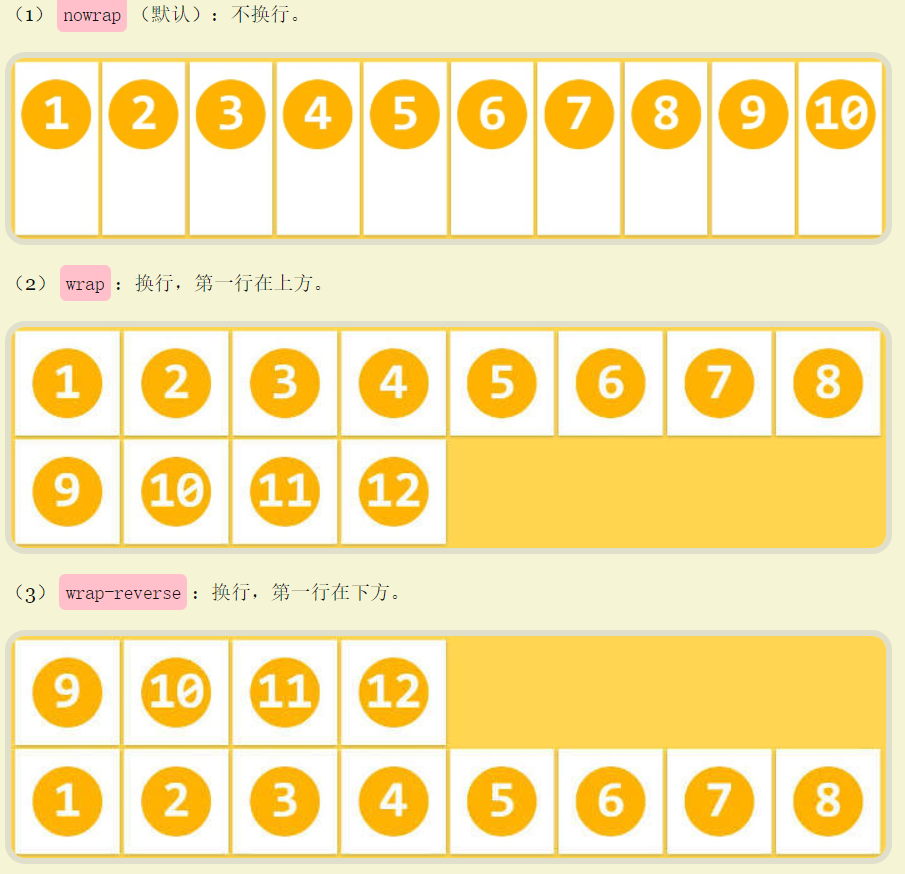

##11. 为什么浏览器读取css选择器的顺序是从右到左

从用户在地址栏中输入地址并按下回车，到他看到整个页面的过程大致如下：

1. 用户在浏览器地址栏输入地址，按下回车；

2. 浏览器向服务器发送请求，服务器响应请求并返回数据；（这其中的DNS解析，路由解析，服务器mvc请求分发，连接数据库等一系列操作略过）
3. 浏览器接收服务器传回的html代码，通过词法解析和语法解析生成dom树，生成dom树期间，解析到link标签则去下载相应的css文件，待所有外部css文件下载完成后，结合页面中的style标签和标签行内style样式，生成render树. render树包含了每个dom节点的样式信息（位置，大小，字体，背景等）。
4. 结合dom树和render树绘制页面，如下图所示：


我们要研究的问题发生在步骤3,构建render树的过程中。
    构建render树的过程是遍历dom树, 每次拿出一个dom节点，然后遍历所有的样式规则查找与当前节点匹配的规则，最后将所有匹配的规则中定义的样式写入一个render对象中，再将该render对象挂到render树上（这个render对象和 dom节点会以某种方式建立联接，知道彼此的存在）。*
\*   也就是说，每次只有一个dom节点，且该节点标签名称，拥有的class和id等我是已知的，例如<span class="abc" id="demo">，但却可能有成千上万条css规则(这个数量并不夸张)，我们需要从这多的规则中找中符合当前的节点的1条或几条规则(这个数量绝不会很多)。
   由于每条规则都可能有多层嵌套，例如 #container p.content .title a {...}，如果采用从左到右的方式读取css规则，那么大多数规则读到最后会发现是不匹配的，这样会做很多无用功。
   而如果采取从右到左的方式，那么只要发现最右边的key selector不匹配，整条规则就都不必再看下去了。例如当前节点是<span class="abc" id="demo">, 那么只有最右端选择器是span或.abc或#demo的css 规则有可能匹配，其它的就可以直接被舍弃了。
   根据2009年Google和Firefox的测试，right-to-left方式可以避免70%左右的无效匹配，因此目前主流浏览器都采用这种方式读取css selector(css规则).*
*