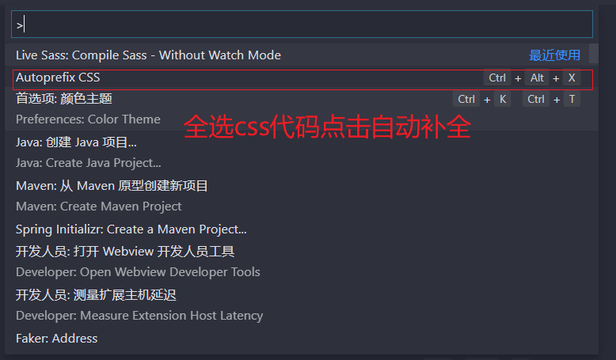

# Css扩展

## 1. Css 原生的变量和函数(自定义属性和函数使用)

[MDN官方的解释](https://developer.mozilla.org/zh-CN/docs/Web/CSS/Using_CSS_custom_properties)

[阮一峰CSS变量教程](http://www.ruanyifeng.com/blog/2017/05/css-variables.html)

> 自定义属性（有时候也被称作CSS变量或者级联变量）是由CSS作者定义的，它包含的值可以在整个文档中重复使用。由自定义属性标记设定值（比如： --main-color: black;），由var() 函数来获取值（比如： color: var(--main-color);）
复杂的网站都会有大量的CSS代码，通常也会有许多重复的值。举个例子，同样一个颜色值可能在成千上百个地方被使用到，如果这个值发生了变化，需要全局搜索并且一个一个替换（很麻烦哎～）。自定义属性在某个地方存储一个值，然后在其他许多地方引用它。另一个好处是语义化的标识。比如，--main-text-color 会比 #00ff00 更易理解，尤其是这个颜色值在其他上下文中也被使用到。
自定义属性受级联的约束，并从其父级继承其值。

```html
<!DOCTYPE html>
<html lang="en">
  <head>
    <meta charset="UTF-8" />
    <meta name="viewport" content="width=device-width, initial-scale=1.0" />
    <title>Document</title>
    <style>
      html {
        --color: lightgreen;
        --font-size: 28px;
      }
      div {
        width: 200px;
        height: 200px;
        border: 1px solid red;
      }
      .box1 {
        /* background: pink; */
        background: var(--color);
      }
      .box2 {
        /*  background: green; */
        /* 获取定义的颜色变量 */
        background: var(--color);
      }
      p {
        font-size: calc(3 * 60%);
      }
    </style>
  </head>
  <body>
    <div class="box1"></div>
    <div class="box2"></div>
    <p>
      自定义属性（有时候也被称作CSS变量或者级联变量）是由CSS作者定义的，它包含的值可以在整个文档中重复使用。由自定义属性标记设定值（比如：
      --main-color: black;），由var() 函数来获取值（比如： color:
      var(--main-color);)
    </p>
  </body>
</html>

```

> 原生的css自定义属性存在浏览器的兼容任性的问题，虽然目前的80%的浏览器兼容，但是还是用的少。

## 2. Less

[less中文网站](http://lesscss.cn/)

[less英文网站](https://less.bootcss.com/)

> Less 是一门 CSS 预处理语言，它扩展了 CSS 语言，增加了变量、Mixin、函数等特性，使 CSS 更易维护和扩展。
>
> Less 可以运行在 Node 或浏览器端。

### 2.1 基本使用方式

#### 2.1.1 在页面直接使用Less

```html
<link rel="stylesheet/less" type="text/css" href="styles.less" />
<script src="//cdnjs.cloudflare.com/ajax/libs/less.js/3.11.1/less.min.js" ></script>

```

```html
<!DOCTYPE html>
<html lang="en">
  <head>
    <meta charset="UTF-8" />
    <meta name="viewport" content="width=device-width, initial-scale=1.0" />
    <title>less网页端使用</title>
    <!-- <link rel="stylesheet/less" type="text/css" href="styles.less" /> -->

    <style type="text/less">
      /* 定义页面中的全局的变量  使用@来定义变量 */
      @basic-width: 1200px;
      @basicFontSize: 16px;
      .wrap {
        width: @basic-width;
        margin: 0 auto;
        height: 450px;
        background: red;
        background: #f7f7f7;
        p {
          font-size: @basicFontSize;
          color: red;
          span {
            color: green;
          }
        }
      }
    </style>
  </head>
  <body>
    <div class="wrap">
      <p>
        <span>Less</span> 是一门 CSS 预处理语言，它扩展了 CSS
        语言，增加了变量、Mixin、函数等特性，使 CSS 更易维护和扩展。 Less
        可以运行在 Node 或浏览器端。
      </p>
    </div>
    <script src="https://cdnjs.cloudflare.com/ajax/libs/less.js/3.11.1/less.min.js"></script>
  </body>
</html>

```


#### 2.1.2 在NodeJs环境下使用

```shell
npm install -g less #全局安装less
> lessc styles.less styles.css # 将写好的style.less 编译为style.css文件在引入到项目中
```

#### 2.1.3 Vscode 中使用Less

vscode 安装less插件  easy-less


**style.less**

```less
@basicwidth:100px;
@contentWidth:@basicwidth+20px;
.wrap{
  width:@contentWidth;
  height: 100px;
  background: lawngreen;
}
```

**style.css**

```css
.wrap {
  width: 120px;
  height: 100px;
  background: lawngreen;
}

```

#### 2.1.4 离线编译less文件

[koala中文官网](http://koala-app.com/index-zh.html)


**使用方式:拖入编写好的less所在的文件夹，执行编译，会将编译好的css放在同一级的目录下。**

### 2. Less-变量(Variables)

#### 2.1.1 变量的基本使用

**变量的基本定义和运算**

```html
<!DOCTYPE html>
<html lang="en">
  <head>
    <meta charset="UTF-8" />
    <meta name="viewport" content="width=device-width, initial-scale=1.0" />
    <title>less网页端使用</title>
    <!-- <link rel="stylesheet/less" type="text/css" href="styles.less" /> -->

    <style type="text/less">
      /* 定义页面中的全局的变量  使用@来定义变量 */
      @basic-width: 1200px;
      /**/
      @basicFontSize: 16px;
      /*在原有的变量的基础上可以进行运算*/
      @p-fontsize:@basicFontSize+14px;
      .wrap {
        width: @basic-width;
        margin: 0 auto;
        height: 450px;
        background: red;
        background: #f7f7f7;
        p {
          font-size: @basicFontSize;
          color: red;
          span {
            color: green;
          }
        }
      }
    </style>
  </head>
  <body>
    <div class="wrap">
      <p>
        <span>Less</span> 是一门 CSS 预处理语言，它扩展了 CSS
        语言，增加了变量、Mixin、函数等特性，使 CSS 更易维护和扩展。 Less
        可以运行在 Node 或浏览器端。
      </p>
    </div>
    <script src="https://cdnjs.cloudflare.com/ajax/libs/less.js/3.11.1/less.min.js"></script>
  </body>
</html>

```


**变量的插入**

```less
@basicwidth:200px;
@contentWidth:@basicwidth+20px;
@my-selector:content;
/* @{} 获取定义的变量的值进行填充 */
.@{my-selector}{
  width:1200px;
  margin: 0 auto;
}
.border{
 border: 1px solid green;
 border-radius:10px ;
}

.wrap{
  width:@contentWidth;
  height: 600px;
  background: lawngreen;
  /*混合 引入已经定义好的其他的属性值*/
  .border();
}
```

*编译后的css*

```css
/* @{} 获取定义的变量的值进行填充 */
.content {
  width: 1200px;
  margin: 0 auto;
}
.border {
  border: 1px solid green;
  border-radius: 10px ;
}
.wrap {
  width: 220px;
  height: 600px;
  background: lawngreen;
  /*混合 引入已经定义好的其他的属性值*/
  border: 1px solid green;
  border-radius: 10px ;
}

```

**对页面中路径的补全**

```less
@basicwidth:200px;
@contentWidth:@basicwidth+20px;
@my-selector:content;
@images:"../images";

/* @{} 获取定义的变量的值进行填充 */
.@{my-selector}{
  width:1200px;
  margin: 0 auto;
}
.border{
 border: 1px solid green;
 border-radius:10px ;
}

.wrap{
  width:@contentWidth;
  height: 600px;
  background: lawngreen;
  /*混合 引入已经定义好的其他的属性值*/
  .border();
  /* 引入定义好的图片路径的前缀的值 */
  background: url("@{images}/1.jpg");
}

```

*编译后的css*

```css
/* @{} 获取定义的变量的值进行填充 */
.content {
  width: 1200px;
  margin: 0 auto;
}
.border {
  border: 1px solid green;
  border-radius: 10px ;
}
.wrap {
  width: 220px;
  height: 600px;
  background: lawngreen;
  /*混合 引入已经定义好的其他的属性值*/
  border: 1px solid green;
  border-radius: 10px ;
  /* 引入定义好的图片路径的前缀的值 */
  background: url("../images/1.jpg");
}

```


#### 2.1.2 变量的混合使用(Mixins)

```html
@basicwidth:200px;
@contentWidth:@basicwidth+20px;
/*定义共有的基本的属性值*/
.border{
 border: 1px solid green;
 border-radius:10px ;
}

.wrap{
  width:@contentWidth;
  height: 600px;
  background: lawngreen;
  /*混合 引入已经定义好的其他的属性值*/
  /*.border();*/
/*也可以省略() 进行简写*/
	.border;
}
```

**带参数/多个参数/默认值的混合**

````less
/* 多个参数的混合 */
/* .border(@w,@style,@color){
  border: @w @style @color;
} */
/* 默认值的混合 */
.border(@w:2px ,@style:solid,@color:green){
  border: @w @style @color;
}

.box{
  /* 传入值 实参 */
  /* .border(1px,solid,red); */
  /* 使用默认值 */
  /* .border(); */
  /* 命名参数  针对于值需要值的参数 其他的使用默认值*/
  .border(@color:pink);
}

````

**匹配混合:**

> 同一种的样式按照不同的参数来进行显示。就是匹配模式 RLTB 就是标记的作用

```less

/* 同名会自动调用 */
.triangle(@_;@w;@color){
  width: 0;
  height: 0;
  overflow: hidden;
}
/* 向右的箭头 */
.triangle(L,@w,@color){
  border-width:@w/2 0px @w/2 @w;
  border-style: dashed  dashed dashed solid;
  border-color: transparent transparent transparent  @color;
}

/* right */
.triangle(R,@w,@color){
  border-width:@w/2 @w @w/2 0px;
  border-style: dashed solid dashed dashed ;
  border-color: transparent @color transparent transparent  ;
}

/* top */
.triangle(L,@w,@color){
  border-width:@w/2 0px @w/2 @w;
  border-style: dashed  dashed dashed solid;
  border-color: transparent transparent transparent  @color;
}

/* bottom */
.triangle(L,@w,@color){
  border-width:@w/2 0px @w/2 @w;
  border-style: dashed  dashed dashed solid;
  border-color: transparent transparent transparent  @color;
}


```

```less
@import "./triangle.less";

#wrap > .box{
  .triangle(R,40px,pink);
}
```

```html
<!DOCTYPE html>
<html lang="en">
  <head>
    <meta charset="UTF-8" />
    <meta name="viewport" content="width=device-width, initial-scale=1.0" />
    <title>Document</title>
    <link rel="stylesheet" href="style.css" />
  </head>
  <body>
    <div id="wrap">
      <div class="box"></div>
    </div>
  </body>
</html>

```


#### 2.1.3 变量的延迟加载

> 两次定义变量时，使用变量的最后定义，从当前作用域向上搜索。这类似于css本身，其中css定义中的最后一个属性用于确定值。

```less
@var: 0;
.class {
  @var: 1;
  .brass {
    @var: 2;
    three: @var;
    @var: 3;
  }
  one: @var;
}
```

```css
.class {
  one: 1;
}
.class .brass {
  three: 3;
}
```


###2.2  嵌套(Nesting)

```less
#header {
  color: black;
  .navigation {
    font-size: 12px;
  }
  .logo {
    width: 300px;
  }
}
```

```css
#header {
  color: black;
}
#header .navigation {
  font-size: 12px;
}
#header .logo {
  width: 300px;
}
```

> 用 Less 书写的代码更加简洁，并且模仿了 HTML 的组织结构。

**父级属性多层嵌套**

> 你还可以使用此方法将伪选择器（pseudo-selectors）与混合（mixins）一同使用。下面是一个经典的 clearfix 技巧，重写为一个混合（mixin） (& 表示当前选择器的父级）

```less
.clearfix {
  display: block;
  zoom: 1;
/*& 代表当前的选择器的父级*/
  &:after {
    content: " ";
    display: block;
    font-size: 0;
    height: 0;
    clear: both;
    visibility: hidden;
  }
}
```

*编译后的CSS*

```css
.clearfix {
  display: block;
  zoom: 1;
}
.clearfix:after {
  content: " ";
  display: block;
  font-size: 0;
  height: 0;
  clear: both;
  visibility: hidden;
}
```

####2.3 函数(Functions)

> Less 内置了多种函数用于转换颜色、处理字符串、算术运算等

```less
// func.less
.border-radius(@radius) {
  -webkit-border-radius: @radius;
     -moz-border-radius: @radius;
          border-radius: @radius;
}

#header {
  .border-radius(4px);
}
.button {
  .border-radius(6px);
}
```


### 2.4 运算

```less
// 所有操作数被转换成相同的单位
@conversion-1: 5cm + 10mm; // 结果是 6cm
@conversion-2: 2 - 3cm - 5mm; // 结果是 -1.5cm

// conversion is impossible
@incompatible-units: 2 + 5px - 3cm; // 结果是 4px

// example with variables
@base: 5%;
@filler: @base * 2; // 结果是 10%
@other: @base + @filler; // 结果是 15%
```


### 2.5 导入

```less
@import "library"; // library.less
@import "typo.css";
```

### 2.6 注释

```less
//编译以后是看不见的 对开发人员使用
/*编译以后可见的，对用户使用*/
.clearfix {
  display: block;
  zoom: 1;
  &:after {
    content: " ";
    display: block;
    font-size: 0;
    height: 0;
    clear: both;
    visibility: hidden;
  }
}
```

### 2.7 arguments参数

```less

.border(@w,@style,@color){
  border: @arguments;
}
```

### 2.7 参数的默认值

```less
/*函数的变量的默认值*/

.ul(@width:2px;@style;@color){
  border: @width @style @color;
}

ul{
  .ul(@style:solid;@color:pink)
}
```

## 3. Sass

[Sass官网](https://www.sass.hk/)

>  世界上最成熟、最稳定、最强大的专业级CSS扩展语言！


### 3.1 Sass安装 [https://www.sass.hk/install/](https://www.sass.hk/install/)


> 在Setting.json中配置sass的输出文件路径:

```json
"easysass.formats": [ 
        //nested：嵌套缩进的 css 代码。
        //expanded：没有缩进的、扩展的css代码。
        //compact：简洁格式的 css 代码。
        //compressed：压缩后的 css 代码
        {
            "format": "expanded",
            "extension": ".css" //设置编译输出的文件名
        },
        {
            "format": "compressed",
            "extension": ".min.css" //设置编译输出的文件名
        }
    ],
    "easysass.targetDir": "./css/" //提供 css 输出路径的设置（可以是绝对路径或者相对路径）
```


```json
iveSassCompile.settings.formats":[
    // 扩展
    {
        "format": "compressed",//可定制的出口CSS样式（expanded，compact，compressed，nested）
       // "extensionName": ".min.css",//编译后缀名
        "extensionName": ".min.css",//编译后缀名
        "savePath": "~/css/" ,  //编译保存的路径
    } 
],

"liveSassCompile.settings.excludeList": [
    "**/node_modules/**",
    ".vscode/**"
 ],
```

[更多配置](https://github.com/ritwickdey/vscode-live-sass-compiler/blob/master/docs/settings.md)

### 3.2 **Sass和Scss的区别:**

Sass 有两种语法格式。首先是 SCSS (Sassy CSS) —— 也是本文示例所使用的格式 —— 这种格式仅在 CSS3 语法的基础上进行拓展，所有 CSS3 语法在 SCSS 中都是通用的，同时加入 Sass 的特色功能。此外，SCSS 也支持大多数 CSS hacks 写法以及浏览器前缀写法 (vendor-specific syntax)，以及早期的 IE 滤镜写法。这种格式以 `.scss` 作为拓展名。

另一种也是最早的 Sass 语法格式，被称为缩进格式 (Indented Sass) 通常简称 "Sass"，是一种简化格式。它使用 “缩进” 代替 “花括号” 表示属性属于某个选择器，用 “换行” 代替 “分号” 分隔属性，很多人认为这样做比 SCSS 更容易阅读，书写也更快速。缩进格式也可以使用 Sass 的全部功能，只是与 SCSS 相比个别地方采取了不同的表达方式，具体请查看 [the indented syntax reference](http://sass-lang.com/docs/yardoc/file.INDENTED_SYNTAX.html)。这种格式以 `.sass` 作为拓展名。

任何一种格式可以直接 [导入 (@import)](https://www.sass.hk/docs/#t7-1) 到另一种格式中使用，或者通过 `sass-convert` 命令行工具转换成另一种格式：

```
# Convert Sass to SCSS
$ sass-convert style.sass style.scss

# Convert SCSS to Sass
$ sass-convert style.scss style.sass
```

```sass
/* Scss的基础用法
多行注释开始和结束必须加
*/  
//单行注释每一行 必须加
//白日依山尽  
//黄河入海流

@import "base";

@mixin alert{
color:red;
}
.nav{
@include alert;
}

ul{
font-size:15px;
li{
list-style: none;
}
}
```

```scss
/* sass基础使用方式
	多行住是可以不写结束

// 白日依山尽
	黄河入海流

-alert
	color:red

.nav 
	+alert

ul 
	font-size:18px
	li 
		list-style:none
```

> scss 严格的语法  和css使一样的
>
> sass 省略{} 语法也没那么严谨  [sass语法](https://sass-lang.com/documentation/syntax)

### 3.3变量

[快速入门](https://www.sass.hk/guide/)

```sass
/* 多行注释在编译后的文件中是可见的 */
/*多行注释会被编译到cs中，但是如果是压缩后的css，注释就不会编译到css中*/

//注释不可见？
$base-color: #c6538c;
$basic-font-size:16px;
$border-dark: rgba($base-color, 0.88);

.alert{
  font-size: $basic-font-size;
  border: 1px solid $border-dark;
}

```

```css
@charset "UTF-8";

/* 多行注释在编译后的文件中是可见的 */
/*多行注释会被编译到cs中，但是如果是压缩后的css，注释就不会编译到css中*/
.alert {
  font-size: 16px;
  border: 1px solid rgba(198, 83, 140, 0.88);
}

/*# sourceMappingURL=style.css.map */
```

### 3.4 嵌套

```scss
/* 多行注释在编译后的文件中是可见的 */
/*多行注释会被编译到cs中，但是如果是压缩后的css，注释就不会编译到css中*/

//注释不可见？
$base-color: #c6538c;
$basic-font-size:16px;
$border-dark: rgba($base-color, 0.88);

.alert{
  font-size: $basic-font-size;
  border: 1px solid $border-dark;
  //嵌套
  a {
    text-decoration: none;
    span{
      color: lightcoral;
    }
  }
}

```

```css
@charset "UTF-8";
/* 多行注释在编译后的文件中是可见的 */
/*多行注释会被编译到cs中，但是如果是压缩后的css，注释就不会编译到css中*/
.alert { font-size: 16px; border: 1px solid rgba(198, 83, 140, 0.88); }

.alert a { text-decoration: none; }

.alert a span { color: lightcoral; }
/*# sourceMappingURL=style.css.map */
```

### 3.5 父选择器的标识符&

```scss
.alert{
  font-size: $basic-font-size;
  border: 1px solid $border-dark;
  //嵌套
  a {
    text-decoration: none;
    span{
      color: lightcoral;
    }
  }
  //父选择器
  &:hover{
    background: lawngreen;
  }
}
```

### 3.6 群组选择器的嵌套

```
.container {
  h1, h2, h3 {margin-bottom: .8em}
}
```

```css
.container h1, .container h2, .container h3 { margin-bottom: .8em }
```

### 3.7 子组合选择器和同层组合选择器：>、+和~;

```scss
article {
  ~ article { border-top: 1px dashed #ccc }
  > section { background: #eee }
  dl > {
    dt { color: #333 }
    dd { color: #555 }
  }
  nav + & { margin-top: 0 }
}
```

```css
article ~ article { border-top: 1px dashed #ccc }
article > footer { background: #eee }
article dl > dt { color: #333 }
article dl > dd { color: #555 }
nav + article { margin-top: 0 }
```

### 3.8 嵌套属性

```scss
nav {
  border: {
  style: solid;
  width: 1px;
  color: #ccc;
  }
}
```

```css
nav {
  border-style: solid;
  border-width: 1px;
  border-color: #ccc;
}
```

### 3.9 导入scss

```scss
@import "style.scss"
```

### 3.10 混合

```scss
//定义混合
@mixin rounded-corners {
  -moz-border-radius: 5px;
  -webkit-border-radius: 5px;
  border-radius: 5px;
}
notice {
  background-color: green;
  border: 2px solid #00aa00;
    //调用混合
  @include rounded-corners;
}

```

### 3.11 混合传参数

```cscc
@mixin link-colors($normal, $hover, $visited) {
  color: $normal;
  &:hover { color: $hover; }
  &:visited { color: $visited; }
}

a {
  @include link-colors(blue, red, green);
}

```

```css
a { color: blue; }
a:hover { color: red; }
a:visited { color: green; }
```

### 3.12 参数的默认值

```scss
@mixin border-radius($radius:5px){
     -webkit-border-radius: $radius;
     border-radius: $radius;
}
```

## 4. Stylus

[https://stylus.bootcss.com/](https://stylus.bootcss.com/)

> 相比于 sass 的激进和 less 的常规，Stylus 是一个高效、动态以及丰富的 CSS 预处理器。它同时支持缩进的和通俗的两种风格的 CSS 语法风格。

## 5. Autoprefix

> 自动添加css3前缀


```json
"autoprefixer.browsers" : [
  "ie >= 6", 
  "firefox >= 8",
  "chrome >= 24",
  "Opera>=10"
],
```



```css
div {
  width: 200px;
  height: 300px;
  background: lawngreen;
  -moz-animation: run 3s ease infinite;
  -o-animation: run 3s ease infinite;
  animation: run 3s ease infinite;
  -webkit-animation: run 3s ease infinite;
  display: -webkit-flex;
  display: -moz-box;
  display: -ms-flexbox;
  display: flex;
}

@-webkit-keyframes run {
  from {}

  to {}
}

@-moz-keyframes run {
  from {}

  to {}
}

@-o-keyframes run {
  from {}

  to {}
}

@keyframes run {
  from {}

  to {}
}
```

## 6 . Flex伸缩盒

[携程网](http://m.ctrip.com/html5/)


阮一峰的网络日志  flex布局[http://www.ruanyifeng.com/blog/2015/07/flex-grammar.html](http://www.ruanyifeng.com/blog/2015/07/flex-grammar.html)


> 布局的传统解决方案，基于[盒状模型](https://developer.mozilla.org/en-US/docs/Web/CSS/box_model)，依赖 [`display`](https://developer.mozilla.org/en-US/docs/Web/CSS/display) 属性 + [`position`](https://developer.mozilla.org/en-US/docs/Web/CSS/position)属性 + [`float`](https://developer.mozilla.org/en-US/docs/Web/CSS/float)属性。它对于那些特殊布局非常不方便，比如，[垂直居中](https://css-tricks.com/centering-css-complete-guide/)就不容易实现。
>
> 2009年，W3C 提出了一种新的方案----Flex 布局，可以简便、完整、响应式地实现各种页面布局。目前，它已经得到了所有浏览器的支持，这意味着，现在就能很安全地使用这项功能。
>
> Flex 是 Flexible Box 的缩写，意为"弹性布局"，用来为盒状模型提供最大的灵活性。
>
> 任何一个容器都可以指定为 Flex 布局。
>
> ```html
> div{
> 	display:flex | line-flext;
> }
> 
> ```
>
> Webkit 内核的浏览器，必须加上`-webkit`前缀。
>
> ```css
> .box{
>   display: -webkit-flex; /* Safari */
>   display: flex;
> }
> ```

### 5.1 基本概念

[Demo演示](http://static.vgee.cn/static/index.html)

> 采用 Flex 布局的元素，称为 Flex 容器（flex container），简称"容器"。它的所有子元素自动成为容器成员，称为 Flex 项目（flex item），简称"项目"。
>
> 容器默认存在两根轴：水平的主轴（main axis）和垂直的交叉轴（cross axis）。主轴的开始位置（与边框的交叉点）叫做`main start`，结束位置叫做`main end`；交叉轴的开始位置叫做`cross start`，结束位置叫做`cross end`。
>
> 项目默认沿主轴排列。单个项目占据的主轴空间叫做`main size`，占据的交叉轴空间叫做`cross size`。


### 5.2 容器的属性

> - flex-direction  主轴的排列方式
> - flex-wrap  主轴排列的元素是否换行
> - flex-flow   flex-flow`属性是`flex-direction`属性和`flex-wrap`属性的简写形式，默认值为`row nowrap
> - justify-content  `justify-content`属性定义了项目在主轴上的对齐方式
> - align-items   `align-items`属性定义项目在交叉轴上如何对齐。
> - align-content  属性定义了多根轴线的对齐方式。如果项目只有一根轴线，该属性不起作用

### 5.3 flex-direction

> 主轴的方向。
>
> .box {
> 		flex-direction: row | row-reverse | column | column-reverse;
> }
>
> - `row`（默认值）：主轴为水平方向，起点在左端。
> - `row-reverse`：主轴为水平方向，起点在右端。
> - `column`：主轴为垂直方向，起点在上沿。
> - `column-reverse`：主轴为垂直方向，起点在下沿。


### 5.4 justify-content

> `justify-content`属性定义了项目在主轴上的对齐方式。
>
> ```css
> .box {
>   justify-content: flex-start | flex-end | center | space-between | space-around;
> }
> ```
>
> - `flex-start`（默认值）：左对齐
> - `flex-end`：右对齐
> - `center`： 居中
> - `space-between`：两端对齐，项目之间的间隔都相等。
> - `space-around`：每个项目两侧的间隔相等。所以，项目之间的间隔比项目与边框的间隔大一倍。
> - `space-evenly ` : 均匀的分配剩余的空间

### 5.5 flex-wrap

> 默认情况下，项目都排在一条线（又称"轴线"）上。`flex-wrap`属性定义，如果一条轴线排不下，如何换行
>
> ```css
> .box{
> 	flex-wrap: nowrap | wrap | wrap-reverse;
> }
> ```


### 5.6 align-items

> - `flex-start`：交叉轴的起点对齐。
> - `flex-end`：交叉轴的终点对齐。
> - `center`：交叉轴的中点对齐。
> - `baseline`: 项目的第一行文字的基线对齐。
> - `stretch`（默认值）：如果项目未设置高度或设为auto，将占满整个容器的高度


### 5.7 项目的属性

> - `order ` `order`属性定义项目的排列顺序。数值越小，排列越靠前，默认为0。
> - `flex-grow`   `flex-grow`属性定义项目的放大比例，默认为`0`，即如果存在剩余空间，也不放大。
> - `flex-shrink`  `flex-shrink`属性定义了项目的缩小比例，默认为1，即如果空间不足，该项目将缩小。值为0项目比缩放
> - `flex-basis`  元素的宽度设置 和width一样  同时存在  的话 flex-basis 优先级高
> - `flex`   `flex`属性是`flex-grow`, `flex-shrink` 和 `flex-basis`的简写，默认值为`0 1 auto`。后两个属性可选。
> - `align-self` `align-self`属性允许单个项目有与其他项目不一样的对齐方式，可覆盖`align-items`属性。默认值为`auto`，表示继承父元素的`align-items`属性，如果没有父元素，则等同于`stretch`。

### 5.8 order


### 5.9 flex-grow

> `flex-grow`属性定义项目的放大比例，默认为`0`，即如果存在剩余空间，也不放大。
>
> 容器存在多余的空间时，项目可以放大占据剩余的空间。


如果所有项目的`flex-grow`属性都为1，则它们将等分剩余空间（如果有的话）。如果一个项目的`flex-grow`属性为2，其他项目都为1，则前者占据的剩余空间将比其他项多一倍。

### 5.10 flex-shrink

> `flex-shrink`属性定义了项目的缩小比例，默认为1，即如果空间不足，该项目将缩小。
>
> 项目在容器中放不下的时候，元素可以缩放，填充满容器


如果所有项目的`flex-shrink`属性都为1，当空间不足时，都将等比例缩小。如果一个项目的`flex-shrink`属性为0，其他项目都为1，则空间不足时，前者不缩小。

负值对该吗，吗，， 属性无效。

### 5.11 Flex-basis

> `flex-basis`属性定义了在分配多余空间之前，项目占据的主轴空间（main size）。浏览器根据这个属性，计算主轴是否有多余空间。它的默认值为`auto`，即项目的本来大小。
>
> 当一个元素同时被设置了 `flex-basis` (除值为 `auto` 外) 和 `width` (或者在 `flex-direction: column` 情况下设置了`height`) , `flex-basis` 具有更高的优先级.

### 5.12 align-self

> `align-self`属性允许单个项目有与其他项目不一样的对齐方式，可覆盖`align-items`属性。默认值为`auto`，表示继承父元素的`align-items`属性，如果没有父元素，则等同于`stretch`。
>
> align-self属性不适用于块类型的盒模型和表格单元。如果任何 flexbox 元素的侧轴方向 margin 值设置为 auto，则会忽略 `align-self`。


###  5.13 flex

> `flex`属性是`flex-grow`, `flex-shrink` 和 `flex-basis`的简写，默认值为`0 1 auto`。后两个属性可选。
>
> ```css
> .item {
>   flex: none | [ <'flex-grow'> <'flex-shrink'>? || <'flex-basis'> ]
> }
> ```
>
> 该属性有两个快捷值：`auto` (`1 1 auto`) 和 none (`0 0 auto`)。
>
> 大多数情况下，开发者需要将 `flex` 设置为 `auto`，`initial`，`none`，或一个无单位正数

## 6. Grid 布局

> 前端布局的时代变化:
>
> 1. table，通过 Dreamweaver 拖拽表格或者手写 table 标签布局
> 2. div、span、position、float，借助元素元素盒模型本身的特性以及 float position 等属性等进行布局
> 3. flexbox ，革命性的突破，解决传统布局方案上的三大痛点 排列方向、对齐方式，自适应尺寸。是目前最为成熟和强大的布局方案。
> 4. grid layout，二维布局模块，具有强大的内容尺寸和定位的能力，适合需要在两个维度上对齐内容的布局。

[阮一峰 Gride布局](http://www.ruanyifeng.com/blog/2019/03/grid-layout-tutorial.html)

> **CSS 网格布局**擅长于将一个页面划分为几个主要区域，以及定义这些区域的大小、位置、层次等关系（前提是HTML生成了这些区域）。
>
> 像表格一样，网格布局让我们能够按行或列来对齐元素。 然而在布局上，网格比表格更可能做到或更简单。 例如，网格容器的子元素可以自己定位，以便它们像CSS定位的元素一样，真正的有重叠和层次。


### 5.1 容器和项目

### 5.2 行和列

### 5.3 单元格

### 5.4 网格线

### 5.5 容器属性

### 5.6 项目属性


## 7. Emmet 语法

[https://docs.emmet.io/abbreviations/syntax/](https://docs.emmet.io/abbreviations/syntax/)

