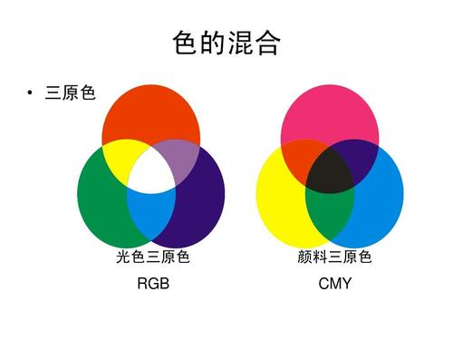

# CSS

> 层叠样式表(英文全称：Cascading Style Sheets)是一种用来表现[HTML](https://baike.baidu.com/item/HTML)（[标准通用标记语言](https://baike.baidu.com/item/标准通用标记语言/6805073)的一个应用）或[XML](https://baike.baidu.com/item/XML)（标准通用标记语言的一个子集）等文件样式的计算机语言。CSS不仅可以静态地修饰网页，还可以配合各种脚本语言动态地对网页各元素进行格式化。 [1] 
>
> CSS 能够对网页中元素位置的排版进行像素级精确控制，支持几乎所有的字体字号样式，拥有对网页对象和模型样式编辑的能力。
>
> 层叠样式:网页中最终展示的效果,就像透明的色彩卡片一层一层叠加，最终展示的才是给我们的效果。
>
> 页面的图片的宽,高,形状,位置,效果....达到最终的效果。



:kissing_smiling_eyes: 没有使用css的效果


:slightly_smiling_face: 使用了css的效果


[css官方地址](https://www.w3.org/TR/)

> **css的组成**:   
>
> + 选择器: 选中页面中的哪一个，或者那些符合条件的元素给添加样式
> + 属性: 给页面中的元素添加那些样式,宽,高,颜色,边框,背景.....
> + 属性的值: 赋给演示需要的值。

> **浏览器读取编译css的顺序:**
>
>浏览器读取css选择器的顺序是从右到左

## 1.Css的基本的使用方式

+ 选择器
+ 声明块
  + 声明
    + 属性
    + 值


### 1.1 Css的三种使用方式

+ 行内样式表  只能正对当前的元素使用
+ 内部样式表 在页面的head标签内部使用，对页面多个元素的样式进行调整
+ 外部样式表  在外部的css文件中书写，针对于多个页面的样式进行书写规范。

> 行内样式表 : 在开始标签内部使用style属性声明添加样式,在添加样式的属性和赋值 style="color:red;font-size:24px;"属性之间使用分号相隔。

```html
<p style="color: lightcoral; font-size: 20px">
      层叠样式表(英文全称：Cascading Style
      Sheets)是一种用来表现HTML（标准通用标记语言的一个应用）或XML（标准通用标记语言的一个子集）等文件样式的计算机语言。CSS不仅可以静态地修饰网页，还可以配合各种脚本语言动态地对网页各元素进行格式化。
      [1] CSS
      能够对网页中元素位置的排版进行像素级精确控制，支持几乎所有的字体字号样式，拥有对网页对象和模型样式编辑的能力。
      层叠样式:网页中最终展示的效果,就像透明的色彩卡片一层一层叠加，最终展示的才是给我们的效果。
      页面的图片的宽,高,形状,位置,效果....达到最终的效果
    </p>
```

> 内部样式表

```html
<!DOCTYPE html>
<html lang="en">
  <head>
    <meta charset="UTF-8" />
    <meta name="viewport" content="width=device-width, initial-scale=1.0" />
    <title>Document</title>
    <style>
      div {
        width: 600px;
        height: 400px;
        border: 1px solid red;
        margin: 0 auto;
      }
    </style>
  </head>
  <body>
    <div></div>
  </body>
</html>

```

> :smile: 外部样式表:
>
> ​	将css样式表编写到外部的css文件中，在通过link进行引用。
>
> ​	link引入的外部样式表可以在多个页面进行复用，减少开发的时间。
>
> ​	:exclamation: 外部的css样式表，可以使用浏览器的缓存机制，加快网页的加载速度，提升用户的体验。

```html
/*style.css*/
div {
        width: 600px;
        height: 400px;
        border: 1px solid red;
        margin: 0 auto;
      }
```

```html
<!DOCTYPE html>
<html lang="en">
  <head>
    <meta charset="UTF-8" />
    <meta name="viewport" content="width=device-width, initial-scale=1.0" />
    <title>Document</title>
      <!---link  引入外部的连接资源->
      <!--引入外部的css文件 rel声明是层叠样式表  href 引入的资源 可以是本地的 可以使远程的-->
    <link rel="stylesheet" href="style.css">
      <!--link也可以用来引入外部的网页图标-->
      <link rel="icon" href="//www.jd.com/favicon.ico"mce_href="//www.jd.com/favicon.ico" type="image/x-icon"/>
  </head>
  <body>
    <div></div>
  </body>
</html>

```

### 1.2 Css三种使用方式的优先级别

```html
<!DOCTYPE html>
<html lang="en">
  <head>
    <meta charset="UTF-8" />
    <meta name="viewport" content="width=device-width, initial-scale=1.0" />
    <title>Document</title>
    <link rel="stylesheet" href="style.css" />
    <style>
      div {
        width: 200px;
        height: 300px;
        border: 1px solid green;
      }
    </style>
  </head>
  <body>
    <div style="width: 300px;height: 300px;border: 2px solid pink;"></div>
  </body>
</html>

```

> 我们在页面使用样式表规则:
>
> 1. 先在外部的样式表规定多个页面的相同元素的样式
> 2. 在在页面内使用内部样式表去补充页面的样式
> 3. 针对某一个元素使用行内样式表单独调试
>
> 页面加载代码的顺序是从上而下，从左到右的顺序。所以css优先级根据覆盖的最终效果是:
>
> ​		**行内样式表 > 内部样式表>外部样式表**
>
> :heavy_exclamation_mark: 行内样式表在实际开发中很少使用，修改项目的时候很麻烦。但也是不是绝对的，只是不推荐使用。

## 2.Css选择器

[CSS3选择器规范地址](https://www.w3.org/TR/2011/REC-css3-selectors-20110929/)

[css3最新选择器规范地址](https://www.w3.org/TR/selectors )

### 2.1 Css基本选择器

1. **通配符选择器**

```html
<!DOCTYPE html>
<html lang="en">
  <head>
    <meta charset="UTF-8" />
    <meta name="viewport" content="width=device-width, initial-scale=1.0" />
    <title>Document</title>
    <style>
      /* *代表通配符，body中的所有的元素 */
      * {
        /* color默认代表文字的颜色 */
        color: red;
      }
    </style>
  </head>
  <body>
    <p>
      Vue (读音 /vjuː/，类似于 view)
      是一套用于构建用户界面的渐进式框架。与其它大型框架不同的是，Vue
      被设计为可以自底向上逐层应用。Vue
      的核心库只关注视图层，不仅易于上手，还便于与第三方库或既有项目整合。另一方面，当与现代化的工具链以及各种支持类库结合使用时，Vue
      也完全能够为复杂的单页应用提供驱动。
    </p>

    <section>
      Vue (读音 /vjuː/，类似于 view)
      是一套用于构建用户界面的渐进式框架。与其它大型框架不同的是，Vue
      被设计为可以自底向上逐层应用。Vue
      的核心库只关注视图层，不仅易于上手，还便于与第三方库或既有项目整合。另一方面，当与现代化的工具链以及各种支持类库结合使用时，Vue
      也完全能够为复杂的单页应用提供驱动。
    </section>

    <div>
      Vue (读音 /vjuː/，类似于 view)
      是一套用于构建用户界面的渐进式框架。与其它大型框架不同的是，Vue
      被设计为可以自底向上逐层应用。Vue
      的核心库只关注视图层，不仅易于上手，还便于与第三方库或既有项目整合。另一方面，当与现代化的工具链以及各种支持类库结合使用时，Vue
      也完全能够为复杂的单页应用提供驱动。
    </div>
  </body>
</html>

```

2. **元素选择器****

```html
<!DOCTYPE html>
<html lang="en">
  <head>
    <meta charset="UTF-8" />
    <meta name="viewport" content="width=device-width, initial-scale=1.0" />
    <title>Document</title>
    <style>
      /* 元素选择器就是根据页面中标签的名称进行选择器，选择到的是页面中所有的选择器名称的标签元素 */
      p {
        color: red;
      }
      section {
        color: green;
      }
    </style>
  </head>
  <body>
    <p>
      Vue (读音 /vjuː/，类似于 view)
      是一套用于构建用户界面的渐进式框架。与其它大型框架不同的是，Vue
      被设计为可以自底向上逐层应用。Vue
      的核心库只关注视图层，不仅易于上手，还便于与第三方库或既有项目整合。另一方面，当与现代化的工具链以及各种支持类库结合使用时，Vue
      也完全能够为复杂的单页应用提供驱动。
    </p>
    <p>
      Vue (读音 /vjuː/，类似于 view)
      是一套用于构建用户界面的渐进式框架。与其它大型框架不同的是，Vue
      被设计为可以自底向上逐层应用。Vue
      的核心库只关注视图层，不仅易于上手，还便于与第三方库或既有项目整合。另一方面，当与现代化的工具链以及各种支持类库结合使用时，Vue
      也完全能够为复杂的单页应用提供驱动。
    </p>

    <section>
      Vue (读音 /vjuː/，类似于 view)
      是一套用于构建用户界面的渐进式框架。与其它大型框架不同的是，Vue
      被设计为可以自底向上逐层应用。Vue
      的核心库只关注视图层，不仅易于上手，还便于与第三方库或既有项目整合。另一方面，当与现代化的工具链以及各种支持类库结合使用时，Vue
      也完全能够为复杂的单页应用提供驱动。
    </section>
  </body>
</html>

```

3. **id选择器**

```html
<!DOCTYPE html>
<html lang="en">
  <head>
    <meta charset="UTF-8" />
    <meta name="viewport" content="width=device-width, initial-scale=1.0" />
    <title>Document</title>
    <style>
      /* 元素选择器就是根据页面中标签的名称进行选择器，选择到的是页面中所有的选择器名称的标签元素 */
      p {
        color: red;
      }
      /* id选择器：
            在元素的开始标签中通过id=""来对当前的元素进行标识，再通过#+id定义的名称值 进行选择标记的标签进行样式定义
            id的值必须是唯一的，在一个页面中只能有一个。
       */
      #p {
        color: pink;
      }
      section {
        color: green;
      }
    </style>
  </head>
  <body>
    <p>
      Vue (读音 /vjuː/，类似于 view)
      是一套用于构建用户界面的渐进式框架。与其它大型框架不同的是，Vue
      被设计为可以自底向上逐层应用。Vue
      的核心库只关注视图层，不仅易于上手，还便于与第三方库或既有项目整合。另一方面，当与现代化的工具链以及各种支持类库结合使用时，Vue
      也完全能够为复杂的单页应用提供驱动。
    </p>
    <p id="p">
      Vue (读音 /vjuː/，类似于 view)
      是一套用于构建用户界面的渐进式框架。与其它大型框架不同的是，Vue
      被设计为可以自底向上逐层应用。Vue
      的核心库只关注视图层，不仅易于上手，还便于与第三方库或既有项目整合。另一方面，当与现代化的工具链以及各种支持类库结合使用时，Vue
      也完全能够为复杂的单页应用提供驱动。
    </p>

    <section>
      Vue (读音 /vjuː/，类似于 view)
      是一套用于构建用户界面的渐进式框架。与其它大型框架不同的是，Vue
      被设计为可以自底向上逐层应用。Vue
      的核心库只关注视图层，不仅易于上手，还便于与第三方库或既有项目整合。另一方面，当与现代化的工具链以及各种支持类库结合使用时，Vue
      也完全能够为复杂的单页应用提供驱动。
    </section>
    </div>
  </body>
</html>

```

4. **class选择器**

```html
<!DOCTYPE html>
<html lang="en">
  <head>
    <meta charset="UTF-8" />
    <meta name="viewport" content="width=device-width, initial-scale=1.0" />
    <title>Document</title>
    <style>
      /* 类选择器可以为多个同名的元素定义相同的样式,这个也是我们在实际开发中使用最多的。
          在元素的开始标签中使用class=""进行命名标记，在使用.+class命名的值 进行样式定义
        同一个元素我们可以定义多个class 可以组合定义这个元素的样式，在后边的学习和框架中我们会经常见到
       */
      .one {
        color: gold;
      }
        .two{
            font-size:24px;
        }
      section {
        color: green;
      }
    </style>
  </head>
  <body>
    <p>
      Vue (读音 /vjuː/，类似于 view)
      是一套用于构建用户界面的渐进式框架。与其它大型框架不同的是，Vue
      被设计为可以自底向上逐层应用。Vue
      的核心库只关注视图层，不仅易于上手，还便于与第三方库或既有项目整合。另一方面，当与现代化的工具链以及各种支持类库结合使用时，Vue
      也完全能够为复杂的单页应用提供驱动。
    </p>
    <p id="p">
      Vue (读音 /vjuː/，类似于 view)
      是一套用于构建用户界面的渐进式框架。与其它大型框架不同的是，Vue
      被设计为可以自底向上逐层应用。Vue
      的核心库只关注视图层，不仅易于上手，还便于与第三方库或既有项目整合。另一方面，当与现代化的工具链以及各种支持类库结合使用时，Vue
      也完全能够为复杂的单页应用提供驱动。
    </p>
    <p class="one two">
      Vue (读音 /vjuː/，类似于 view)
      是一套用于构建用户界面的渐进式框架。与其它大型框架不同的是，Vue
      被设计为可以自底向上逐层应用。Vue
      的核心库只关注视图层，不仅易于上手，还便于与第三方库或既有项目整合。另一方面，当与现代化的工具链以及各种支持类库结合使用时，Vue
      也完全能够为复杂的单页应用提供驱动。
    </p>
    <p class="one">
      Vue (读音 /vjuː/，类似于 view)
      是一套用于构建用户界面的渐进式框架。与其它大型框架不同的是，Vue
      被设计为可以自底向上逐层应用。Vue
      的核心库只关注视图层，不仅易于上手，还便于与第三方库或既有项目整合。另一方面，当与现代化的工具链以及各种支持类库结合使用时，Vue
      也完全能够为复杂的单页应用提供驱动。
    </p>
      <section class="one">
          Vue (读音 /vjuː/，类似于 view)
      是一套用于构建用户界面的渐进式框架。与其它大型框架不同的是，Vue
      被设计为可以自底向上逐层应用。Vue
      的核心库只关注视图层，不仅易于上手，还便于与第三方库或既有项目整合。另一方面，当与现代化的工具链以及各种支持类库结合使用时，Vue
      也完全能够为复杂的单页应用提供驱动。
      </section>
  </body>
</html>

```

5. **属性选择器**

```html
<!DOCTYPE html>
<html lang="en">
  <head>
    <meta charset="UTF-8" />
    <meta name="viewport" content="width=device-width, initial-scale=1.0" />
    <title>Document</title>
    <style>
      /* 属性选择器: 
          element[properties='']{}
          第一种: 没有元素 那就是所有具有哪一个属性的元素会被选中
          第二种: 有元素那就是选择哪一类元素中具有这个属性的元素会被选中
       */
      [name*='s'] {
      }
      /* element[properties='']{}
        等于 所以属性值必须是全写
        元素的属性值是text的元素被选中 
      */
      input[type='text'] {
        background-color: pink;
      }
      /* 
      element[properties^='']{}
        ^ 所以属性值必须是包含属性名称的开始字母 一个或者多个
      元素的属性值以什么开头 */
      input[type^='pas'] {
        background-color: pink;
      }
      /*
      element[properties$='']{}
        $ 所以属性值必须是包含属性名称的结尾的字母 一个或者多个
      */
      input[type$='ord'] {
        background-color: pink;
      }
      /*
      element[properties*='']{}
        * 所以属性值必须是包含属性名称的字母   一个或者多个
      */
      input[type*='ssw'] {
        background-color: pink;
      }
    </style>
  </head>
  <body>
    <span name="myspan">
      Vue (读音 /vjuː/，类似于 view) 是一套用于构建用户界面的渐进式框架。
    </span>
    <input type="text" name="usernamew" /><br />
    <input type="password" name="passord" />
  </body>
</html>

```

### 2.2 CSS分组选择器

1. 交集选择器

```html
<!DOCTYPE html>
<html lang="en">
  <head>
    <meta charset="UTF-8" />
    <meta name="viewport" content="width=device-width, initial-scale=1.0" />
    <title>Document</title>
    <link rel="stylesheet" href="style.css" />
    <style>
      /* 先选中.one的元素再在p元素中查找所以是两种选择器的交集 */
      p.one {
        color: red;
      }
    </style>
  </head>
  <body>
    <p>
      Vue (读音 /vjuː/，类似于 view)
      是一套用于构建用户界面的渐进式框架。与其它大型框架不同的是，Vue
      被设计为可以自底向上逐层应用。Vue
      的核心库只关注视图层，不仅易于上手，还便于与第三方库或既有项目整合。另一方面，当与现代化的工具链以及各种支持类库结合使用时，Vue
      也完全能够为复杂的单页应用提供驱动。
    </p>
    <p class="one">
      Vue (读音 /vjuː/，类似于 view)
      是一套用于构建用户界面的渐进式框架。与其它大型框架不同的是，Vue
      被设计为可以自底向上逐层应用。Vue
      的核心库只关注视图层，不仅易于上手，还便于与第三方库或既有项目整合。另一方面，当与现代化的工具链以及各种支持类库结合使用时，Vue
      也完全能够为复杂的单页应用提供驱动。
    </p>
  </body>
</html>

```

2. 并集选择器

```html
<!DOCTYPE html>
<html lang="en">
  <head>
    <meta charset="UTF-8" />
    <meta name="viewport" content="width=device-width, initial-scale=1.0" />
    <title>Document</title>
    <link rel="stylesheet" href="style.css" />
    <style>
      /* 并集选择器: 各个选择器之间使用逗号隔开,所有的被选中的元素的样式,所以是并集 */
      p.one,
      section {
        color: red;
      }
    </style>
  </head>
  <body>
    <p>
      Vue (读音 /vjuː/，类似于 view)
      是一套用于构建用户界面的渐进式框架。与其它大型框架不同的是，Vue
      被设计为可以自底向上逐层应用。Vue
      的核心库只关注视图层，不仅易于上手，还便于与第三方库或既有项目整合。另一方面，当与现代化的工具链以及各种支持类库结合使用时，Vue
      也完全能够为复杂的单页应用提供驱动。
    </p>
    <p class="one">
      Vue (读音 /vjuː/，类似于 view)
      是一套用于构建用户界面的渐进式框架。与其它大型框架不同的是，Vue
      被设计为可以自底向上逐层应用。Vue
      的核心库只关注视图层，不仅易于上手，还便于与第三方库或既有项目整合。另一方面，当与现代化的工具链以及各种支持类库结合使用时，Vue
      也完全能够为复杂的单页应用提供驱动。
    </p>
    <section>
      Vue (读音 /vjuː/，类似于 view)
      是一套用于构建用户界面的渐进式框架。与其它大型框架不同的是，Vue
      被设计为可以自底向上逐层应用。Vue
      的核心库只关注视图层，不仅易于上手，还便于与第三方库或既有项目整合。另一方面，当与现代化的工具链以及各种支持类库结合使用时，Vue
      也完全能够为复杂的单页应用提供驱动。
    </section>
  </body>
</html>

```

### 2.3 css关系选择器

1. 包含选择器 空格隔开
2. 子元素选择器  e > f
3. 相邻元素选择器 e + f
4. 兄弟选择器 e ~ f

```html
<!DOCTYPE html>
<html lang="en">
  <head>
    <meta charset="UTF-8" />
    <meta name="viewport" content="width=device-width, initial-scale=1.0" />
    <title>Document</title>
    <link rel="stylesheet" href="style.css" />
    <style>
      /*
        祖先元素:
        - 直接或者间接包含后代元素的元素叫做祖先元素
        - 祖先元素可以有一个或者个子元素，孙子元素，孙子的孙子元素...
        父元素:
        - 直接包含子元素的元素叫父元素
        子元素: >
        - 直接被父元素包含的元素是子元素
        后代元素:
        - 直接或者间接被父元素包含的元素是后代元素
        - 子元素也是后代元素
        兄弟元素: e~f
        - e同级父元素中的f元素，后代元素中的f不会被选择
        相邻元素: e+f
        - e父级元素中和e相邻的f元素只能是相邻的第一个f元素

      */
      /* section 是祖先元素也是父元素
        article 是祖先元素也是父元素,也是section的子元素
        p 元素是子元素，也是后代元素
        包含选择器: 包含在section article 中的p元素
      */
      section article p {
        color: red;
      }

      /*
        后代选择器: 
          可以是子元素
          也可以是子孙元素
      */

      section span {
        background-color: lawngreen;
      }
      /*子元素选择器:
        p > span ：
      */

      p > span {
        color: green;
      }
      /*兄弟选择器: 
      .one 后边的 p元素都会被选中
      */
      .one ~ p {
        font-size: 24px;
      }

      /*
        相邻选择器: 
        article 后边紧挨着的第一个aside元素
      */
      article + aside {
        color: green;
        font-size: 28px;
      }
    </style>
  </head>
  <body>
    <section>
      <article>
        <p class="one">
          <span>Vue (读音 /vjuː/，类似于 view)</span>
          是一套用于构建用户界面的渐进式框架。与其它大型框架不同的是，Vue
          被设计为可以自底向上逐层应用。Vue
          的核心库只关注视图层，不仅易于上手，还便于与第三方库或既有项目整合。另一方面，当与现代化的工具链以及各种支持类库结合使用时，Vue
          也完全能够为复杂的单页应用提供驱动
        </p>
        <p>
          我们已经成功创建了第一个 Vue
          应用！看起来这跟渲染一个字符串模板非常类似，但是 Vue
          在背后做了大量工作。现在数据和 DOM
          已经被建立了关联，所有东西都是响应式的。我们要怎么确认呢？打开你的浏览器的
          JavaScript 控制台 (就在这个页面打开)，并修改 app.message
          的值，你将看到上例相应地更新。
        </p>
        <p>
          我们已经成功创建了第一个 Vue
          应用！看起来这跟渲染一个字符串模板非常类似，但是 Vue
          在背后做了大量工作。现在数据和 DOM
          已经被建立了关联，所有东西都是响应式的。我们要怎么确认呢？打开你的浏览器的
          JavaScript 控制台 (就在这个页面打开)，并修改 app.message
          的值，你将看到上例相应地更新。
        </p>
      </article>
      <aside>
        尝试 Vue.js 最简单的方法是使用 Hello World
        例子。你可以在浏览器新标签页中打开它，跟着例子学习一些基础用法。或者你也可以创建一个
        .html 文件
      </aside>
      <aside>
        尝试 Vue.js 最简单的方法是使用 Hello World
        例子。你可以在浏览器新标签页中打开它，跟着例子学习一些基础用法。或者你也可以创建一个
        .html 文件
      </aside>
    </section>
  </body>
</html>

```


### 2.4 css伪选择器

> **伪类**：同一个标签，根据其**不同的种状态，有不同的样式**。这就叫做“伪类”。伪类用冒号来表示。

#### 2.4.1 伪类选择器

1. 静态伪类选择器

+ :link

+ :visited

```html
<!DOCTYPE html>
<html lang="en">
  <head>
    <meta charset="UTF-8" />
    <meta name="viewport" content="width=device-width, initial-scale=1.0" />
    <title>Document</title>
    <style>
      /* 超链接未被点击之前的样式:  */
      a:link {
        font-size: 20px;
        color: green;
        text-decoration: none;
      }
      /* 改变浏览器默认对超链接显示的颜色 */
      a:-webkit-any-link {
        color: gold;
      }
      /* visited: 访问过url的页面以后 */
      a:visited {
        color: pink;
      }
    </style>
  </head>
  <body>
    <a href="https://www.jd.com">百度一下,你就知道</a>
  </body>
</html>

```

2. 动态伪类选择器

+ :hover  鼠标悬停时的样式
+ :active  设置元素在被用户激活（在鼠标点击与释放之间发生的事件）时的样式。
+ :focus  设置对象在成为输入焦点（该对象的onfocus事件发生）时的样式。

```html
<!DOCTYPE html>
<html lang="en">
  <head>
    <meta charset="UTF-8" />
    <meta name="viewport" content="width=device-width, initial-scale=1.0" />
    <title>Document</title>
    <style>
      /* 超链接未被点击之前的样式:  */
      a:link {
        font-size: 20px;
        color: green;
        text-decoration: none;
      }
      /* 改变浏览器默认对超链接显示的颜色 */
      a:-webkit-any-link {
        color: gold;
      }
      /* visited: 访问过url的页面以后 */
      a:visited {
        color: pink;
      }
      /*鼠标放置在元素之上，悬停的状态时定义的样式*/
      a:hover {
        color: brown;
      }
      /* 鼠标左键按下未松开的样式   */
      a:active {
        color: aqua;
      }
      /* 焦点聚集是的状态 */
      input:focus {
        background-color: blue;
      }
    </style>
  </head>
  <body>
    <a href="https://www.jd.com">百度一下,你就知道</a>
    <input type="text" />
  </body>
</html>

```

> :exclamation: **设置超链接a在未被访问前的样式。**
>
> - 如果需要给超链接定义：访问前，鼠标悬停，当前被点击，已访问这4种伪类效果，而又没有按照一致的书写顺序，不同的浏览器可能会有不同的表现 
>
> - 超链接的4种状态，需要有特定的书写顺序才能生效。
>
>   `a:link {} `
>
>   `a:visited {} `
>
>   `a:hover {} `
>
>   `a:active {}`

3. 目标伪类选择器

+ :tartget   
  + URL后面跟锚点#，指向文档内某个具体的元素。这个被链接的元素就是目标元素(target 		element)，:target选择器用于选取当前活动的目标元素。

```html
<!DOCTYPE html>
<html lang="en">
  <head>
    <meta charset="UTF-8" />
    <meta name="viewport" content="width=device-width, initial-scale=1.0" />
    <title>Document</title>
    <style>
     /* 当点击锚点连接的时候 #one的div会被命中, 那么当前样式就会触发*/
      p:target {
        color: lightgreen;
      }
    </style>
  </head>
  <body>
    <a href="#one">第一章元素</a>
    <p id="one">
      我们已经成功创建了第一个 Vue
      应用！看起来这跟渲染一个字符串模板非常类似，但是 Vue
      在背后做了大量工作。现在数据和 DOM
      已经被建立了关联，所有东西都是响应式的。我们要怎么确认呢？打开你的浏览器的
      JavaScript 控制台 (就在这个页面打开)，并修改 app.message
      的值，你将看到上例相应地更新。
    </p>
    <p class="two">
      我们已经成功创建了第一个 Vue
      应用！看起来这跟渲染一个字符串模板非常类似，但是 Vue
      在背后做了大量工作。现在数据和 DOM
      已经被建立了关联，所有东西都是响应式的。我们要怎么确认呢？打开你的浏览器的
      JavaScript 控制台 (就在这个页面打开)，并修改 app.message
      的值，你将看到上例相应地更新。
    </p>
  </body>
</html>

```

4. 语言伪类选择器

+ :lang   匹配使用特殊语言的元素

```html
<!DOCTYPE html>
<html lang="en">
  <head>
    <meta charset="UTF-8" />
    <meta name="viewport" content="width=device-width, initial-scale=1.0" />
    <title>Document</title>
    <style>
      p:lang(zh-cmn-Hans) {
        color: #f00;
      }
      p:lang(en) {
        color: #090;
      }
    </style>
  </head>
  <body>
    <p lang="zh-cmn-Hans">大段测试文字</p>
    <p lang="en">english</p>
  </body>
</html>

```


5. 元素状态伪类选择器

+ :checked   已经选中的元素
+ :enable   可用的元素
+ :disable   被禁用的元素

```html
<!DOCTYPE html>
<html lang="en">
  <head>
    <meta charset="UTF-8" />
    <meta name="viewport" content="width=device-width, initial-scale=1.0" />
    <title>Document</title>
    <style>
      /* 被选择中的input元素 */
      input:checked + span {
        background-color: lightcoral;
      }
      /* 可点击有效果的 button元素 */
      button:enabled {
        background-color: lawngreen;
      }
      /* 被禁用的button元素 */
      button:disabled {
        background-color: lightsalmon;
      }
    </style>
  </head>
  <body>
    <input type="checkbox" name="sports" /><span>篮球</span>
    <input type="checkbox" name="sports" checked /><span>羽毛球</span>
    <input type="checkbox" name="sports" /><span>足球</span>
    <hr />
    <button>点击登录</button> <button disabled>点击注册</button>
  </body>
</html>

```

6. 结构伪类选择器

+ :nth-child 
  + odd  奇数
  + even  偶数
+ :nth-last-child
+ :nth-of-type
+ :nth-last-of-type
+ :first-child   父元素中的第一个子元素,必须包含在一个父元素中
+ :last-child  父元素中的最后一个子元素,必须包含在一个父元素中
+ :only-child  父元素中仅有的一个子元素
+ :first-of-type
+ :last-of-type
+ :root  匹配元素所有在文档的根元素
+ :empty  **匹配没有任何子元素（包括text节点）的元素E**

```html
<!DOCTYPE html>
<html lang="en">
  <head>
    <meta charset="UTF-8" />
    <meta name="viewport" content="width=device-width, initial-scale=1.0" />
    <title>Document</title>
    <style>
      /* e:first-child e元素必须是 */
      li:first-child {
        color: lightcoral;
      }
      li:last-child {
        color: aqua;
      }
      /* 父元素的第n个子元素 n从1开始  */
      li:nth-child(2) {
        color: lightseagreen;
      }
      /*  li:nth-child(odd) {
        color: lightseagreen;
      }
      li:nth-child(even) {
        color: lightseagreen;
      } */
      /*同类型中的兄弟元素的第n个元素 n从零开始*/
      li:nth-last-of-type(3) {
        color: pink;
      }
    </style>
  </head>
  <body>
    <ul>
      <li>Hello World 1</li>
      <li>Hello World 2</li>
      <li>Hello World 3</li>
      <li>Hello World 4</li>
      <li>Hello World 5</li>
      <li>Hello World 6</li>
    </ul>
  </body>
</html>

```

7. 否定伪类选择呢器

+ E:not(F) 匹配所有除F外的E元素

```html
<!DOCTYPE html>
<html lang="en">
  <head>
    <meta charset="UTF-8" />
    <meta name="viewport" content="width=device-width, initial-scale=1.0" />
    <title>Document</title>
    <style>
      /* 排除 (选择器)的其余的元素 */
      p:not(:last-child) {
        color: lightcoral;
      }
    </style>
  </head>
  <body>
    <p class="one">
      <span>Vue (读音 /vjuː/，类似于 view)</span>
      是一套用于构建用户界面的渐进式框架。与其它大型框架不同的是，Vue
      被设计为可以自底向上逐层应用。Vue
      的核心库只关注视图层，不仅易于上手，还便于与第三方库或既有项目整合。另一方面，当与现代化的工具链以及各种支持类库结合使用时，Vue
      也完全能够为复杂的单页应用提供驱动
    </p>
    <p>
      我们已经成功创建了第一个 Vue
      应用！看起来这跟渲染一个字符串模板非常类似，但是 Vue
      在背后做了大量工作。现在数据和 DOM
      已经被建立了关联，所有东西都是响应式的。我们要怎么确认呢？打开你的浏览器的
      JavaScript 控制台 (就在这个页面打开)，并修改 app.message
      的值，你将看到上例相应地更新。
    </p>
  </body>
</html>

```

#### 2.4.2 伪元素选择器

> **设置在对象前（依据对象树的逻辑结构）发生的内容。用来和[content](../../properties/content/content.htm)属性一起使用，并且必须定义content属性**
>
> - CSS3将伪对象选择符(Pseudo-Element Selectors)前面的*单个冒号(:)修改为双冒号(::)*用以区别伪类选择符(Pseudo-Classes  Selectors)，但以前的写法仍然有效。
> - 使用伪元素清除盒子浮动
> - 使用伪元素插入图片,icon

+ ::after
+ ::before

```html
<!DOCTYPE html>
<html lang="en">
  <head>
    <meta charset="UTF-8" />
    <meta name="viewport" content="width=device-width, initial-scale=1.0" />
    <title>Document</title>
    <style>
      span::before {
        content: 'Hello World';
        color: lightcoral;
      }
      span::after {
        content: '------------';
        color: green;
      }
    </style>
  </head>
  <body>
    <span>
      Vue (读音 /vjuː/，类似于 view) 是一套用于构建用户界面的渐进式框架
    </span>
  </body>
</html>

```

###  :imp: 2.5 Css选择器的权重

> 我们可以通过给选择器添加**权值**和**权级**这两个概念的方式来更好的理解选择器的权重
> （注意:“权值”和“权级”的概念是为了更好的理解权重而提出的，并不是真是存在的)

| 选择器         | 表达式或示例                                                 | 说明                                                         | 权重 |
| -------------- | ------------------------------------------------------------ | ------------------------------------------------------------ | ---- |
| ID选择器       | #aaa                                                         |                                                              | 0100 |
| 类选择器       | .aaa                                                         |                                                              | 0010 |
| 标签选择器     | h1                                                           | 元素的tagName                                                | 0001 |
| 属性选择器     | [title]                                                      | [详见这里](http://www.cnblogs.com/rubylouvre/archive/2009/10/27/1590102.html) | 0010 |
| 相邻选择器     | selecter + selecter                                          | 拆分为两个选择器再计算                                       |      |
| 兄长选择器     | selecter ~ selecter                                          | 拆分为两个选择器再计算                                       |      |
| 亲子选择器     | selecter > selecter                                          | 拆分为两个选择器再计算                                       |      |
| 后代选择器     | selecter selecter                                            | 拆分为两个选择器再计算                                       |      |
| 通配符选择器   | *                                                            |                                                              | 0000 |
| 各种伪类选择器 | 如:link， :visited， :hover， :active， :target， :root， :not等 |                                                              | 0010 |
| 各种伪元素     | 如::first-letter,::first-line,::after,::before,::selection   |                                                              | 0001 |
| ！important    |                                                              | `!important` 用来提升优先级，加了这句的样式的优先级是最高的。 |      |

```html
<!DOCTYPE html>
<html lang="en">
  <head>
    <meta charset="UTF-8" />
    <meta name="viewport" content="width=device-width, initial-scale=1.0" />
    <title>Document</title>
    <style>
      /*当前选择器的权重运算结果是: 0001 + 0001 = 0010 */
      p span {
        color: red;
      }
      /*当前选择器的权重是: 0001 */
      span {
        color: green;
      }

      /* 虽然我们说浏览器加载代码的顺序是从上到下，从左到右，但是权重大的选择器会被使用 */
    </style>
  </head>
  <body>
    <p class="one">
      <span>Vue (读音 /vjuː/，类似于 view)</span>
      是一套用于构建用户界面的渐进式框架。与其它大型框架不同的是，Vue
      被设计为可以自底向上逐层应用。Vue
      的核心库只关注视图层，不仅易于上手，还便于与第三方库或既有项目整合。另一方面，当与现代化的工具链以及各种支持类库结合使用时，Vue
      也完全能够为复杂的单页应用提供驱动
    </p>
  </body>
</html>

```


> 在次添加权重

```html
<!DOCTYPE html>
<html lang="en">
  <head>
    <meta charset="UTF-8" />
    <meta name="viewport" content="width=device-width, initial-scale=1.0" />
    <title>Document</title>
    <style>
      /*当前选择器的权重运算结果是: 0001 + 0001 = 0010 */
      p span {
        color: red;
      }
      /*当前选择器的权重是: 0001 + 0010 + 0001 = 0100 */
      p.one span {
        color: pink;
      }
      /*当前选择器的权重是: 0001 */
      span {
        color: green;
      }

      /* 虽然我们说浏览器加载代码的顺序是从上到下，从左到右，但是权重大的选择器会被使用 */
    </style>
  </head>
  <body>
    <p class="one">
      <span>Vue (读音 /vjuː/，类似于 view)</span>
      是一套用于构建用户界面的渐进式框架。与其它大型框架不同的是，Vue
      被设计为可以自底向上逐层应用。Vue
      的核心库只关注视图层，不仅易于上手，还便于与第三方库或既有项目整合。另一方面，当与现代化的工具链以及各种支持类库结合使用时，Vue
      也完全能够为复杂的单页应用提供驱动
    </p>
  </body>
</html>

```


## 3. Css盒子模型

