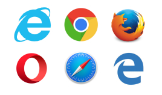

# Html 基本结构和语义

## 1. 基本结构

```html
<!-- documenttype 文档类型是 html 这是html5的声明头 告诉浏览器以哪种类型来调用哪个解析器核心来解析html -->
<!DOCTYPE html>
<!-- html代码书写的主框架 lang 是国际化的语言 默认是英文的 帮助翻译工具确定要使用的翻译规则-->
<html lang="en">
  <!-- head是头 -->
  <head>
    <!-- meta 元数据配置 charset 是字符编码 -->
    <meta charset="UTF-8" />
    <!-- 网页的标题 -->
    <title>document</title>
    <!-- 告诉以默认的哪一个ie浏览器的内核版本打开  一般是对于国产的双核浏览器来说的不如360浏览器 
    是IE8的专属标记，用来兼容其它低版本IE浏览器的，告诉IE8浏览器以哪个低版本的IE浏览器来渲染页面。-->
    <meta http-equiv="X-UA-Compatible" content="IE=edge,chrome=1" />
    <!--参数解析： 
      1）name项：常用的选项有Keywords(关键字) ，description(网站内容描述)，author(作者)，robots(机器人向导)等。 
      2）http-equiv项：可用于代替name项，常用的选项有Expires(期限)，Pragma(cache模式)，Refresh(刷新)，Set-Cookie(cookie设定)，Window-target(显示窗口的设定)，content-Type(显示字符集的设定)等。 
      3）content项：根据name项或http-equiv项的定义来决定此项填写什么样的字符串。   -->
    <meta name="description" content="Description" />
    <!-- 视口: 学习移动端的时候在详细的说明 -->
    <meta
      name="viewport"
      content="width=device-width, user-scalable=no, initial-scale=1.0, maximum-scale=1.0, minimum-scale=1.0"
    />
  </head>
  <body>
    <!-- html 的主要内容展示区域 -->
  </body>
</html>
```

```html
<!-- 这是早期的html4的文档声明的头 现在已经不推荐使用了-->
【过渡定义类型】：HTML4.01文档过渡定义类型，此类型定义的文档，对于标记和属性的语法要求并不是很严格，可以使用HTML中的标签与元素包括一些修饰性标签（例如：u、b等标签），不可以使用框架。

<!DOCTYPE html PUBLIC "-//W3C//DTD HTML 4.01 Transitional//EN" "http://www.w3.org/TR/html4/loose.dtd">
【严格定义类型】：HTML4.01文档严格定义类型，此类型定义的文档，对于文档内的代码要求比较严格，不允许使用任何表现层的标记和属性（例如：u、b等标签），不可以使用框架。

<!DOCTYPE html PUBLIC "-//W3C//DTD HTML 4.01//EN" "http://www.w3.org/TR/html4/strict.dtd">
【框架定义类型】：HTML4.01文档框架定义类型，除 frameset 元素取代了 body
元素之外，此类型等同于HTML4.01文档过渡定义类型，但可以使用框架。 1
<!DOCTYPE html PUBLIC "-//W3C//DTD HTML 4.01 Frameset//EN" "http://www.w3.org/TR/html4/frameset.dtd">
```

## 2. 字符集合字符编码表

### 2.1 基础知识

> 计算机中储存的信息都是用二进制数表示的；而我们在屏幕上看到的英文、汉字等字符是二进制数转换之后的结果。通俗的说，按照何种规则将字符存储在计算机中，如'a'用什么表示，称为"编码"；反之，将存储在计算机中的二进制数解析显示出来，称为"解码"，如同密码学中的加密和解密。在解码过程中，如果使用了错误的解码规则，则导致'a'解析成'b'或者乱码。

**字符集（Charset）**：是一个系统支持的所有抽象字符的集合。字符是各种文字和符号的总称，包括各国家文字、标点符号、图形符号、数字等。

**字符编码（Character Encoding）**：是一套法则，使用该法则能够对自然语言的字符的一个集合（如字母表或音节表），与其他东西的一个集合（如号码或电脉冲）进行配对。即在符号集合与数字系统之间建立对应关系，它是信息处理的一项基本技术。通常人们用符号集合（一般情况下就是文字）来表达信息。而以计算机为基础的信息处理系统则是利用元件（硬件）不同状态的组合来存储和处理信息的。元件不同状态的组合能代表数字系统的数字，因此字符编码就是将符号转换为计算机可以接受的数字系统的数，称为数字代码。

### 2.2 常用字符集和字符编码

> 常见字符集名称：ASCII 字符集、GB2312 字符集、BIG5 字符集、GB18030 字符集、Unicode 字符集等。计算机要准确的处理各种字符集文字，需要进行字符编码，以便计算机能够识别和存储各种文字。

#### 2.2.1 ASCII 字符集&编码

> ASCII（American Standard Code for Information Interchange，美国信息交换标准代码）是基于拉丁字母的一套电脑编码系统。它主要用于显示现代英语，而其扩展版本 EASCII 则可以勉强显示其他西欧语言。它是现今最通用的单字节编码系统（但是有被 Unicode 追上的迹象），并等同于国际标准 ISO/IEC 646。

ASCII 字符集：主要包括控制字符（回车键、退格、换行键等）；可显示字符（英文大小写字符、阿拉伯数字和西文符号）。

ASCII 编码：将 ASCII 字符集转换为计算机可以接受的数字系统的数的规则。使用 7 位（bits）表示一个字符，共 128 字符；但是 7 位编码的字符集只能支持 128 个字符，为了表示更多的欧洲常用字符对 ASCII 进行了扩展，ASCII 扩展字符集使用 8 位（bits）表示一个字符，共 256 字符。ASCII 字符集映射到数字编码规则如下图所示：


ASCII 的最大缺点是只能显示 26 个基本拉丁字母、阿拉伯数目字和英式标点符号，因此只能用于显示现代美国英语（而且在处理英语当中的外来词如 naïve、café、élite 等等时，所有重音符号都不得不去掉，即使这样做会违反拼写规则）。而 EASCII 虽然解决了部份西欧语言的显示问题，但对更多其他语言依然无能为力。因此现在的苹果电脑已经抛弃 ASCII 而转用 Unicode。

#### 2.2.2 伟大的创想 Unicode

> 像天朝一样，当计算机传到世界各个国家时，为了适合当地语言和字符，设计和实现类似 GB232/GBK/GB18030/BIG5 的编码方案。这样各搞一套，在本地使用没有问题，一旦出现在网络中，由于不兼容，互相访问就出现了乱码现象。

> 为了解决这个问题，一个伟大的创想产生了——Unicode。Unicode 编码系统为表达任意语言的任意字符而设计。它使用 4 字节的数字来表达每个字母、符号，或者表意文字(ideograph)。每个数字代表唯一的至少在某种语言中使用的符号。（并不是所有的数字都用上了，但是总数已经超过了 65535，所以 2 个字节的数字是不够用的。）被几种语言共用的字符通常使用相同的数字来编码，除非存在一个在理的语源学(etymological)理由使不这样做。不考虑这种情况的话，每个字符对应一个数字，每个数字对应一个字符。即不存在二义性。不再需要记录"模式"了。U+0041 总是代表'A'，即使这种语言没有'A'这个字符。

> 在计算机科学领域中，Unicode（统一码、万国码、单一码、标准万国码）是业界的一种标准，它可以使电脑得以体现世界上数十种文字的系统。Unicode 是基于通用字符集（Universal Character Set）的标准来发展，并且同时也以书本的形式[1]对外发表。Unicode 还不断在扩增， 每个新版本插入更多新的字符。直至目前为止的第六版，Unicode 就已经包含了超过十万个字符（在 2005 年，Unicode 的第十万个字符被采纳且认可成为标准之一）、一组可用以作为视觉参考的代码图表、一套编码方法与一组标准字符编码、一套包含了上标字、下标字等字符特性的枚举等。Unicode 组织（The Unicode Consortium）是由一个非营利性的机构所运作，并主导 Unicode 的后续发展，其目标在于：将既有的字符编码方案以 Unicode 编码方案来加以取代，特别是既有的方案在多语环境下，皆仅有有限的空间以及不兼容的问题。

**可以这样理解：Unicode 是字符集，UTF-32/ UTF-16/ UTF-8 是三种字符编码方案**

#### 2.2.3 UTF-8

> UTF-8（8-bit Unicode Transformation Format）是一种针对 Unicode 的可变长度字符编码（定长码），也是一种前缀码。它可以用来表示 Unicode 标准中的任何字符，且其编码中的第一个字节仍与 ASCII 兼容，这使得原来处理 ASCII 字符的软件无须或只须做少部份修改，即可继续使用。因此，它逐渐成为电子邮件、网页及其他存储或传送文字的应用中，优先采用的编码。互联网工程工作小组（IETF）要求所有互联网协议都必须支持 UTF-8 编码。
> UTF-8 使用一至四个字节为每个字符编码：
> 128 个 US-ASCII 字符只需一个字节编码（Unicode 范围由 U+0000 至 U+007F）。
> 带有附加符号的拉丁文、希腊文、西里尔字母、亚美尼亚语、希伯来文、阿拉伯文、叙利亚文及它拿字母则需要二个字节编码（Unicode 范围由 U+0080 至 U+07FF）。
> 其他基本多文种平面（BMP）中的字符（这包含了大部分常用字）使用三个字节编码。
> 其他极少使用的 Unicode 辅助平面的字符使用四字节编码。
> 在处理经常会用到的 ASCII 字符方面非常有效。在处理扩展的拉丁字符集方面也不比 UTF-16 差。对于中文字符来说，比 UTF-32 要好。同时，（在这一条上你得相信我，因为我不打算给你展示它的数学原理。）由位操作的天性使然，使用 UTF-8 不再存在字节顺序的问题了。一份以 utf-8 编码的文档在不同的计算机之间是一样的比特流。
> 总体来说，在 Unicode 字符串中不可能由码点数量决定显示它所需要的长度，或者显示字符串之后在文本缓冲区中光标应该放置的位置；组合字符、变宽字体、不可打印字符和从右至左的文字都是其归因。所以尽管在 UTF-8 字符串中字符数量与码点数量的关系比 UTF-32 更为复杂，在实际中很少会遇到有不同的情形。

> **优点**

> UTF-8 是 ASCII 的一个超集。因为一个纯 ASCII 字符串也是一个合法的 UTF-8 字符串，所以现存的 ASCII 文本不需要转换。为传统的扩展 ASCII 字符集设计的软件通常可以不经修改或很少修改就能与 UTF-8 一起使用。
> 使用标准的面向字节的排序例程对 UTF-8 排序将产生与基于 Unicode 代码点排序相同的结果。（尽管这只有有限的有用性，因为在任何特定语言或文化下都不太可能有仍可接受的文字排列顺序。）
> UTF-8 和 UTF-16 都是可扩展标记语言文档的标准编码。所有其它编码都必须通过显式或文本声明来指定。
> 任何面向字节的字符串搜索算法都可以用于 UTF-8 的数据（只要输入仅由完整的 UTF-8 字符组成）。但是，对于包含字符记数的正则表达式或其它结构必须小心。
> UTF-8 字符串可以由一个简单的算法可靠地识别出来。就是，一个字符串在任何其它编码中表现为合法的 UTF-8 的可能性很低，并随字符串长度增长而减小。举例说，字符值 C0,C1,F5 至 FF 从来没有出现。为了更好的可靠性，可以使用正则表达式来统计非法过长和替代值（可以查看 W3 FAQ: Multilingual Forms 上的验证 UTF-8 字符串的正则表达式）。

> **缺点**

> 因为每个字符使用不同数量的字节编码，所以寻找串中第 N 个字符是一个 O(N)复杂度的操作 — 即，串越长，则需要更多的时间来定位特定的字符。同时，还需要位变换来把字符编码成字节，把字节解码成字符。

#### 2.2.4 查看字符编码

```javascript
//在浏览器的控制台输出检测
console.log('hello'.charCodeAt(1)) //101
console.log('你好啊!'.charCodeAt(1)) //22909
```

## 3. 浏览器



只是用户看到仅仅只是浏览器本身，却很少能看到浏览器最核心的部分—浏览器内核。从第一款 libwww（Library WorldWideWeb）浏览器发展至今已经经历了无数竞争与淘汰了。现在国内常见的浏览器有：IE、Firefox、QQ 浏览器、Safari、Opera、Google Chrome、百度浏览器、搜狗浏览器、猎豹浏览器、360 浏览器、UC 浏览器、遨游浏览器、世界之窗浏览器等。但目前最为主流浏览器有五大款，分别是 IE、Firefox、Google Chrome、Safari、Opera。

浏览器最重要的部分是浏览器的内核。浏览器内核是浏览器的核心，也称“渲染引擎”，用来解释网页语法并渲染到网页上。浏览器内核决定了浏览器该如何显示网页内容以及页面的格式信息。不同的浏览器内核对网页的语法解释也不同，因此网页开发者需要在不同内核的浏览器中测试网页的渲染效果。

浏览器内核又可以分成两部分：**渲染引擎(layout engineer 或者 Rendering Engine)和 JS 引擎**。它负责取得网页的内容（HTML、XML、图像等等）、整理讯息（例如加入 CSS 等），以及计算网页的显示方式，然后会输出至显示器或打印机。浏览器的内核的不同对于网页的语法解释会有不同，所以渲染的效果也不相同。所有网页浏览器、电子邮件客户端以及其它需要编辑、显示网络内容的应用程序都需要内核。JS 引擎则是解析 Javascript 语言，执行 javascript 语言来实现网页的动态效果。

最开始渲染引擎和 JS 引擎并没有区分的很明确，后来 JS 引擎越来越独立，内核就倾向于只指渲染引擎。有一个网页标准计划小组制作了一个 ACID 来测试引擎的兼容性和性能。内核的种类很多，如加上没什么人使用的非商业的免费内核，可能会有 10 多种，但是常见的浏览器内核可以分这四种：Trident、Gecko、Blink、Webkit。

1、IE 浏览器：

IE 是微软公司旗下浏览器，是目国内用户量最多的浏览器。IE 诞生于 1994 年，当时微软为了对抗市场份额占据将近百分之九十的网景 Netscape Navigator，于是在 Windows 中开发了自己的浏览器 Internet Explorer，自此也引发了第一次浏览器大战。结果可想而知，微软大获全胜，网景不得不将自己卖给 AOL 公司。但实际上事情并没有结束，网景后来开发了风靡一时的 Firefox 火狐，至今 Firefox 也成为世界五大浏览器之一。
1996 年，微软从 Spyglass 手里拿到 Spyglass Mosaic 的源代码和授权，开始开发自己的浏览器 IE。后来，微软以 IE 和 Windows 捆绑的模式不断向市场扩展份额，使 IE 成为市场的绝对主流。现在装了 Windows 系统的电脑基本无法卸载 IE。

2、Opera 浏览器：

Opera 是挪威 Opera Software ASA 公司旗下的浏览器。1995 年，opera 公司发布第一版 Opera 浏览器，使用自己研发的 Presto 内核。当时 opera 公司的开发团队不断完善 Presto 内核，使 Opera 浏览器一度成为顶级浏览器。直到 2016 年奇虎 360 和昆仑万维收购了 Oprea 浏览器，从此也丢弃了强大的 Presto 内核，改用当时 Google 开源的 webkit 内核。后来 Opera 浏览器跟随 Google 将浏览器内核改为 Blink 内核。自此 Presto 内核也淡出了互联网市场。

3、Safari 浏览器：

第二次浏览器大战是从苹果公司发布 Safari 浏览器开始的。2003 年，苹果公司在苹果手机上开发 Safari 浏览器，利用自己得天独厚的手机市场份额使 Safari 浏览器迅速成为世界主流浏览器。Safari 是最早使用 webkit 内核的浏览器也是现在苹果默认的浏览器。

4、Firefox 浏览器：

Firefox 浏览器使 Mozilla 公司旗下浏览器，也是刚才提到的网景公司后来的浏览器。网景被收购后，网景人员创办了 Mozilla 基金会，这是一个非盈利组织，他们在 2004 年推出自己的浏览器 Firefox。Firefox 采用 Gecko 作为内核。Gecko 是一个开源的项目，代码完全公开，因此受到很多人的青睐。Firefox 的问世加快了第二次浏览器大战的开始。第二次浏览器大战与第一次二元鼎力的局面不同，这一次的特点就是百家争鸣，也自此打破了 IE 浏览器从 98 年网景被收购后独步浏览器市场的局面。

5、Chrome 浏览器：

Chrome 浏览器是 google 旗下的浏览器。Chrome 浏览器至发布以来一直讲究简洁、快速、安全，所以 Chrome 浏览器到现在一直受人追捧。最开始 Chrome 采用 webkit 作为浏览器内核，直到 2013 年，google 宣布不再使用苹果的 webkit 内核，开始使用 webkit 的分支内核 Blink。

以上是五大浏览器的简介，接下来是四大内核。在介绍五大浏览器的同时也已经顺便介绍了四大内核。四大内核分别是：Trident（也称 IE 内核）、webkit、Blink、Gecko。五大浏览器采用的都是单内核，而随着浏览器的发展现在也出现了双内核。像 360 浏览器、QQ 浏览器都是采用双内核。
作为前端开发，熟悉四大内核是非常有必要的。四大内核的解析不同使网页渲染效果更具多样化。下面总结一下各常用浏览器所使用的内核。

1、IE 浏览器内核：Trident 内核，也是俗称的 IE 内核；

2、Chrome 浏览器内核：统称为 Chromium 内核或 Chrome 内核，以前是 Webkit 内核，现在是 Blink 内核；

3、Firefox 浏览器内核：Gecko 内核，俗称 Firefox 内核；

4、Safari 浏览器内核：Webkit 内核；

5、Opera 浏览器内核：最初是自己的 Presto 内核，后来是 Webkit，现在是 Blink 内核；

6、360 浏览器、猎豹浏览器内核：IE+Chrome 双内核；

7、搜狗、遨游、QQ 浏览器内核：Trident（兼容模式）+Webkit（高速模式）；

8、百度浏览器、世界之窗内核：IE 内核；

9、2345 浏览器内核：以前是 IE 内核，现在也是 IE+Chrome 双内核；

10、最新的微软开源的 EdgeChrome 浏览器是基于谷歌的浏览器内核开发的。

**在学习阶段和工作汇总大家一定要多安装一些浏览器，特别是项目要去浏览器的兼容性的问题**

- 谷歌浏览器
- 火狐
- ie
- edge

## 4. 开发工具

### 4.1  Notpad++

[官网](https://notepad-plus.en.softonic.com/)


> 高级的记事本工具

### 4.2  WebStrom

[官网](https://www.jetbrains.com/webstorm/)


> 好用 收费

### 4.3  SublimeText3

[官网](http://www.sublimetext.com/3)


> 当年的前端开发神器 由于插件好用 但是安装有点费事

### 4.4  Hbuilder

[官网](https://www.dcloud.io/)


> 国产的前端开发工具 现在也相当的好用

### 4.5  Vscode

[官网](https://code.visualstudio.com/)


> 微软和红帽联合开发的编辑工具
> 由于插件好用和启动相应速度快
> 现在的前端开发神器 也可以编辑其他的语言

**Vscode 前端开发常用插件集合:**