# Html 常用标签

> 学习标签重点学习两个方面的内容:
>
> + 标签的语义(标签是干什么的)
> + 根据标签的语义，选择合适的标签放置在合适的位置可以提升网页开发的效率。让网页的结构更清晰
>   + 也方便他人阅读
> + 标签的属性(创造标签是自带的属性值)

## 1.  标题标签

+ h1 一级标题
+ h2 二级标题
+ h3 三级标题
+ h4 四级标题
+ h5 五级标题
+ h6  六级标题

```html
 <!-- 标题  h1-h6  层级越越大文字越小  -->
  <h1>一级标题</h1>
  <h2>二级标题</h2>
  <h3>三级标题</h3>
  <h6>六级标题</h6>
```

> 百度新闻中的标题

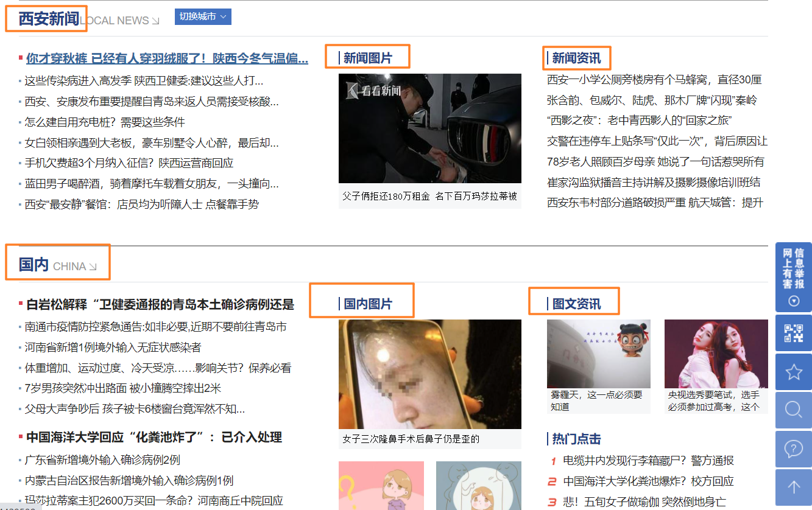

>  :warning: 在网页中一般我们使用H1来进行网页核心内容的描述，有助于搜索引擎在进行关键词爬虫获取的时候获取到SEO(Search Engin Optimization)，所以在一个网页中H1标签最多只有一个
>
>页面中的H1元素过多，搜索引擎会认为是作弊的，最终会导致K站

> 京东首页的H1标签

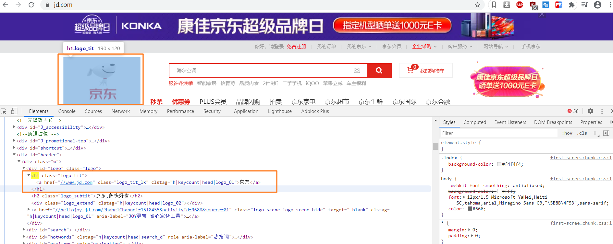

## 2. 段落标签: p

+ 段落是自己占一行 即使内容不满也是占一行
+ 段落之间是有间隙的
+ 首行文字缩进可以使用css进行缩进
+ 浏览器只能解析一个空格

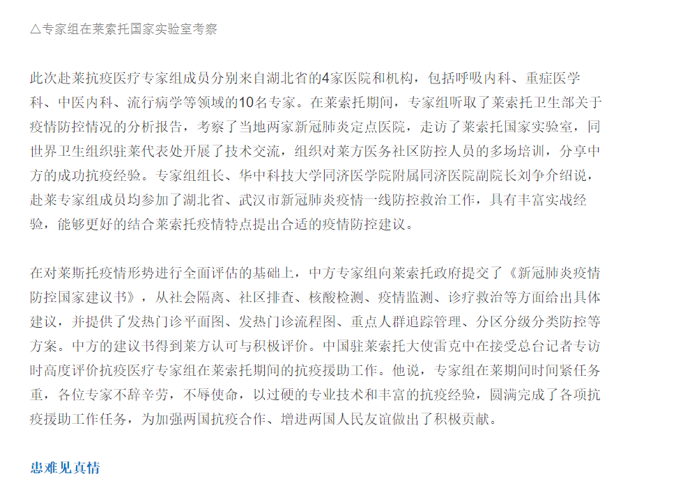

```html
<!-- 段落标签 
      段落之间是有间隙的
      strong加粗处理
      css 文本样式进行文字的缩进
   -->
  <p style="text-indent: 24px;">
    <strong>四川雅安</strong>芦山县卫生健康局局长崔夏说：“对摸排出来的返乡人员首先要建台账，然后要对他们进行14天、
    每天两次的体温监测和随访。办健康证明需要扫码，但有一半以上的务工人员不会用智能手机，也不会扫码，
    更不会点进去填写自己基本的信息和情况，所以必须要我们医护人员手把手教。”
    对于当地交通部门来说，务工人员居住分散，出行人员难以确定，给他们组织运输也带来了很大的压力。
    除此之外，车辆状况、途中的防控、应急处理等等，也都需要他们提前准备。
  </p>

  <p>
    四川雅安芦山县卫生健康局局长崔夏说：“对摸排出来的返乡人员首先要建台账，然后要对他们进行14天、
    每天两次的体温监测和随访。办健康证明需要扫码，但有一半以上的务工人员不会用智能手机，也不会扫码，
    更不会点进去填写自己基本的信息和情况，所以必须要我们医护人员手把手教。”对于当地交通部门来说，务工人员居住分散，出行人员难以确定，给他们组织运输也带来了很大的压力。
    除此之外，车辆状况、途中的防控、应急处理等等，也都需要他们提前准备。
  </p>
```

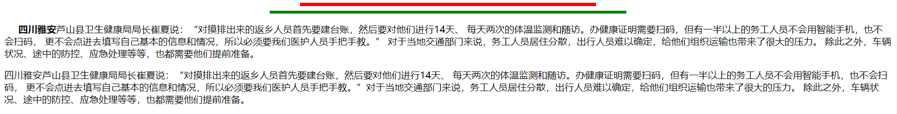

## 3. 常见的单标签

+ hr   分割线
+ br  换行
+ meta 元数据
+ param  
+ link

```html
<!--
link 是导入外部的css文件使用 rel声明是样式表文件
rel 属性规定当前文档与被链接文档之间的关系
-->
<head>
  <meta charset="UTF-8">
  <meta name="viewport" content="width=device-width, initial-scale=1.0">
  <title>欢迎页</title>
  <link rel="stylesheet" href="../css/index.css">
</head>

<!-- 分割线
    size 设置高度:
    width设置宽度:  像素  百分比
    color设置颜色:
 -->
  <hr>
  <hr size="5" width="500px" color="red" >
  <hr size="5" width="40%" color="green" >
```

## 4. 字符实体

在 HTML 中，某些字符是预留的。

在 HTML 中不能使用小于号（<）和大于号（>），这是因为浏览器会误认为它们是标签。

如果希望正确地显示预留字符，我们必须在 HTML 源代码中使用字符实体（character entities）。

[参考资料](https://www.w3school.com.cn/tags/html_ref_entities.html)

| 显示结果 | 描述              | 实体名称          | 实体编号 |
| :------- | :---------------- | :---------------- | :------- |
|          | 空格              | &nbsp;            | &#160;   |
| <        | 小于号            | &lt;              | &#60;    |
| >        | 大于号            | &gt;              | &#62;    |
| &        | 和号              | &amp;             | &#38;    |
| "        | 引号              | &quot;            | &#34;    |
| '        | 撇号              | &apos; (IE不支持) | &#39;    |
| ￠       | 分（cent）        | &cent;            | &#162;   |
| £        | 镑（pound）       | &pound;           | &#163;   |
| ¥        | 元（yen）         | &yen;             | &#165;   |
| €        | 欧元（euro）      | &euro;            | &#8364;  |
| §        | 小节              | &sect;            | &#167;   |
| ©        | 版权（copyright） | &copy;            | &#169;   |
| ®        | 注册商标          | &reg;             | &#174;   |
| ™        | 商标              | &trade;           | &#8482;  |
| ×        | 乘号              | &times;           | &#215;   |
| ÷        | 除号              | &divide;          | &#247;   |

```html
<form action="">
  <label for="name">用户名:</label>
  <input type="text" name="name" id="name"><br>
  <label for="password">密&ensp;&ensp;码:</label>
  <input type="password" name="password" id="password">
</form>
```

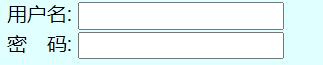

## 5. 图片标签

+ 内置图片
+ 背景图片
+ 本地图片
+ 远程图片

```html
<!-- 图片标签source  资源的路径 
    绝对路径: 找到文件具体在盘符的位置 一旦位置发生改变图片就会加载失败
    相对路径:根据当前文件所在路径去寻找 在项目打包的时候将页面和图片文件夹一块打包就可以保证图片永远是有效的
    dos命令:
    width  宽  
    height  高
    px 像素单位  1px 是多大? 
      传统的像素:像素一般指的是屏幕的分辨率分之一
      自适应  响应式开发中像素单位就不是固定的了。
    title: 标题  鼠标悬停0.5s 出现
    alt:   图片记载失败的时候的提示信息  
   -->
   <!-- 换行 -->
   <br>
  </img>
  </img>
  </img>
  </img>
  <br>
```

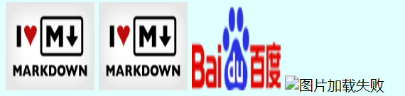

## 6. 超链接

HTML 使用超级链接与网络上的另一个文档相连。

几乎可以在所有的网页中找到链接。点击链接可以从一张页面跳转到另一张页面。

超链接可以是一个字，一个词，或者一组词，也可以是一幅图像，您可以点击这些内容来跳转到新的文档或者当前文档中的某个部分。

当您把鼠标指针移动到网页中的某个链接上时，箭头会变为一只小手。

我们通过使用 <a> 标签在 HTML 中创建链接。

有两种使用 <a> 标签的方式：

1. 通过使用 href 属性 - 创建指向另一个文档的链接
2. 通过使用 name 属性 - 创建文档内的书签

### 6.1 超链接的基本使用

```html
 <!--超链接 :
    href 要连接到的资源路径
    target: 目标资源打开的方式
      _parent 在父级窗口打开
      _self  在自身的页面打开 会覆盖度原有的页面
      _blank  打开新的页面显示连接的内容
	  _top  在顶层窗口打开
   -->
  <a href="http://www.baidu.com" target="_blank">百度一下</a>
```

### 6.1 超链接和iframe 结合使用

> ifreame 是内联框架用于在网页内显示网页:
>
> + \<iframe src="URL"></iframe>  *URL* 指向隔离页面的位置。
> + \<iframe src="demo_iframe.htm" width="200" height="200"></iframe> 
> + height 和 width 属性用于规定 iframe 的高度和宽度。也可以使用百分比
> + \<iframe src="demo_iframe.htm" frameborder="0"></iframe>
> + frameborder 属性规定是否显示 iframe 周围的边框。设置属性值为 "0" 就可以移除边框：

```html
<!DOCTYPE html>
<html lang="en">
  <head>
    <meta charset="UTF-8" />
    <meta name="viewport" content="width=device-width, initial-scale=1.0" />
    <title>欢迎页</title>
    <link rel="stylesheet" href="../css/index.css" />
  </head>
  <body>
    <iframe
      src="baidu.html"
      frameborder="1"
      width="800px"
      height="800px"
    ></iframe>
  </body>
</html>

```

```html
<!DOCTYPE html>
<html lang="en">
  <head>
    <meta charset="UTF-8" />
    <meta name="viewport" content="width=device-width, initial-scale=1.0" />
    <title>Document</title>
    <style>
      body {
        background: #fff;
      }
    </style>
  </head>
  <body>
    

    <a href="https://www.baidu.com" target="_top">百度一下,你就知道</a>
  </body>
</html>

```

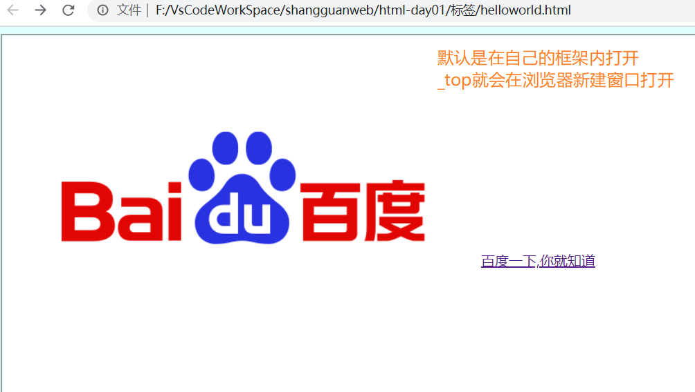

### 6.3 超链接和base元素结合使用

在连接的时候往往路径中域名是重复的

可以使用base作为基本的路径

```html
<!DOCTYPE html>
<html lang="en">
  <head>
    <meta charset="UTF-8" />
    <meta name="viewport" content="width=device-width, initial-scale=1.0" />
    <title>Document</title>
    <style>
      body {
        background: #fff;
      }
    </style>
    <base href="https://www.baidu.com/" />
  </head>
  <body>
    
    <a href="https://www.baidu.com" target="_top">百度一下,你就知道</a>

  <a href="img/PCtm_d9c8750bed0b3c7d089fa7d55720d6cf.png" target="_top">百度一下,你就知</a>
  </body>
</html>

```

### 6.4 超链接和图片结合使用

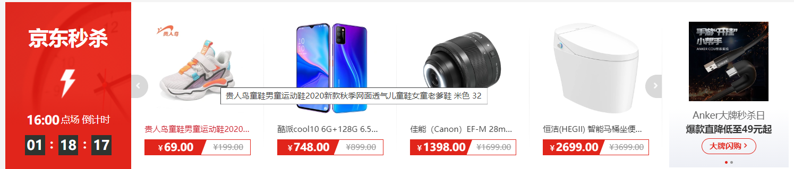

```html
<a href=""></a>
```

### 6.5 锚点连接

> 百度百科中的锚点连接:

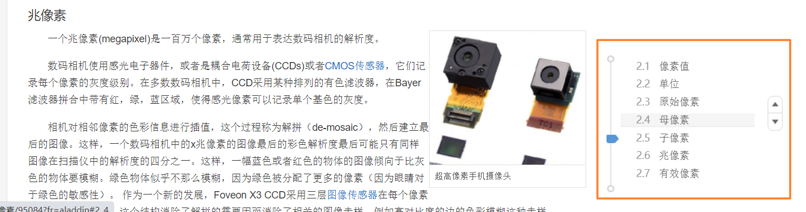

```html
<!DOCTYPE html>
<html lang="en">
  <head>
    <meta charset="UTF-8" />
    <meta name="viewport" content="width=device-width, initial-scale=1.0" />
    <title>Document</title>
    <style>
      p {
        width: 800px;
        height: 600px;
        background: lightcoral;
      }
    </style>
  </head>
  <body>
    <a href="#one">第一节</a>
    <a href="#two">第二节</a>
    <a href="#three">第三节</a>

    <section id="one">
      <p>
        像素是指由图像的小方格组成的，这些小方块都有一个明确的位置和被分配的色彩数值，小方格颜色和位置就决定该图像所呈现出来的样子。
        可以将像素视为整个图像中不可分割的单位或者是元素。不可分割的意思是它不能够再切割成更小单位抑或是元素，它是以一个单一颜色的小格存在
        [1]
        。每一个点阵图像包含了一定量的像素，这些像素决定图像在屏幕上所呈现的大小。
      </p>
    </section>
    <section id="two">
      <p>
        从像素的思想派生出几个其它类型的概念，如体素（voxel）、纹素（texel）和曲面元素（surfel），它们被用于其它计算机图形学和图像处理应用。
        点有时也用来表示像素，特别是计算机市场营销人员，多数时间使用DPI（dots
        per inch）表示。 像素 像素
        我们可以说在一幅可见的图像中的像素（如打印出来的一页）或者用电子信号表示的像素，或者用数码表示的像素，或者显示器上的像素，或者数码相机（感光元素）中的像素。这个列表还可以添加很多其它的例子，
        根据上下文会有一些更为精确的同义词，例如画素，采样点，字节，比特，点，斑，超集，三合点，条纹集，窗口等。
      </p>
    </section>

    <section id="three">
      <p>
        从像素的思想派生出几个其它类型的概念，如体素（voxel）、纹素（texel）和曲面元素（surfel），它们被用于其它计算机图形学和图像处理应用。
        点有时也用来表示像素，特别是计算机市场营销人员，多数时间使用DPI（dots
        per inch）表示。 像素 像素
        我们可以说在一幅可见的图像中的像素（如打印出来的一页）或者用电子信号表示的像素，或者用数码表示的像素，或者显示器上的像素，或者数码相机（感光元素）中的像素。这个列表还可以添加很多其它的例子，
        根据上下文会有一些更为精确的同义词，例如画素，采样点，字节，比特，点，斑，超集，三合点，条纹集，窗口等。
      </p>
    </section>
  </body>
</html>

```

### 6.6 超链接的伪连接

> 可以将a元素改变他的样式成为按钮，图片不做跳转 

```html
<a href="javascript:;" >百度一下,你就知道</a>
<a href="#" onclick="return false;">百度一下,你就知道</a>
```

## 7. 表格标签

```html
<!-- 表格
    table:
      thead 表头 文字是默认加粗 居中显示的
      tr 表行
        td 代表列
    cellspacing  取消单元格之间的间隙
    border 值是1 边框显示  值是0边框隐藏
    跨行合并:rowspan
    跨列合并:colspan
  -->
  <table border="1" width="600px" height="400px" cellspacing="0">
    <caption>本年度财务表单</caption>
    <thead>
        <tr>
          <th>hello</th>
          <th>hello</th>
          <th>hello</th>
          <th>hello</th>
          <th>hello</th>
        </tr>
    </thead>
    <tbody>
      <tr>
        <td colspan="2">张三</td>
        <td>张三</td>
        <td>张三</td>
        <td>张三</td>
      </tr>
      <tr>
        <td>张三</td>
        <td>张三</td>
        <td>张三</td>
        <td>张三</td>
        <td>张三</td>
      </tr>
      <tr>
        <td rowspan="2">张三</td>
        <td>张三</td>
        <td>张三</td>
        <td>张三</td>
        <td>张三</td>
      </tr>
      <tr>
        <td>张三</td>
        <td>张三</td>
        <td>张三</td>
        <td>张三</td>
      </tr>
    </tbody>
  </table>
```

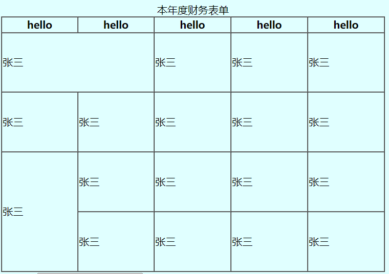

## 8. 表单标签

> 表单是一个很重要的标签元素，无论是在前端还是在后端。

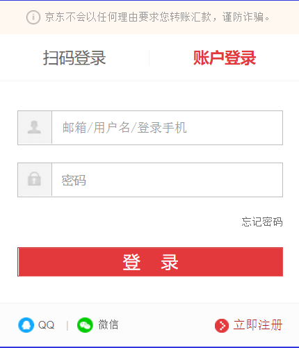

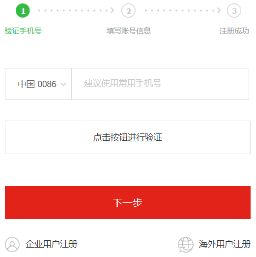

### 8.1 表单的基本使用

+ action  表单提交的路径
+ method 表单提交的方式
  + get 不安全的提交
  + post 安全的提交
+ enctype 规定表单在发送内容的时候对其如何编码
  + application/x-www-form-urlencoded   
    + 在发送前编码所有字符（默认）
  + multipart/form-data   
    + 不对字符编码。
    + 在使用包含文件上传控件的表单时，必须使用该值。

```html
<form action="" method="get">
    <!--点击文字自动聚焦到输入框内-->
  <label for="name">用户名:</label>
  <input type="text" name="name" id="name"><br>
  <label for="password">密&ensp;&ensp;码:</label>
  <input type="password" name="password" id="password"><br>
  <input type="submit" value="提交"	>  
</form>
```

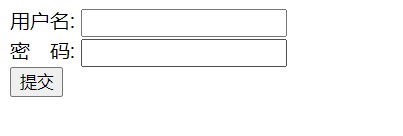

### 8.2 input的类型

+ type 输入的类型
  + text 文本类型
  + password 密码
  + radio 单选框
  + checkbox 多选框
  + file 文件上传
  + email 邮箱
  + color  拾色器
  + button  按钮
  + submit   提交
  + reset重置
  + hidden 输入框隐藏
  + date  日期插件
  + datetime  事件插件
+ autocomplete  输入的内容自动完成 下次输入浏览器自动提示
+ autofocus  自动聚集焦点
+ checked  首次加载的时候自动选中
+ disabled input 元素被禁用
+ list  引用包含输入字段的预定义选项的 datalist
+ max  规定输入字段的最大值
+ min 输入字段的最小值
+ maxlength 规定输入字符的最大长度
+ pattern 规定输入字段值的模式或格式  正则表达式验证
+ placeholder  自动填入的输入提示
+ readonly  输入字段只读
+ required 必须输入值才可以提交
+ size 输入字段的宽度
+ name 值的名称
+ value 默认的值

```html
 <form action="" method="get" enctype="multipart/form-data">
      <label for="name">用户名:</label>
      <!-- 正则表达式 只能输入数字和字母 -->
      <input
        type="text"
        name="name"
        id="name"
        required
        placeholder="请输入用户名..."
        pattern="/^[a-z0-9]+$/i"
        autocomplete="on"
        autofocus
      /><br />
      <label for="password">密&ensp;&ensp;码:</label>
      <input type="password" name="password" id="password" /><br />
      <input type="radio" name="gender" checked />男
      <input type="radio" name="gender" />女
      <input type="radio" name="gender" />保密<br />
      <input type="checkbox" name="sport" checked />篮球
      <input type="checkbox" name="sport" checked />足球
      <input type="checkbox" name="sport" />乒乓球
      <input type="checkbox" name="sport" />羽毛球
      <br />
      <input type="text" placeholder="请选择数值" list="data" />
      <datalist id="data">
        <option>陕西省</option>
        <option>山东省</option>
        <option>山西省</option>
        <option>安徽省</option>
      </datalist>
      <br />
      <input type="file" name="file" id="" /><br />
      <input type="email" name="email" id="email" /><br />
      <input type="color" name="color" id="color" /><br />
      <input type="date" name="datetime" id="datetime" /><br />
      <input type="reset" value="重置" />
      <input type="submit" value="提交" />
    </form>
```

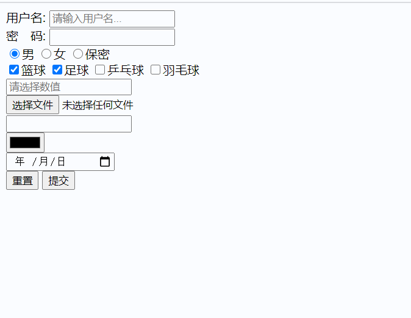

## 9. span标签

+ 默认情况下标其中的文字和普通文字没有区别
+ 在网页中用来显示一些特殊的文字和关键字
+ 行内元素设置宽高没有作用需要将其转换为块级元素

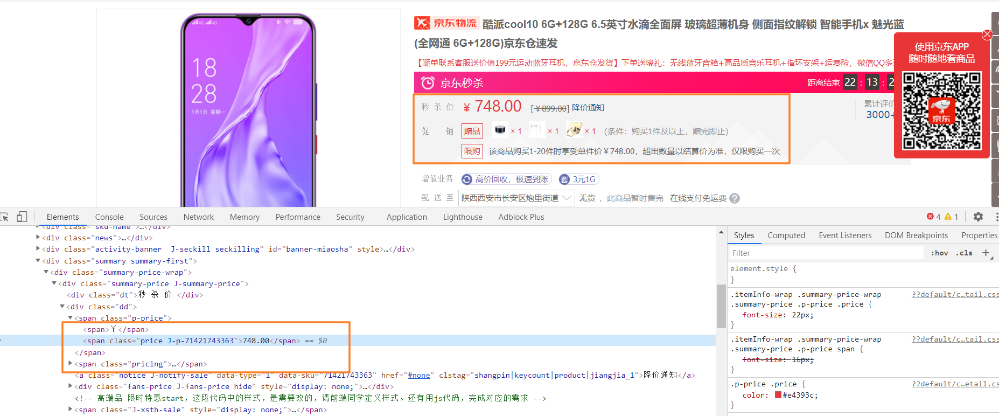

## 10. **div标签**

> <div> 可定义文档中的分区或节（division/section）。
>
> <div> 标签可以把文档分割为独立的、不同的部分。它可以用作严格的组织工具，并且不使用任何格式与其关联。
> 如果用 id 或 class 来标记 <div>，那么该标签的作用会变得更加有效。
> 用法
>
> <div> 是一个块级元素。这意味着它的内容自动地开始一个新行。实际上，换行是 <div> 固有的唯一格式表现。可以通过 <div> 的 class 或 id 应用额外的样式。
>
> 不必为每一个 <div> 都加上类或 id，虽然这样做也有一定的好处。
>
> 可以对同一个 <div> 元素应用 class 或 id 属性，但是更常见的情况是只应用其中一种。这两者的主要差异是，class 用于元素组（类似的元素，或者可以理解为某一类元素），而 id 用于标识单独的唯一的元素。

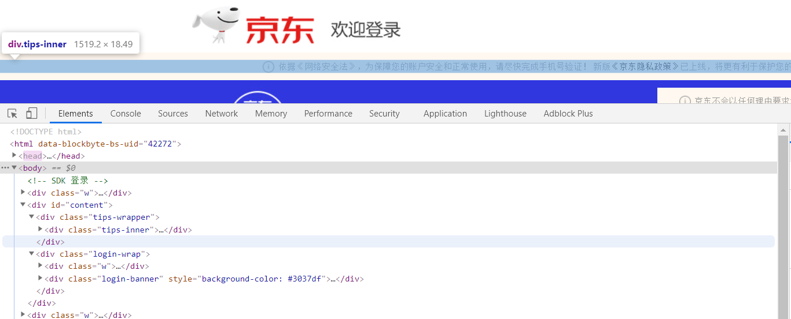

```html
<!DOCTYPE html>
<html lang="en">
  <head>
    <meta charset="UTF-8" />
    <meta name="viewport" content="width=device-width, initial-scale=1.0" />
    <title>Document</title>
    <style>
      div {
        width: 600px;
        height: 400px;
        border: 1px solid red;
        margin: 0 auto;
      }
    </style>
  </head>
  <body>
    <div>
      <p>
        像素是指由图像的小方格组成的，这些小方块都有一个明确的位置和被分配的色彩数值，小方格颜色和位置就决定该图像所呈现出来的样子。
      </p>
      <p>
        像素是指由图像的小方格组成的，这些小方块都有一个明确的位置和被分配的色彩数值，小方格颜色和位置就决定该图像所呈现出来的样子。
      </p>
    </div>
  </body>
</html>

```


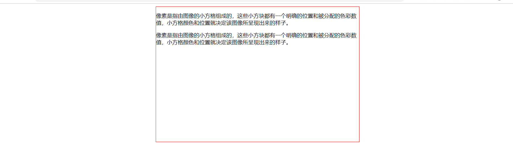

## 11. fieldset和legend标签

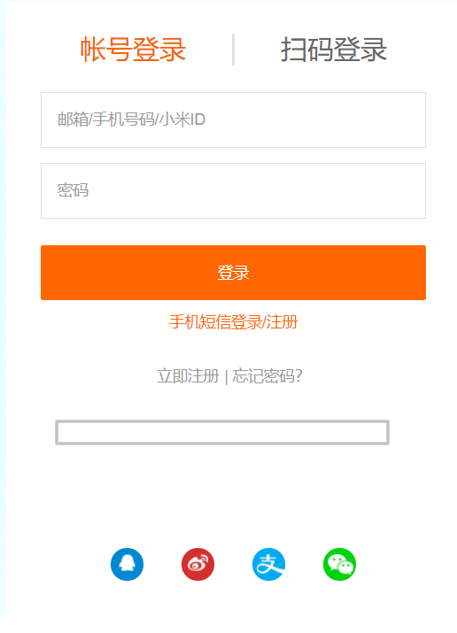

```html
 <fieldset>
      <legend>年度财务报表</legend>
    </fieldset>
```


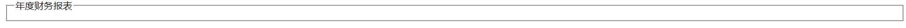

## 12. 文本域标签

> 评论框使用

```html
<textarea name="" id="" cols="30" rows="10"></textarea>
```


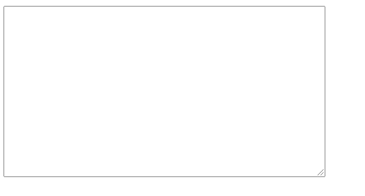

>在实际的项目中我们使用富文本编辑器:
>
>+ [**TinyMCE**](https://www.tiny.cloud/docs/demo/full-featured/)
>+ [**CKEditor**](https://ckeditor.com/)
>+ [**UEditor**](http://ueditor.baidu.com/website/) 
>+ [**wangEditor**](http://www.wangeditor.com/)
>+ [**kindeditor**](http://kindeditor.net/demo.php)
>+ [**imditor**](https://simditor.tower.im/)
>+ [**dhtmlxEditor**](https://dhtmlx.com/docs/products/dhtmlxRichText/)

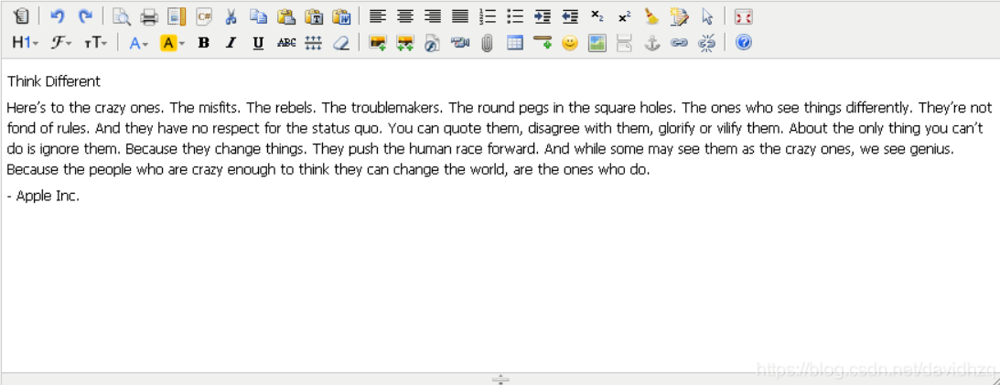

## 13. 列表标签

> 列表可以整洁，整齐的，有序的展示数据，作为布局会更加自由和方便

+ 导航栏的制作
+ 信息列表
+ 页表标注

> 导航栏制作

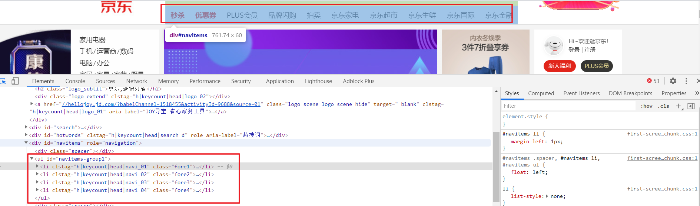

> 信息展示

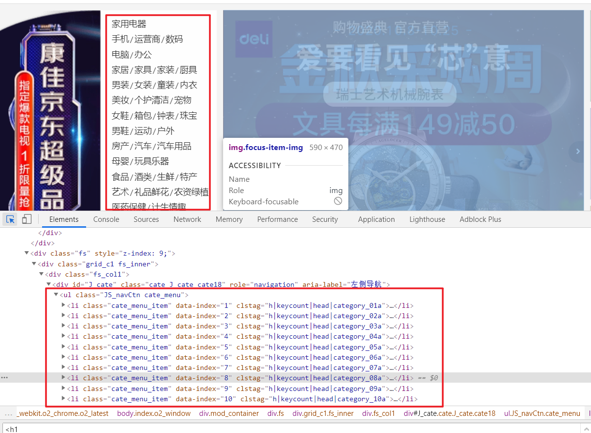

> 自定义列表页脚信息展示

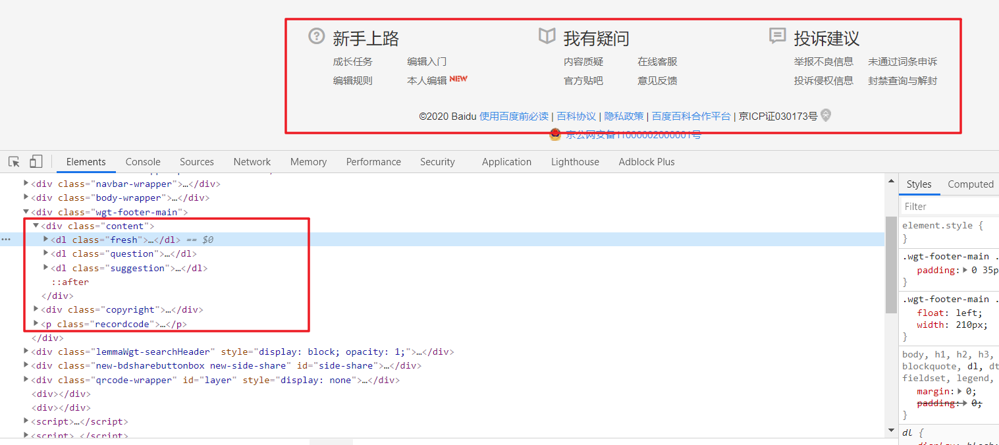

### 13.1 无序列表

+ ul 是li元素的父级元素,两者必须同时使用才会有列表的效果
+ 各个li元素之间是同级别的并列关系

```html
<ul>
      <li>Hello World 1</li>
      <li>Hello World 2</li>
      <li>Hello World 3</li>
      <li>Hello World 4</li>
      <li>Hello World 5</li>
    </ul>
    <hr />
    <ul style="list-style: circle">
      <li>Hello World 1</li>
      <li>Hello World 2</li>
      <li>Hello World 3</li>
      <li>Hello World 4</li>
      <li>Hello World 5</li>
    </ul>
    <hr />
    <ul>
      <li><a href="">百度一下 1</a></li>
      <li><a href="">百度一下 2</a></li>
      <li><a href="">百度一下 3</a></li>
      <li><a href="">百度一下 4</a></li>
      <li><a href="">百度一下 5</a></li>
    </ul>
```

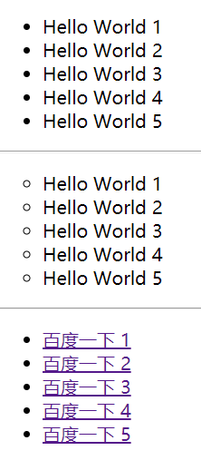

### 13.2 有序列表

> 有序列表在网页中使用的相对少一点，有序列表的标记符也可以改变

```html
 <ol>
      <li>Hello world 1</li>
      <li>Hello world 2</li>
      <li>Hello world 3</li>
      <li>Hello world 4</li>
      <li>Hello world 5</li>
    </ol>
```


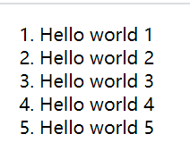

### 13.3 自定义列表标签

> 自定义标签在有页面中使用的相对多多一点

```html
 <dl>
      <dt>购物指南</dt>
      <dd>购物流程</dd>
      <dd>会员介绍</dd>
      <dd>生活旅行</dd>
      <dd>常见问题</dd>
    </dl>
    <dl>
      <dt>配送方式</dt>
      <dd>上门自提</dd>
      <dd>211限时送</dd>
      <dd>配送服务查询</dd>
      <dd>海外配送</dd>
    </dl>
```

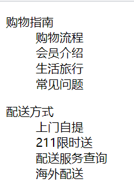

## 14.文本格式化标签

+ b  加粗
+ u  下划线
+ del  删除线
+ i  斜体字

```HTML
	<b>Hello World</b>
    <del>Hello Worlrd</del>
    <u>Hello World</u>
    <i>Hello World</i>
```

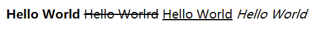

> I 标签通常用来在页面中红插入图标或者字体图标
>
> [为什么大家都用i标签用作小图标?](https://www.cnblogs.com/limeiky/p/6210829.html)
>
> 1. 用 <i> 元素做图标在语义上是不正确的（虽然看起来像 icon 的缩写）；
> 2. <i> 比 <span> 短，但 gzip 后差异很小，不过打字可以少按三个键；
> 3. 多数图标用的是空 <i> 元素，配合 ::before 伪元素实现，因为没有内容，读屏器不会朗读（这样即使有特殊处理也跳过了），机器理解起来应该也没什么影响。
>
> 综合来看，从实用性上暂时没看出有什么缺陷，所以目前用不用 <i> 取决于你对于遵循规范有多洁癖。（加载速度更快）

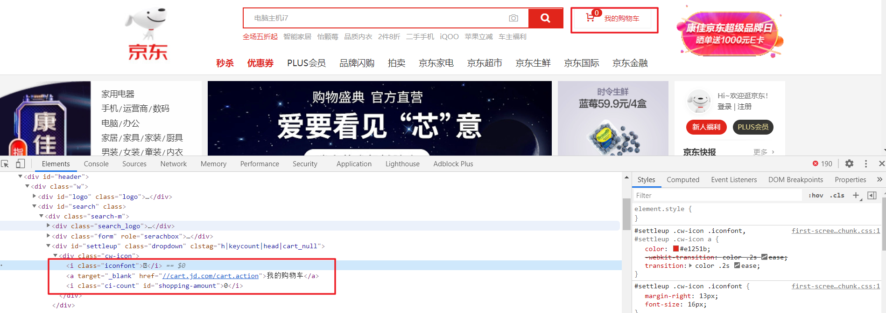

## 15. 视频标签

+ autoplay  自动播放 必须集合muted播放静音才可以自动播放 值是autoplay 可以省略不写
+ controls 播放器的控件 值是controls 可以省略不写
+ loop 循环播放 值是loop 可以省略不写
+ width 定义播放器的宽
+ height 定义播放器的高
+ poster 规定视频下载时显示的图像，或者在用户点击播放按钮前显示的图像。
+ muted 规定视频的音频输出应该被静音。

```html
 <video src="https://www.w3school.com.cn/i/movie.ogg" controls="controls">
      your browser does not support the video tag
    </video>
    <video
      src="https://www.w3school.com.cn/i/movie.ogg"
      controls="controls"
      autoplay="autoplay"
      muted
      loop
    >
      your browser does not support the video tag
    </video>

    <video controls="controls">
      your browser does not support the video tag
      <source src="https://www.w3school.com.cn/i/movie.ogg" type="video/ogg" />
      src="src="https://www.w3school.com.cn/i/movie.ogg"" type="video/mp4">
    </video>
```


## 16.音频标签

+ controls
+ autoplay
+ loop
+ muted
+ src

```html
 <audio src="https://www.w3school.com.cn/i/horse.ogg" controls>
      你的李兰器不支持该音频格式
    </audio>

    <audio controls autoplay loop muted>
      <source src="https://www.w3school.com.cn/i/horse.ogg" type="audio/ogg" />
    </audio>
```

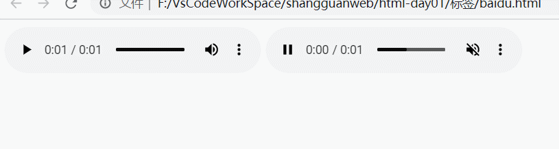

> 在实际的项目中我们需要自己去写视频或者音频的播放器，或者使用第三方的视频播放器插件

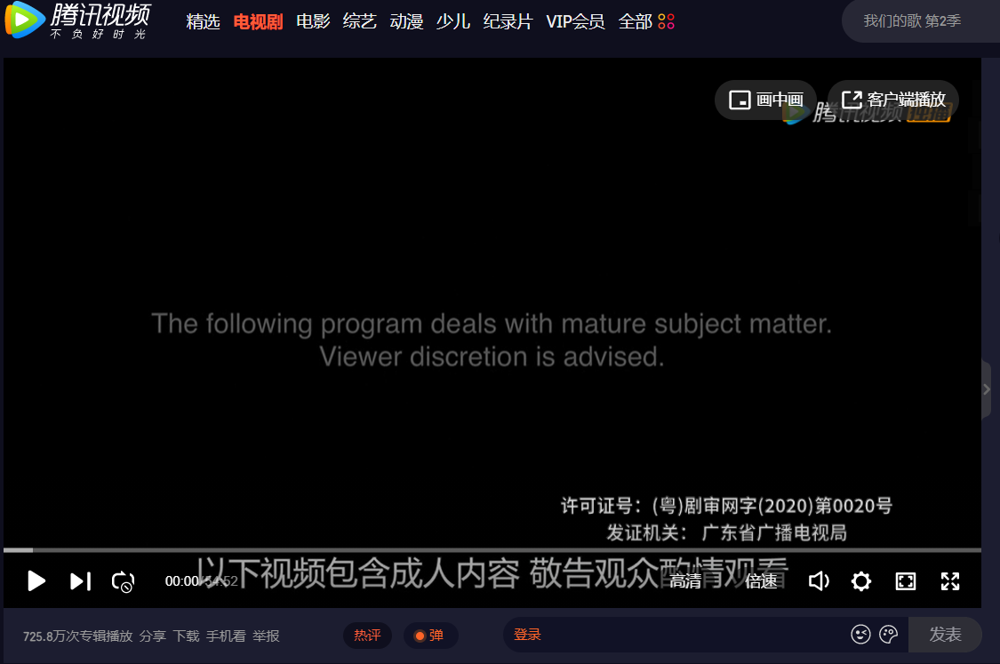

## 17 下拉菜单

```html
<select name="address" id="address">
      <option value="陕西省">陕西省</option>
      <option value="山东省">山东省</option>
      <option value="河南省">河南省</option>
      <option value="四川省">四川省</option>
      <option value="河北省">河北省</option>
      <option value="山西省">山西省</option>
    </select>
```


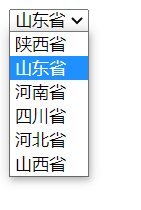

> 常见的省市级三级联动效果

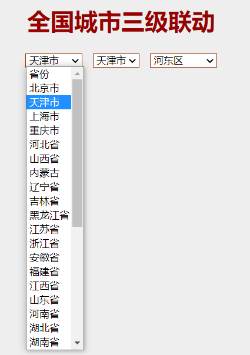

## 18. Html5新增的标签

### 18.1 article标签

### 18.2 aside标签

### 18.3 canvas标签

### 18.4 datalist标签

### 18.5 embed标签

### 18.6 footer标签

### 18.7 header标签

### 18.8 nav标签

### 18.9 section标签

### 18.10 time标签

```html
<nav>导航栏，类似：首页|新闻|咨询|游戏|汽车</nav>
<article>
	<header>
		包含大标题
	</header>
	<section>
		包含小标题，和内容
	</section>
	<div>
		通用
	</div>
	<footer>
		尾部
	</footer>
</article>
<aside>与article同级，一般为边栏内容</aside>
```

```html
<canvas id="myCanvas">your browser does not support the canvas tag </canvas>

<script type="text/javascript">

var canvas=document.getElementById('myCanvas');
var ctx=canvas.getContext('2d');
ctx.fillStyle='#FF0000';
ctx.fillRect(0,0,80,100);

</script>
```


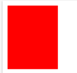

