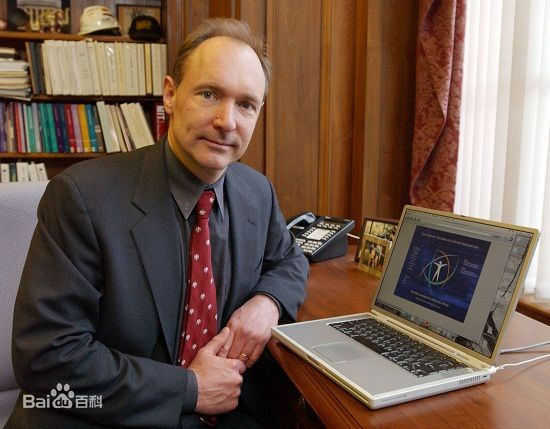

# Html 简介

## 1.Html 介绍

> HTML 称为超文本标记语言( Hyper Text Markup Language)，是一种标识性的语言。它包括一系列标签．通过这些标签可以将网络上的文档格式统一，使分散的 Internet 资源连接为一个逻辑整体。HTML 文本是由 HTML 命令组成的描述性文本，HTML 命令可以说明文字，图形、动画、声音、表格、链接等。 [1]
> 超文本是一种组织信息的方式，它通过超级链接方法将文本中的文字、图表与其他信息媒体相关联。这些相互关联的信息媒体可能在同一文本中，也可能是其他文件，或是地理位置相距遥远的某台计算机上的文件。这种组织信息方式将分布在不同位置的信息资源用随机方式进行连接，为人们查找，检索信息提供方便

[html 百度百科](https://baike.baidu.com/item/HTML/97049?fr=aladdin)

**解读什么是超文本标记性语言**

- 超文本 超越普通文本
- 标记性 标签性
  - 标签是由\<html> 组成 <></>单词组成
  - 标签总是成对出现的但是也有一些单标签
- 语言(文本语言不是编程语言)
  - 文本语言直接书写由浏览器直接解析，不需要编译
  - 不能书写逻辑结构的东西
  - 是语言就有自己的语法和规范着也是我们必须去学习的一点

## 2. Html 历史版本发展

HTML 是用来标记 Web 信息如何展示以及其他特性的一种语法规则，它最初于 1989 年由 CERN 的 Tim Berners-Lee 发明。HTML 基于更古老一些的语言 SGML 定义，并简化了其中的语言元素。这些元素用于告诉浏览器如何在用户的屏幕上展示数据，所以很早就得到各个 Web 浏览器厂商的支持。

**HTML 历史上有如下版本：** [5]

- ①HTML 1.0：在 1993 年 6 月作为互联网工程工作小组(IETF)工作草案发布。 [5]
- ②HTML 2.0：1995 年 1 1 月作为 RFC 1866 发布，于 2000 年 6 月发布之后被宣布已经过时。 [5]
- ③HTML 3.2：1997 年 1 月 14 日，W3C 推荐标准。 [5]
- ④HTML 4.0：1997 年 12 月 18 日，W3C 推荐标准。 [5]
- ⑤HTML 4.01（微小改进）：1999 年 12 月 24 日，W3C 推荐标准。 [5]
- ⑥HTML 5：HTML5 是公认的下一代 Web 语言，极大地提升了 Web 在富媒体、富内容和富应用等方面的能力，被喻为终将改变移动互联网的重要推手

HTML 在 Web 迅猛发展的过程中起着重要作用，有着重要的地位。但随着网络应用的深入，特别是电子商务的应用，HTML 过于简单的缺陷很快凸现出来：HTML 不可扩展。HTML 不允许应用程序开发者为具体的应用环境定义自定义的标记。HTML 只能用于信息显示。HTML 可以设置文本和图片显示方式，但没有语义结构，即 HTML 显示数据是按照布局而非语义的。随着网络应用的发展，各行业对信息有着不同的需求，这些不同类型的信息未必都是以网页的形式显示出来。例如。当通过搜索引擎进行数据搜索时，按照语义而非按照布局来显示数据会具有更多的优点。
总而言之，HTML 的缺点使其交互性差，语义模糊，这些缺陷难以适应 Internet 飞速发展的要求，因此一个标准、简洁、结构严谨以及可高度扩展的 XML 就产生了。

## 3.蒂姆·伯纳斯·李

> 蒂姆·伯纳斯·李 [1] （Tim Berners-Lee），OM，KBE，FRS，FREng，FRSA，（Sir Timothy John "Tim" Berners-Lee，1955 年 6 月 8 日－），英国计算机科学家。
> 他是万维网的发明者，南安普顿大学与麻省理工学院教授。1990 年 12 月 25 日，罗伯特·卡里奥在 CERN 和他一起成功通过 Internet 实现了 HTTP 代理与服务器的第一次通讯。
> 万维网联盟（W3C）是伯纳斯·李为关注万维网发展而创办的组织，并担任万维网联盟的主席。他也是万维网基金会的创办人。伯纳斯-李还是麻省理工学院计算机科学及人工智能实验室创办主席及高级研究员。同时，伯纳斯-李是网页科学研究倡议会的总监。最后，他是麻省理工学院集体智能中心咨询委员会成员。
> 2004 年，英女皇伊丽莎白二世向伯纳斯·李颁发大英帝国爵级司令勋章。2009 年 4 月，他获选为美国国家科学院外籍院士。在 2012 年夏季奥林匹克运动会开幕典礼上，他获得了“万维网发明者”的美誉。伯纳斯·李本人也参与了开幕典礼，在一台 NeXT 计算机前工作。他在 Twitter 上发表消息说：“这是给所有人的”，体育馆内的 LCD 光管随即显示出文字来。2017 年，他因“发明万维网、第一个浏览器和使万维网得以扩展的基本协议和算法”而获得 2016 年度的图灵奖。
