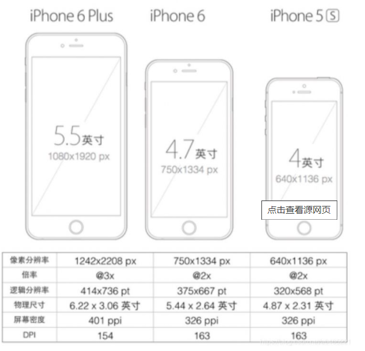
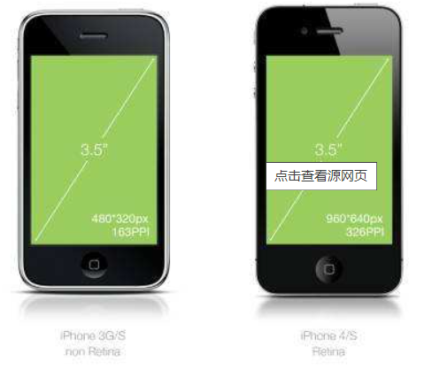
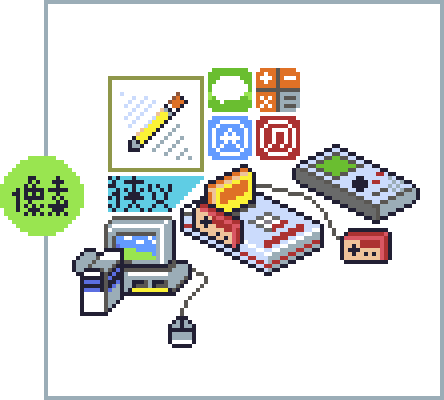
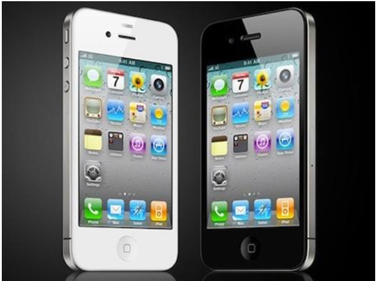
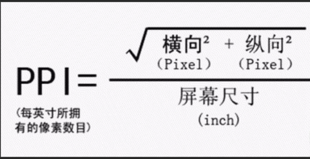
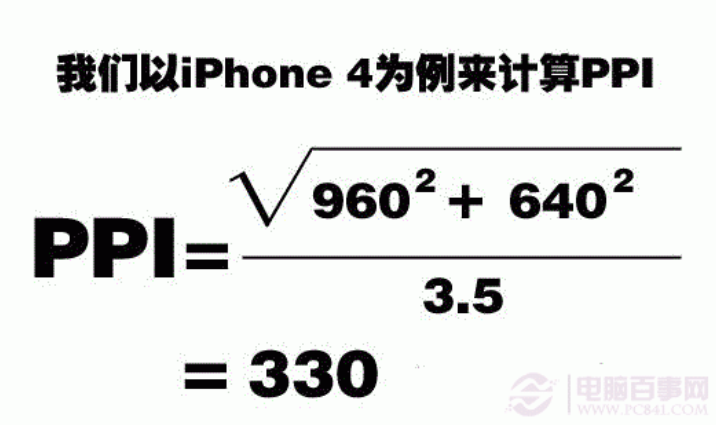
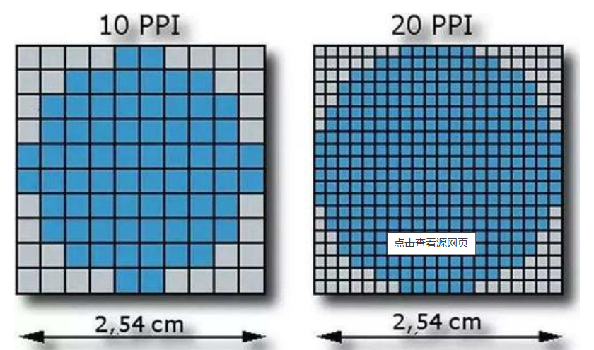

# 聊聊像素

## 1. 基础知识

### 1.1屏幕

> **屏幕**是一种用于显示图像及色彩的电器。它分为银幕和荧幕，也称**显示屏**
>
> 在当前的市面上通常见到的是Pc端的屏幕和移动端的屏幕，那么我们也看到了Pc端和移动端最大的区别在与`屏幕的尺寸`和`分辨率`上,通常我们所说的屏幕的尺寸指的是屏幕的对角线的长度(一般使用英寸来度量)。
>
> 屏幕分辨率是指纵横向上的像素点数，单位是px。屏幕分辨率确定[计算机](https://baike.baidu.com/item/计算机/140338)屏幕上显示多少信息的设置，以水平和垂直像素来衡量。就相同大小的屏幕而言，当屏幕分辨率低时（例如 640 x 480），在屏幕上显示的像素少，单个像素尺寸比较大。屏幕分辨率高时（例如 1600 x 1200），在屏幕上显示的像素多，单个像素尺寸比较小。
>
> 显示分辨率就是屏幕上显示的像素个数，分辨率160×128的意思是水平方向含有像素数为160个，垂直方向像素数128个。屏幕尺寸一样的情况下，分辨率越高，显示效果就越精细和细腻。移动端的分辨率第一个数字是宽，第二个数字是高。

### 1.2  长度单位

> 长度单位，其实在我们的生活中，也非常常见，例如，厘米、毫米、英寸，还有经常接触到的像素（px），元素的字体高度（em）、字母x的高度（ex）、百分比（%）等等这些单位，但是我们都可以将它们归结为两大类别：第一类，就是绝对长度单位；第二类，就是相对长度单位。

`相同屏幕尺寸的手机，分辨率是不一样的，所以在屏幕上的像素点是不一样的,清晰度就是不一样的`，所以我们可以说英寸是绝对单位，像素是相对单位，在实际开发中我们使用的也是相对单位。

**绝对单位:**

> 具体的绝对长度单位主要包括以下几个：
>
> **1）、cm，厘米：**一个长度计量单位，1m=100cm。
>
> **2）、mm，毫米：**与厘米一样，也是一个长度计量单位，1cm=10mm；毫米同时还是降雨量的计量单位。
>
> **3）、in，英寸：**这个是美国尺子上都有的单位，1英寸=2.54厘米，12英寸=1英寸。
>
> **4）、pt，点（points）：**一个印刷度量单位，1英寸相当于72点，例如，将元素p设置为24点的话，就是1英寸的三分之一（1/3）；所以，p{font-size：24pt；}与p{font-size：0.33in；}是等价。
>
> **5）、pc，派卡（Picas）：**一个印刷术语，1派卡相当于12点，6派卡相当于1英寸。
>
> 当然，由于这些单位都是绝对长度单位，在我们的web开发中，运用比较少，主要是因为绝对长度单位不利于页面屏幕的渲染，他们更多的是被用在印刷、打印等方向。

**相对单位:**

> 相对长度单位，我们都见得比较多，例如，px，em，ex，rem；这些都是相对长度单位。
>
> **1）px，像素：**px是相对于显示器屏幕分辨率而言。用px设置字体大小时，可能比较稳定和精确。但是这种方法存在一些问题，例如：IE无法调整那些使用px作为单位的字体大小；国外的大部分网站能够调整的原因在于其使用了em或rem作为字体单位；Firefox能够调整px和em，rem，但是96%以上的中国网民还是喜欢使用IE浏览器。为了保证用户体验和web页面效果，所以在web开发中还引入了“em”这个长度单位。
>
> **2）em，元素的字体高度：**em是相对于父元素的属性值而计算的，所以em是非具体的数值。它需要一个参考点，一般都是以<body>的“font-size”为基准。任意浏览器的默认字体高都是16px。所有未经调整的浏览器都符合：1em= 16px。有时为简化font-size的换算，需要在css中的body选择器中声明font-size=62.5%,此时1em=16px*62.5%=10px,这样12px=1.2em,10px=1em,也就是说换算时只需将原有px数值除以10，然后换上em作为单位即可。 **em 的值并不是固定的；em的值会继承父级元素的字体大小。**
>
> **3）ex，所有字体元素中小写x的高度：**这个主要与字体有关，不同的字体，即使设置了相同的字体大小，但是ex的值也有可能不同，主要是因为字体的x高度可能不同。不过这个在我们实际开发中运用比较少，一般设置em后，ex就会默认为em的一半，也有为计算方便，将1ex假设等于0.5em,原因在于，大多数的字体的小写字母都是相应大写字母高度的一半。
>
> **4）rem，元素字体高度：**与em相比较多了一个"r"，是CSS3新增的一个相对单位，是root em，简写rem，这个单位与em的区别在于，使用rem为元素设定字体大小时，**rem相对的只是HTML根元素。**通过rem，既可以做到只修改根元素就可以成比例地调整所有字体大小，又可以避免字体大小逐层复合的连锁反应。 目前，除IE9以下的版本外，所有浏览器均已支持rem。
>
> **另外，我们在开发中还需要注意两点： ****
>
> 第一，若rem没有在根元素（html字体）指定参照值，那浏览器默认1 rem就是16px,若rem有指定值，则1rem就是等于指定值 。
>
>  第二，html设置为62.5%或者10px时会失效，是因为小于12px或者75%的字体大小不支持换算。这可能与有些浏览器不支持12px以下的大小有关。所以，使用rem单位，html的字体默认字体大小必须设置为12px或以上。若小于12px则浏览器换算时自动默认字体为12px。

## 2.像素

### 2.1 像素发展

> 起源—古代马赛克艺术的产生:
>
> 像素艺术不是凭空出现的，与很多艺术形式有着很深的渊源，最早产生的是**镶嵌艺术**(音译Mosaic，俗称马赛克)就是其中之一。

> 发展—红白机的辉煌与诺基亚的衰落
>
> 现代像素的产生，基于各类显示设备作为载体。以标准RGB排列方式的显示器为例，通过电子枪打在屏幕的“红(R)、绿(G)、蓝(B)”三色发光极上来产生不同的色彩，而每一组“三原色”就是一个像素点。

> 后来手机界大佬诺基亚在2003年推出了第一批搭载“塞班系统”(Symbian)的智能手机，再次让像素游戏在移动电话平台大放异彩，也让Gameloft等著名手游厂商在掌上游戏领域开拓了一片天地。不过好景不长，就在诺基亚垄断全球手机市场份额的同时，乔布斯于2007年带着第一代iphone彻底打破了塞班智能手机“一机独大”的格局。

### 2.2 像素密度

> 图像每英寸长度内的像素点数。
>
> DPI（Dots Per Inch，每英寸点数）是一个量度单位，用于点阵[数码影像](https://baike.baidu.com/item/数码影像/6208065)，指每一[英寸](https://baike.baidu.com/item/英寸)长度中，取样、可显示或输出点的数目。
>
> DPI是打印机、鼠标等设备[分辨率](https://baike.baidu.com/item/分辨率/213523)的度量单位。是衡量打印机[打印精度](https://baike.baidu.com/item/打印精度/3653721)的主要参数之一，一般来说，DPI值越高，表明打印机的打印精度越高。
>
> DPI是指每英寸的像素，也就是扫描精度。DPI越低，扫描的清晰度越低，由于受网络传输速度的影响，web上使用的图片都是72dpi，但是冲洗照片不能使用这个参数，必须是300dpi或者更高350dpi。例如要冲洗4*6英寸的照片，扫描精度必须是300dpi，那么文件尺寸应该是(4*300)*(6*300)=1200像素*1800像素。
>
> DPI原来是印刷上的记量单位，意思是每英寸上，所能印刷的网点数（Dot Per Inch）。但随着数字输入，[输出设备](https://baike.baidu.com/item/输出设备)快速发展，大多数的人也将数字影像的解析度用DPI表示，但较为严谨的人可能注意到，印刷时计算的网点（Dot）和电脑显示器的显示像素（Pixel）并非相同，所以较专业的人士，会用`PPI`(Pixel Per Inch)表示数字影像的解析度，以区分二者

*PPI即每英寸所拥有的像素数目。pixels per inch所表示的是每英寸对角线上所拥有的像素（pixel）数目。其实计算方法很简单，用长跟高的[像素](https://baike.baidu.com/item/像素)数计算出对角方向的像素数（直角三角形），然后再用对角的像素数除以屏幕尺寸就是ppi了,公式表达为 PPI=√（X^2+Y^2）/ Z （X：长度像素数；Y：宽度像素数；Z：屏幕大小*

**PPI就是单位面积中像素的数量，PPI值越大屏幕展现出来的效果就越精细。**

**在相同尺寸的设备中屏幕的分辨率越高，内容越精细。像素的实际大小就越小，反之PPI的值越小，画质粗糙，像素的实际大小就越大。**

> `视网膜屏幕`是分辨率超过人眼识别极限的高分辨率屏幕，是由[苹果公司](https://baike.baidu.com/item/苹果公司/304038)在2010年[iPhone 4](https://baike.baidu.com/item/iPhone 4)发布会上首次推出的营销术语。
>
> 视网膜（Retina）屏幕是苹果公司"发明"的一个营销术语。并在部分移动产品使用。苹果这个术语用在iphone 4手机上，自此一直沿用，它将960×640的像素压缩到一个3.5英寸的显示屏内。也就是说，`该屏幕的像素密度达到326像素/英寸（ppi`），称之为“视网膜屏幕”。3