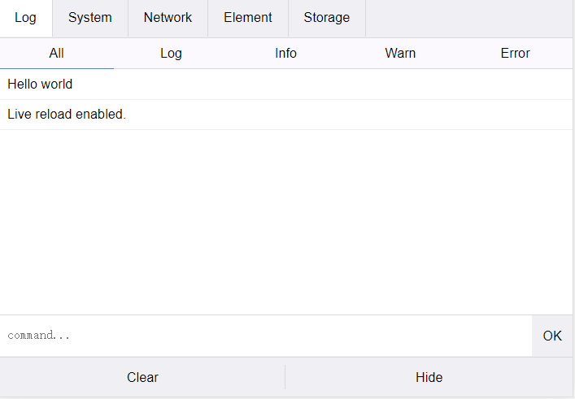

# 聊聊像素

## 1. 基础知识

### 1.1屏幕


> **屏幕**是一种用于显示图像及色彩的电器。它分为银幕和荧幕，也称**显示屏**
>
> 在当前的市面上通常见到的是Pc端的屏幕和移动端的屏幕，那么我们也看到了Pc端和移动端最大的区别在与`屏幕的尺寸`和`分辨率`上,通常我们所说的屏幕的尺寸指的是屏幕的对角线的长度(一般使用英寸来度量)。
>
> 屏幕分辨率是指纵横向上的像素点数，单位是px。屏幕分辨率确定[计算机](https://baike.baidu.com/item/计算机/140338)屏幕上显示多少信息的设置，以水平和垂直像素来衡量。就相同大小的屏幕而言，当屏幕分辨率低时（例如 640 x 480），在屏幕上显示的像素少，单个像素尺寸比较大。屏幕分辨率高时（例如 1600 x 1200），在屏幕上显示的像素多，单个像素尺寸比较小。
>
> 显示分辨率就是屏幕上显示的像素个数，分辨率160×128的意思是水平方向含有像素数为160个，垂直方向像素数128个。屏幕尺寸一样的情况下，分辨率越高，显示效果就越精细和细腻。移动端的分辨率第一个数字是宽，第二个数字是高。


### 1.2  长度单位

> 长度单位，其实在我们的生活中，也非常常见，例如，厘米、毫米、英寸，还有经常接触到的像素（px），元素的字体高度（em）、字母x的高度（ex）、百分比（%）等等这些单位，但是我们都可以将它们归结为两大类别：第一类，就是绝对长度单位；第二类，就是相对长度单位。


`相同屏幕尺寸的手机，分辨率是不一样的，所以在屏幕上的像素点是不一样的,清晰度就是不一样的`，所以我们可以说英寸是绝对单位，像素是相对单位，在实际开发中我们使用的也是相对单位。

**绝对单位:**

具体的绝对长度单位主要包括以下几个：

**1）、cm，厘米：**一个长度计量单位，1m=100cm。

**2）、mm，毫米：**与厘米一样，也是一个长度计量单位，1cm=10mm；毫米同时还是降雨量的计量单位。

**3）、in，英寸：**这个是美国尺子上都有的单位，1英寸=2.54厘米，12英寸=1英寸。

**4）、pt，点（points）：**一个印刷度量单位，1英寸相当于72点，例如，将元素p设置为24点的话，就是1英寸的三分之一（1/3）；所以，p{font-size：24pt；}与p{font-size：0.33in；}是等价。

**5）、pc，派卡（Picas）：**一个印刷术语，1派卡相当于12点，6派卡相当于1英寸。

> 当然，由于这些单位都是绝对长度单位，在我们的web开发中，运用比较少，主要是因为绝对长度单位不利于页面屏幕的渲染，他们更多的是被用在印刷、打印等方向。

**相对单位:**

相对长度单位，我们都见得比较多，例如，px，em，ex，rem；这些都是相对长度单位。

> **1）px，像素：**px是相对于显示器屏幕分辨率而言。用px设置字体大小时，可能比较稳定和精确。但是这种方法存在一些问题，例如：IE无法调整那些使用px作为单位的字体大小；国外的大部分网站能够调整的原因在于其使用了em或rem作为字体单位；Firefox能够调整px和em，rem，但是96%以上的中国网民还是喜欢使用IE浏览器。为了保证用户体验和web页面效果，所以在web开发中还引入了“em”这个长度单位。
>
> **2）em，元素的字体高度：**em是相对于父元素的属性值而计算的，所以em是非具体的数值。它需要一个参考点，一般都是以<body>的“font-size”为基准。任意浏览器的默认字体高都是16px。所有未经调整的浏览器都符合：1em= 16px。有时为简化font-size的换算，需要在css中的body选择器中声明font-size=62.5%,此时1em=16px*62.5%=10px,这样12px=1.2em,10px=1em,也就是说换算时只需将原有px数值除以10，然后换上em作为单位即可。 **em 的值并不是固定的；em的值会继承父级元素的字体大小。**
>
> **3）ex，所有字体元素中小写x的高度：**这个主要与字体有关，不同的字体，即使设置了相同的字体大小，但是ex的值也有可能不同，主要是因为字体的x高度可能不同。不过这个在我们实际开发中运用比较少，一般设置em后，ex就会默认为em的一半，也有为计算方便，将1ex假设等于0.5em,原因在于，大多数的字体的小写字母都是相应大写字母高度的一半。
>
> **4）rem，元素字体高度：**与em相比较多了一个"r"，是CSS3新增的一个相对单位，是root em，简写rem，这个单位与em的区别在于，使用rem为元素设定字体大小时，**rem相对的只是HTML根元素。**通过rem，既可以做到只修改根元素就可以成比例地调整所有字体大小，又可以避免字体大小逐层复合的连锁反应。 目前，除IE9以下的版本外，所有浏览器均已支持rem。
>
> **另外，我们在开发中还需要注意两点： ****
>
> 第一，若rem没有在根元素（html字体）指定参照值，那浏览器默认1 rem就是16px,若rem有指定值，则1rem就是等于指定值 。
>
> 第二，html设置为62.5%或者10px时会失效，是因为小于12px或者75%的字体大小不支持换算。这可能与有些浏览器不支持12px以下的大小有关。所以，使用rem单位，html的字体默认字体大小必须设置为12px或以上。若小于12px则浏览器换算时自动默认字体为12px。

## 2.像素基础

### 2.1 像素发展

> 起源—古代马赛克艺术的产生:
>
> 像素艺术不是凭空出现的，与很多艺术形式有着很深的渊源，最早产生的是**镶嵌艺术**(音译Mosaic，俗称马赛克)就是其中之一。


> 发展—红白机的辉煌与诺基亚的衰落
>
> 现代像素的产生，基于各类显示设备作为载体。以标准RGB排列方式的显示器为例，通过电子枪打在屏幕的“红(R)、绿(G)、蓝(B)”三色发光极上来产生不同的色彩，而每一组“三原色”就是一个像素点。


> 后来手机界大佬诺基亚在2003年推出了第一批搭载“塞班系统”(Symbian)的智能手机，再次让像素游戏在移动电话平台大放异彩，也让Gameloft等著名手游厂商在掌上游戏领域开拓了一片天地。不过好景不长，就在诺基亚垄断全球手机市场份额的同时，乔布斯于2007年带着第一代iphone彻底打破了塞班智能手机“一机独大”的格局。


### 2.2 像素密度

> 图像每英寸长度内的像素点数。
>
> DPI（Dots Per Inch，每英寸点数）是一个量度单位，用于点阵[数码影像](https://baike.baidu.com/item/数码影像/6208065)，指每一[英寸](https://baike.baidu.com/item/英寸)长度中，取样、可显示或输出点的数目。
>
> DPI是打印机、鼠标等设备[分辨率](https://baike.baidu.com/item/分辨率/213523)的度量单位。是衡量打印机[打印精度](https://baike.baidu.com/item/打印精度/3653721)的主要参数之一，一般来说，DPI值越高，表明打印机的打印精度越高。
>
> DPI是指每英寸的像素，也就是扫描精度。DPI越低，扫描的清晰度越低，由于受网络传输速度的影响，web上使用的图片都是72dpi，但是冲洗照片不能使用这个参数，必须是300dpi或者更高350dpi。例如要冲洗4*6英寸的照片，扫描精度必须是300dpi，那么文件尺寸应该是(4*300)*(6*300)=1200像素*1800像素。
>
> DPI原来是印刷上的记量单位，意思是每英寸上，所能印刷的网点数（Dot Per Inch）。但随着数字输入，[输出设备](https://baike.baidu.com/item/输出设备)快速发展，大多数的人也将数字影像的解析度用DPI表示，但较为严谨的人可能注意到，印刷时计算的网点（Dot）和电脑显示器的显示像素（Pixel）并非相同，所以较专业的人士，会用`PPI`(Pixel Per Inch)表示数字影像的解析度，以区分二者

*PPI即每英寸所拥有的像素数目。pixels per inch所表示的是每英寸对角线上所拥有的像素（pixel）数目。其实计算方法很简单，用长跟高的[像素](https://baike.baidu.com/item/像素)数计算出对角方向的像素数（直角三角形），然后再用对角的像素数除以屏幕尺寸就是ppi了,公式表达为 PPI=√（X^2+Y^2）/ Z （X：长度像素数；Y：宽度像素数；Z：屏幕大小*


**PPI就是单位面积中像素的数量，PPI值越大屏幕展现出来的效果就越精细。**

**在相同尺寸的设备中屏幕的分辨率越高，内容越精细。像素的实际大小就越小，反之PPI的值越小，画质粗糙，像素的实际大小就越大。**


> `视网膜屏幕`是分辨率超过人眼识别极限的高分辨率屏幕，是由[苹果公司](https://baike.baidu.com/item/苹果公司/304038)在2010年[iPhone 4](https://baike.baidu.com/item/iPhone 4)发布会上首次推出的营销术语。
>
> 视网膜（Retina）屏幕是苹果公司"发明"的一个营销术语。并在部分移动产品使用。苹果这个术语用在iphone 4手机上，自此一直沿用，它将960×640的像素压缩到一个3.5英寸的显示屏内。也就是说，`该屏幕的像素密度达到326像素/英寸（ppi`），称之为“视网膜屏幕”。

同一尺寸的图片，分辨率越高，图片越清晰。


### 2.3 设备的独立像素

常见设备的dpr查询[https://screensiz.es/phone](https://screensiz.es/phone)

常见设备的dpr查询[http://devicepixelratio.com/](http://devicepixelratio.com/)

一个像素不是一个像素[https://www.quirksmode.org/blog/archives/2010/04/a_pixel_is_not.html](https://www.quirksmode.org/blog/archives/2010/04/a_pixel_is_not.html)

>  在网上有些文章对iOS的pt存在一些误解，它不等同于印刷概念里的 1 pt=1/72英寸

iOS 开发中用到的单位 pt 是独立像素的意思，它是绝对长度，不随屏幕像素密度变化而变化（和我们日常用到的毫米、厘米是一个意思，只是它要小得多），在非视网膜的 iPhone 上（iPhone 3G），苹果规定 1px=1pt，也就是说 pt 和像素点是一一对应的。但随着 iPhone 4 的到来，高分屏出现了（视网膜屏），这个时候 **1pt 对应 2px**。所以用固定长度 pt 作为开发单位的好处是：这样可以统一图形在同一种类不同型号设备上图形的大小。而如果用像素作为单位的话，就乱了套了，**因为在不同像素密度的屏幕里面，像素本身大小是不一样的**。


理论上来讲，在白色手机上相同大小的图片和文字，在黑色手机上会被缩放一倍，因为它的分辨率提高了一倍。这样，岂不是后面出现更高分辨率的手机，页面元素会变得越来越小吗？

然而，事实并不是这样的，我们现在使用的智能手机，不管分辨率多高，他们所展示的界面比例都是基本类似的。乔布斯在`iPhone4`的发布会上首次提出了`Retina Display`(视网膜屏幕)的概念，它正是解决了上面的问题，这也使它成为一款跨时代的手机。


> 在`iPhone4`使用的视网膜屏幕中，把`2x2`个像素当`1`个像素使用，这样让屏幕看起来更精致，但是元素的大小却不会改变。


如果黑色手机使用了视网膜屏幕的技术，那么显示结果应该是下面的情况，比如列表的宽度为`300`个像素，那么在一条水平线上，白色手机会用`300`个物理像素去渲染它，而黑色手机实际上会用`600`个物理像素去渲染它。

我们必须用一种单位来同时告诉不同分辨率的手机，它们在界面上显示元素的大小是多少，这个单位就是设备独立像素(`Device Independent Pixels`)简称`DIP`或`DP`。上面我们说，列表的宽度为`300`个像素，实际上我们可以说：列表的宽度为`300`个设备独立像素。


为了让同一个网页在 iphone4 和 iphone3 上的有相同的显示效果，引入了独立像素的概念。iphone4 的独立像素为 320 * 480，是 iphone4 的物理像素的一半，和 iphone3 的物理像素一样。也就是说，iphone4 上的 1 个独立像素 == 2 个物理像素。在 iphone4 上，在不缩放的前提下，CSS 中的 1px 便由 1 个独立像素来渲染，相当于 2 个物理像素。这样，`width: 320px;` 的元素由 320 个独立像素来渲染，也就是由 640 个物理像素来渲染，正好占满 iphopn4 的屏幕宽度。`font-size: 20px;` 的字体在 iphone3 和 iphone4 上的尺寸也相同，只不过在 iphone4 上的字体更清楚。


下图展示了不同型号的 iphone 的物理像素和独立像素 (`设备分辨率代表物理像素`，`逻辑分辨率代表独立像素`)。

为了描述不同型号的手机物理像素和独立像素之间的关系，引入了一个新的概念：设备像素比 devicePixelRatio。在 js 中通过 `window.devicePixelRatio` 查看。

> **devicePixelRatio = 物理像素 / 独立像素**
>
> ```undefined
> iphone3: devicePixelRatio = 320 / 320 = 1
> iphone4: devicePixelRatio = 640 / 320 = 2
> iphone6Plus: devicePixelRatio = 1242 / 414 = 3
> ```


实际上，从苹果提出视网膜屏幕开始，才出现设备像素比这个概念，因为在这之前，移动设备都是直接使用物理像素来进行展示。

紧接着，`Android`同样使用了其他的技术方案来实现`DPR`大于`1`的屏幕，不过原理是类似的。由于`Android`屏幕尺寸非常多、分辨率高低跨度非常大，不像苹果只有它自己的几款固定设备、尺寸。所以，为了保证各种设备的显示效果，`Android`按照设备的像素密度将设备分成了几个区间：


当然，所有的`Android`设备不一定严格按照上面的分辨率，每个类型可能对应几种不同分辨率，所以，每个`Android`手机都能根据给定的区间范围，确定自己的`DPR`，从而拥有类似的显示。当然，仅仅是类似，由于各个设备的尺寸、分辨率上的差异，设备独立像素也不会完全相等，所以各种`Android`设备仍然不能做到在展示上完全相等。

## 3.像素

### 3.1 物理像素

> 物理像素 设备像素，在同一个设备上，它的物理像素是固定的，这是厂商在出厂时就设置好了的，即一个设备的分辨率是固定的。 屏幕从工厂出来那天起，它上面的**物理像素点**就固定不变了，单位**pt**。
>
> 我们 可以通过js代码获取页面的物理尺寸:
>
> ```javascript
> <script>
> 		// CSS像素对应着以后要提到的理想视口的宽高
> 		var screenW = screen.width;
> 		var screenH = screen.height;
> 		console.log ("理想视口的宽 = " + screenW );
> 		console.log ("理想视口的高 = " + screenH );
> 		// 对于设备像素比DPR也有对应的javascript属性
> 		var dprVal = window.devicePixelRatio;
> 		console.log ("DPR的值为 = " + dprVal );
> </script>
> ```

### 3.2 Css像素

> 在写`CSS`时，我们用到最多的单位是`px`，即`CSS像素`，当页面缩放比例为`100%`时(PC端)，一个`CSS像素`等于一个设备独立像素。但是`CSS像素`是很容易被改变的，当用户对浏览器进行了放大，`CSS像素`会被放大，这时一个`CSS像素`会跨越更多的物理像素。
>
> `页面的缩放系数 = CSS像素 / 设备独立像素`。


## 4. 二倍图

> 同一张图片，在PC端和移动端的效果是不一样的，不可能将图片进行拉伸，图片的效果机会发生改变，使用二倍图可以解决这个问题

```html
<!DOCTYPE html>
<html lang="en">
  <head>
    <meta charset="UTF-8" />
   <!--  <meta name="viewport" content="width=device-width, initial-scale=1.0" /> -->
    <title>Document</title>
    <style>
      * {
        margin: 0;
        padding: 0;
      }
      body {
        background: #fff;
      }
    </style>
  </head>
  <body>
    
    <br>
    
    
    <script>
      alert(window.devicePixelRatio)
    </script>
  </body>
</html>

```

 


## 5. 移动端调试

### 5.1 谷歌浏览器提供的开发工具


### 5.2 chrome://inspect/#devices

> 在谷歌浏览器中输入chrome://inspect/#devices, 用usb连接手机，便可以看到我们当前手机中访问的页面，点击即可弹出调试页面,与pc端页面一样，我们同样可以打断点，查看网络请求等。

### 5.3 http-server

> 注意node js 和 hhtp-server的版本问题

```shell
npm install http-server -g
hs或者 http-server
 http-server -c-1 #禁用缓存
Pc和移动端就可以访问了
```

### 5.4 anywhere

> ```undefined
> npm install anywhere -g  
> 在项目的目录下执行
> anywhere
> ```

### 5.4 Weinre

[Weinre官网](http://people.apache.org/~pmuellr/weinre/docs/latest/Home.html)

>  [Weinre(Web Inspector Remote)](http://people.apache.org/~pmuellr/weinre-docs/latest/Home.html)是一款基于Web Inspector(Webkit)的远程调试工具， 它使用JS编写， 可以让我们在电脑上直接调试运行在手机上的远程页面。 与传统的Web Inspector的使用场景不同， Weinre的使用场景如下图， 调试的页面在手机上， 调试工具在PC的chrome， 二者通过网络连接通信。
>
> Weinre是基于nodejs实现的， 使用它必须先安装node运行环境，安装node可参考：[node官网](http://nodejs.org/download/)。新版的node已经集成了npm, 所以直接在在命令行键入下面的命令即可安装， 如果你是Mac/Linux用户， 还需要在前面加入"sudo":

```shell
npm -g install weinre
```

```shell
# 开启weinre
weinre --boundHost localhost --httpPort 8081 #默认主机是localhost 默认端口是8080
```


> 接着我们需要在需要调试的页面上加上一段script标签
>
> <script src="http://192.168.0.7:8080/target/target-script-min.js#anonymous"></script>
>
> 需要改为你自己的ip地址


### 5.4 browser-sync


```shell
npm install -g browser-sync
随后进入项目根目录下
browser-sync start --files "*.*"
```


### 5.5 腾讯的移动端调试工具VConsole

```html
<script src="http://wechatfe.github.io/vconsole/lib/vconsole.min.js?v=3.2.0"></script>
    <script>
        // init vConsole
        var vConsole = new VConsole();
        console.log('Hello world');
    </script>
```




## 6. 视口

